# 2D 光源的通用属性

每种 2D 光源类型具有各种属性和选项，可用于自定义它们的外观和行为。本页面记录了所有 2D 光源类型的通用属性。

以下是不同光源类型通用的属性。关于每种光源类型特定的属性，请参考相应的章节：

- [Freeform](LightTypes.md#freeform)
- [Sprite](LightTypes.md#sprite)
- [Spot](LightTypes.md#spot) (**注意:** 从 URP 11 开始，**Point** 光源已更名为 **Spot** 光源。)
- [Global](LightTypes.md#global)

## 创建光源

通过 **GameObject > Light > 2D** 创建 **2D Light** GameObject，并选择以下四种可用类型之一：

- **Freeform**：可以使用样条编辑器（Spline Editor）编辑光源形状。
- **Sprite**：可以选择一个 Sprite 来创建该光源类型。
- **Spot**：可以控制光照的内外半径、方向和角度。
- **Global**：此 2D 光源影响所有渲染的 Sprite，并适用于所有目标排序层（Sorting Layers）。

以下是不同光源类型通用的属性。

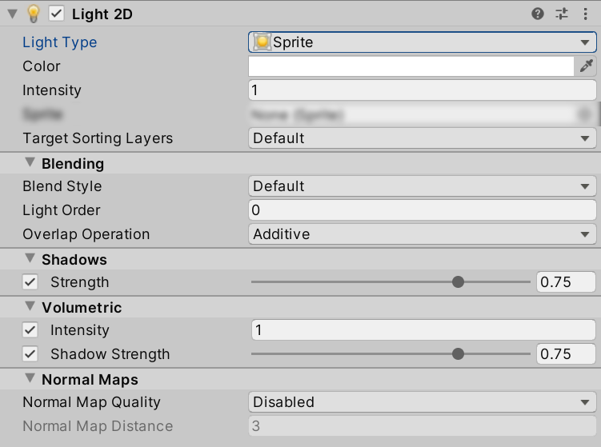

| **属性** | **功能** |
| ------------------------------------------------------------ | ------------------------------------------------------------ |
| **Light Type** | 选择要使用的光源类型。可用类型包括 **Freeform**、**Sprite**、**Spot** 和 **Global**。 |
| **Color** | 使用颜色选择器设置光源的颜色。 |
| **[Intensity](#intensity)** | 输入所需的光源亮度值，默认值为 1。 |
| **[Overlap Operation](#overlap-operation)** | 选择此光源使用的叠加操作。可用的操作包括 **Additive** 和 **Alpha Blend**。 |
| **Target Sorting Layers** | 选择此光源影响的排序层（Sorting Layers）。 |
| **[Blend Style](LightBlendStyles.md)** | 选择此光源使用的混合样式（Blend Style）。不同的混合样式可以在 [2D Renderer Asset](2DRendererData_overview.md) 中进行自定义。 |
| **[Light Order](#light-order)**（不适用于 **Global Lights**） | 输入一个值，以指定此光源相对于相同排序层上的其他光源的渲染顺序。值较小的光源先渲染，负值也是有效的。 |
| **Shadow Strength** | 使用滑块控制 **Shadow Caster 2D** 遮挡该光源时阻挡的光量。该值范围为 0（不遮挡光线）到 1（完全遮挡光线）。 |
| **Volumetric Intensity** | 使用滑块选择体积光的透明度。该值范围为 0（透明）到 1（不透明）。 |
| **Volumetric Shadow Strength** | 使用滑块控制 **Shadow Caster 2D** 遮挡此光源时阻挡的体积光量。该值范围为 0（无遮挡）到 1（完全遮挡）。 |
| **[Normal Map Quality](#quality)** | 选择 **Disabled**（默认）、**Accurate** 或 **Fast** 以调整光照计算的精度。 |
| **[Normal Map Distance](#distance)**（仅当 **Use Normal Map** 未禁用时可用） | 输入光源与受光 Sprite 之间的距离（以 Unity 单位为单位）。此设置不会影响光源在场景中的位置。 |

## Overlap Operation（光源叠加操作）

此属性控制所选光源与其他渲染光源的交互方式。可以通过启用或禁用此属性在两种模式之间切换。以下示例展示了两种模式的效果：

| 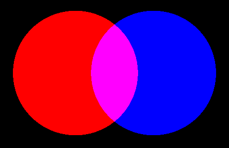 | 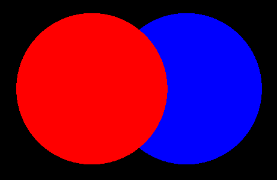 |
| ------------------------------------------------------------ | ------------------------------------------------------ |
| **Overlap Operation** 设为 **Additive** | **Overlap Operation** 设为 **Alpha Blend** |

- 当 **Overlap Operation** 设为 **Additive** 时，该光源会与其他光源进行加法混合，即相交光源的像素值相加。这是默认的光源混合行为。
- 当 **Overlap Operation** 设为 **Alpha Blend** 时，光源会根据 Alpha 值进行混合。这可以用于在光源交叠时完全覆盖另一个光源，但光源的渲染顺序也取决于 **[Light Order](#light-order)**。

## 光源顺序（Light Order）

**Light Order** 值决定了光源在渲染队列中的位置，相对于目标相同排序层（Sorting Layers）上的其他光源。数值较小的光源会先渲染，数值较高的光源会覆盖在下方光源之上。当 **Overlap Operation** 设置为 **Alpha Blend** 时，这尤其会影响混合光源的外观。

## 强度（Intensity）

光源强度适用于所有类型的光源。颜色决定光源的基础颜色，而强度允许颜色的亮度超过 1，使采用乘法混合的光源可以使 Sprite 变得比其原始颜色更亮。

## 使用法线贴图（Use Normal Map）

除 **Global** 光源外，所有光源都可以切换使用 Sprite 材质中的法线贴图。启用后，将显示 **Distance** 和 **Accuracy** 作为新的属性。

| 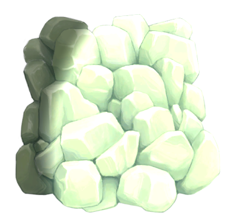 | 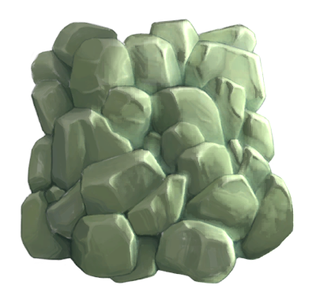 |
| -------------------------------------- | -------------------------------------- |
| **Use Normal Map**: **Disabled**       | **Use Normal Map**: **Enabled**       |

## 距离（Distance）

**Distance** 控制光源与 Sprite 表面之间的距离，进而改变光照效果。此距离不会影响光源强度，也不会影响光源在场景中的位置。以下示例展示了不同 **Distance** 值的效果。

| 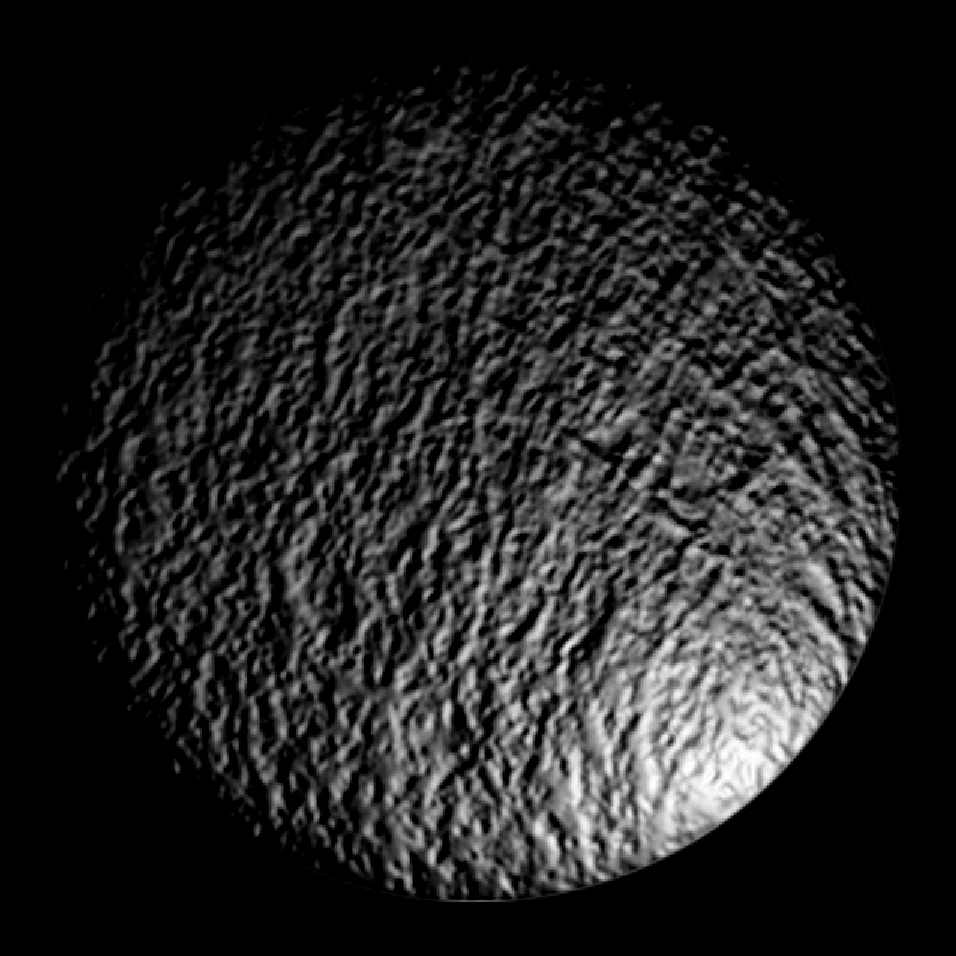 | 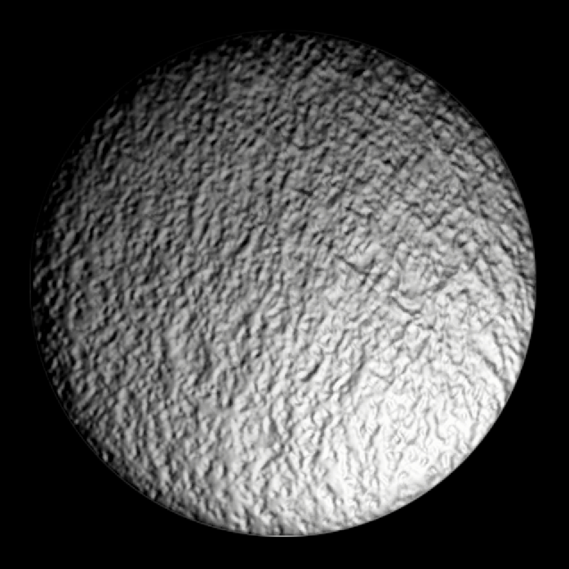 | 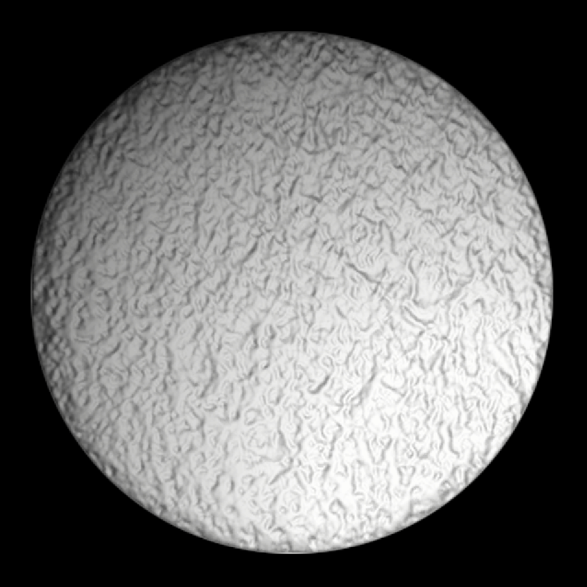 |
| ------------------------------------- | ----------------------------------- | ----------------------------------- |
| **Distance**: 0.5                     | **Distance**: 2                     | **Distance**: 8                     |

## 质量（Quality）

光照质量允许开发者在性能和精度之间进行选择。选择 **Fast** 可能会导致光照产生伪影（Artifacts）。较小的光源和较大的 **Distance** 值可以减少 **Fast** 和 **Accurate** 之间的差异。

## 体积光透明度（Volume Opacity）

所有光源类型均支持体积光。使用 **Volume Opacity** 滑块控制体积光的可见性：
- **0**：体积光完全透明。
- **1**：体积光完全不透明。

## 阴影强度（Shadow Intensity）

**Shadow Intensity** 控制 **Shadow Caster 2D** 遮挡的光照强度，影响阴影的可见程度。适用于 **非 Global** 光源。使用滑块控制 **Shadow Caster 2D** 遮挡的光量。

滑块范围为 0 到 1：
- **0**：**Shadow Caster 2D** 不遮挡任何光线，不产生阴影。
- **1**：**Shadow Caster 2D** 完全遮挡光源，产生完全不透光的阴影。

| 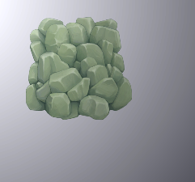 | 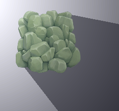 | 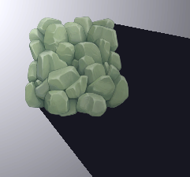 |
| -------------------------------- | --------------------------------- | ---------------------------------- |
| **Shadow Intensity** = 0.0       | **Shadow Intensity** = 0.5       | **Shadow Intensity** = 1.0        |

## 阴影体积强度（Shadow Volume Intensity）

**Shadow Volume Intensity** 决定 **Shadow Caster 2D** 阻挡的体积光量。适用于 **非 Global** 光源，并且当 **Volume Opacity** 大于 0 时生效。使用滑块控制 **Shadow Caster 2D** 遮挡的体积光量。

滑块范围为 0 到 1：
- **0**：**Shadow Caster 2D** 不遮挡体积光，不产生阴影。
- **1**：**Shadow Caster 2D** 完全遮挡体积光，产生最大强度的阴影。

## 目标排序层（Target Sorting Layers）

光源仅会影响选定的 **Sorting Layers**（排序层）。在 **Target Sorting Layers** 下拉菜单中选择光源影响的排序层。

如需添加或移除 **Sorting Layers**，请参考 [Tag Manager - Sorting Layers](https://docs.unity.cn/cn/tuanjiemanual/Manual/class-TagManager.html#SortingLayers) 了解更多信息。
