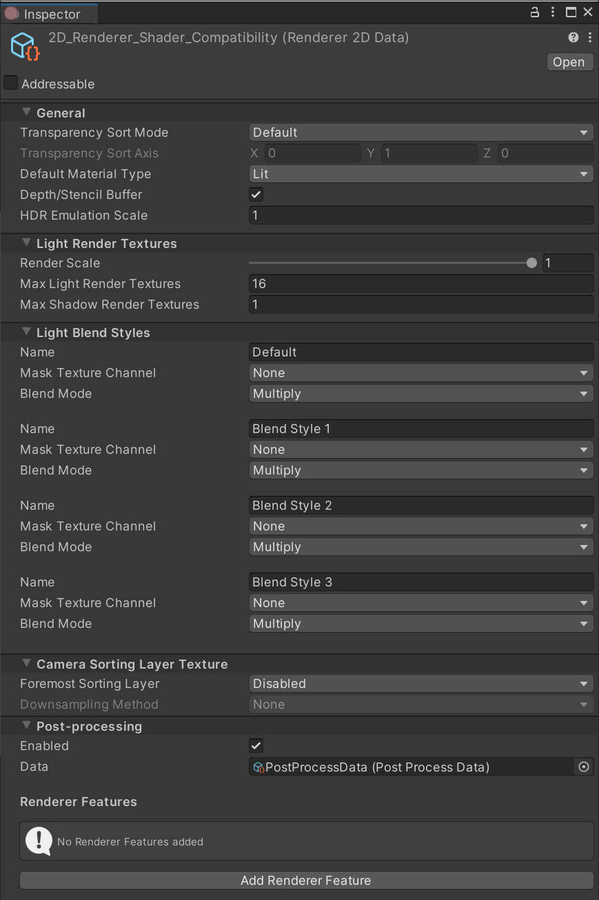
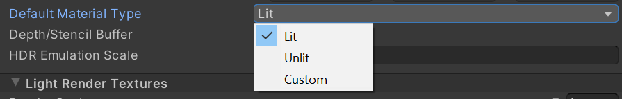
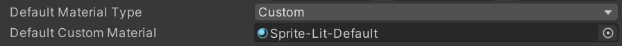

# 2D 渲染器数据资源

**2D Renderer Data** 资源包含影响 **2D 光照** 应用于受光 Sprite 方式的设置。您可以通过 [HDR Emulation Scale](HDREmulationScale.md) 设置光照如何模拟 HDR 效果，或自定义 [Light Blend Styles](LightBlendStyles.md)。有关其属性和选项的详细信息，请参考相应页面。

## 默认材质类型（Default Material Type）

Unity 在创建 Sprite 时，会根据所选的 **Default Material Type** 分配材质。可用的选项及其功能如下：

- **Lit**：Unity 分配具有 Lit 类型的材质（默认材质：Sprite-Lit-Default）。此类型的材质受 2D 光照影响。
- **Unlit**：Unity 分配具有 Unlit 类型的材质（默认材质：Sprite-Lit-Default）。此类型的材质不受 2D 光照影响。
- **Custom**：Unity 分配具有 Custom 类型的材质。选择此选项后，Unity 会显示 **Default Custom Material** 框。您可以在此框中分配所需的材质。

## 使用深度/模板缓冲区（Use Depth/Stencil Buffer）

此选项默认启用。取消勾选可禁用 **Depth/Stencil Buffer**，这样可能会提高项目的性能，特别是在移动平台上。如果您未使用任何需要 **Depth/Stencil Buffer** 的功能（例如 [Sprite Mask](https://docs.unity.cn/cn/tuanjiemanual/Manual/class-SpriteMask.html)），建议禁用此选项。

## 相机排序层纹理（Camera Sorting Layer Texture）

**2D Renderer Data** 资源指定 Unity 如何提供 `CameraSortingLayerTexture` 变量，以便在自定义 Shader 中使用。建议在同一帧内的以下层级中使用该数据，否则可能会导致意外结果。

### 最前排序层（Foremost Sorting Layer）

用于 `CameraSortingLayerTexture` 纹理的所有层将从最靠后的层开始捕获，并一直绘制到 **Foremost Sorting Layer** 指定的层。

### 降采样方法（Downsampling Method）

降采样可以降低 `CameraSortingLayerTexture` 使用的纹理分辨率。可用选项包括：
- **None**（无降采样）
- **2x Bilinear**（双线性 2 倍降采样）
- **4x Box**（4 倍盒型滤波降采样）
- **4x Bilinear**（双线性 4 倍降采样）

## 渲染器功能（Renderer Features）

2D 渲染器支持 [URP Renderer Features](urp-renderer-feature.md)。这些功能的设置会在任何 2D 内置 Pass 排队之前调用。有关详细信息，请参考 [URP Renderer Features](urp-renderer-feature.md) 文档。
