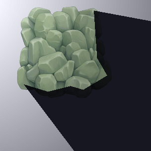
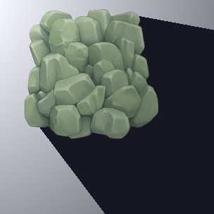
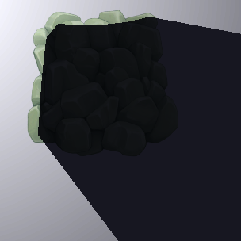
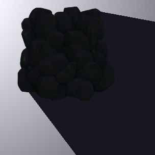
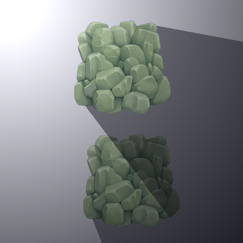
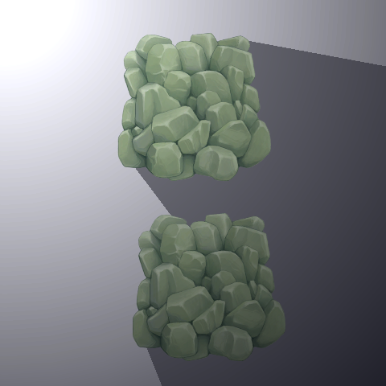

## Shadow Caster 2D

**Shadow Caster 2D**（阴影投射器 2D）组件定义了光源用于确定投射阴影的形状和属性。要向 GameObject 添加 **Shadow Caster 2D** 组件，请转到菜单：**Component > Rendering > 2D > Shadow Caster 2D**。

| **属性**                  | **功能** |
| ------------------------- | ------------------------------------------------------------ |
| **Use Renderer Silhouette** | 启用此选项并同时启用 **Self Shadows**，则 GameObject 的 Renderer 轮廓将包含在阴影中。启用此选项但禁用 **Self Shadows**，则 Renderer 轮廓不会包含在阴影中。此选项仅在 GameObject 具有有效的 Renderer 时可用。 |
| **Casts Shadows**         | 启用此选项以让 Renderer 投射阴影。 |
| **Self Shadows**          | 启用此选项以让 Renderer 在自身上投射阴影。 |

|                  |                   |
| ------------------------------------------------------------ | ------------------------------------------------------------ |
| **Use Renderer Silhouette** 关闭，**Self Shadow** 关闭 | **Use Renderer Silhouette** 启用，**Self Shadow** 关闭 |
|                  |                    |
| **Use Renderer Silhouette** 关闭，**Self Shadows** 启用 | **Use Renderer Silhouette** 启用，**Self Shadows** 启用 |

## Composite Shadow Caster 2D（复合阴影投射器 2D）

**Composite Shadow Caster 2D** 组件可将多个 **Shadow Caster 2D** 的形状合并为一个单独的 **Shadow Caster 2D**。要向 GameObject 添加 **Composite Shadow Caster 2D** 组件，请转到菜单：**Component > Rendering > 2D > Composite Shadow Caster 2D**，然后将带有 **Shadow Caster 2D** 组件的 GameObject 作为其子对象。该组件会合并其层级内的所有 **Shadow Caster 2D**，包括父对象上的 **Shadow Caster 2D**。

|     |   |
| -------------------------------------- | ----------------------------------- |
| **未使用 Composite Shadow Caster 2D** | **使用 Composite Shadow Caster 2D** |
