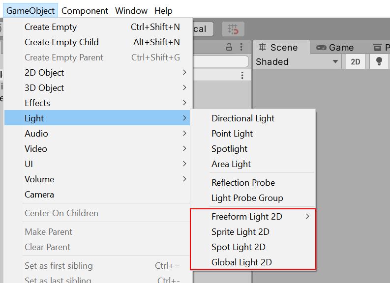

# 2D 图形特性

URP 提供的 2D 功能包括 [2D 光照](Lights-2D-intro.md) 渲染管线，它允许您创建 **2D Lights** 并实现 2D 光照效果。此外，[2D 像素完美相机](2d-pixelperfect.md) 可帮助您的项目实现像素化视觉风格。以下是 Light 2D 组件包含的不同 2D 光照类型：

- [自由形状光（Freeform）](LightTypes.md#freeform)
- [精灵光（Sprite）](LightTypes.md#sprite)
- [聚光灯（Spot）](LightTypes.md#spot) (**注意:** 从 URP 11 开始，**点光源（Point）** 已重命名为 **聚光灯（Spot）**。)
- [全局光（Global）](LightTypes.md#global)

> **重要提示**：从 URP 11 开始，[参数化光（Parametric）](LightTypes.md#parametric) 已被弃用。要将现有的参数化光转换为自由形状光，请前往：
> **Edit > Render Pipeline > Universal Render Pipeline > Upgrade Project/Scene Parametric Lights to Freeform**

该包还包含 **2D 渲染器数据（2D Renderer Data）** 资源，其中包含 **混合样式（Blend Styles）** 参数，并允许您为项目创建最多四种自定义光照操作。

> **注意**：如果启用了实验性的 2D 渲染器（路径：**Graphics Settings** > 在 **Scriptable Render Pipeline Settings** 下添加 2D 渲染器资源），那么 URP 资源中的某些与 3D 渲染相关的选项不会影响最终应用或游戏的表现。