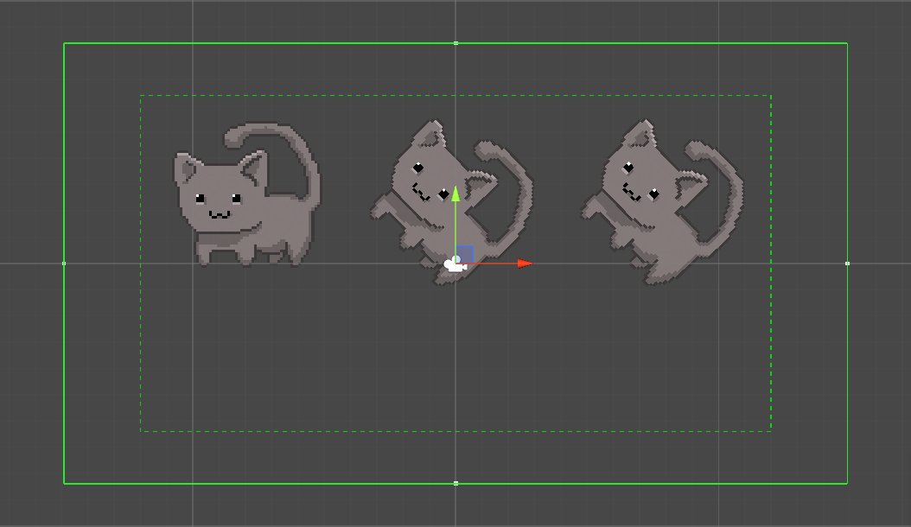
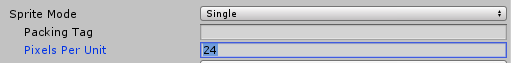
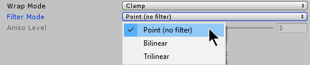
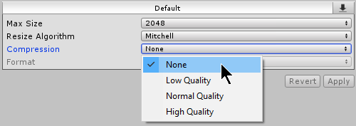
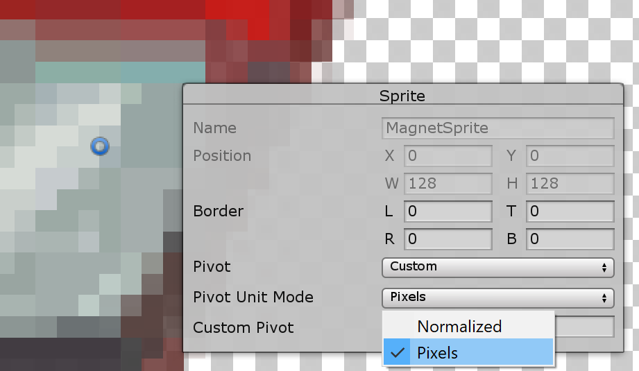
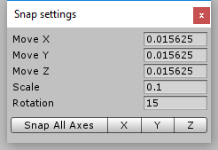
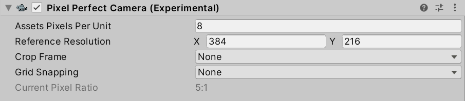
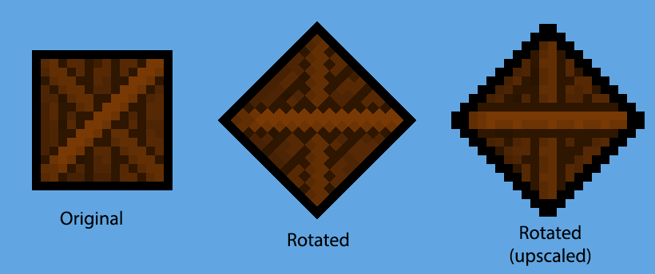
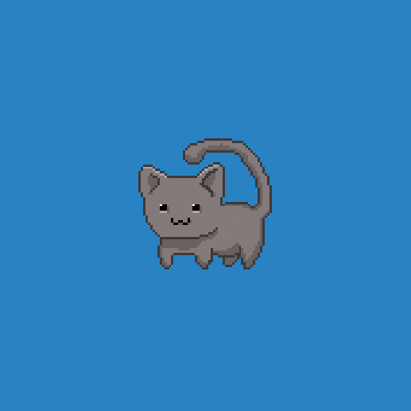
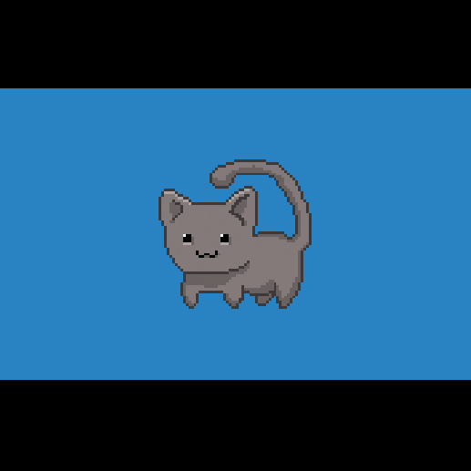

# 2D Pixel Perfect

**2D Pixel Perfect** 包含 **Pixel Perfect Camera** 组件，该组件可确保您的像素艺术在不同分辨率下保持清晰锐利，并且运动时稳定不抖动。

该组件可自动计算 Unity 需要的缩放，以适应分辨率变化，您无需手动调整。您可以使用组件设置来自定义相机视口内的像素渲染定义，并可通过 **Run in Edit Mode** 功能立即在 **Game 视图** 中预览更改。

将 **Pixel Perfect Camera** 组件附加到场景中的主相机 GameObject。它在 **Scene 视图** 中以相机 Gizmo 为中心，并由两个绿色边界框表示：
- **实线边界框**：表示 **Game 视图** 中的可见区域。
- **虚线边界框**：表示 **参考分辨率（Reference Resolution）**。

**参考分辨率** 是您的资源（Assets）所设计的原始分辨率，它对组件功能的影响在文档后续部分有详细说明。

在使用组件前，请确保按照以下步骤正确准备 Sprites，以获得最佳效果。

## 准备 Sprites

1. 导入贴图并设置为 **Sprite** 后，将所有 **Sprites** 的 **Pixels Per Unit（PPU）** 设为相同的值。

    

2. 在 **Sprites** 的 **Inspector** 窗口中，将 **Filter Mode** 设为 `Point`（点过滤）。

    

3. 将 **Compression** 设为 `None`（无压缩）。

    

4. 按以下步骤正确设置 Sprite 的 Pivot（枢轴）：
    1. 在 Sprite Inspector 中打开 **Sprite Editor**。
    2. 如果 **Sprite Mode** 设为 `Multiple`，且包含多个 Sprite 元素，则需要为每个 Sprite 元素单独设置 **Pivot**。
    3. 在 **Sprite 设置** 下，将 **Pivot** 设为 `Custom`，然后将 **Pivot Unit Mode** 设为 `Pixels`。这使您可以使用像素单位精确设置枢轴点的坐标，或在 **Sprite Editor** 中拖动枢轴点，并自动吸附到像素边角。
    4. 需要时，为每个 **Sprite 元素** 重复此步骤。

    

## Snap 设置（网格对齐）

为了确保 **Sprites** 在移动时保持像素级别的对齐，请按照以下步骤设置正确的 Snap 参数。

1. 打开 **Snap 设置**，路径：**Edit** > **Snap Settings**。
2. 设置 **Move X/Y/Z** 值，使其等于 `1 / Pixel Perfect Camera 的 Asset Pixels Per Unit（PPU）`。例如：
   - 如果 **PPU** 为 `100`，则 **Move X/Y/Z** 设为 `0.01`（1 / 100 = 0.01）。
3. **Unity 不会自动应用 Snap 设置到已有的 GameObject**，因此如果场景中已有 GameObjects，需手动选择它们，然后点击 **Snap All Axes** 以应用 Snap 设置。

## 组件属性

| **属性** | **功能** |
| --- | --- |
| **Asset Pixels Per Unit** | 设置场景中 1 个单位（Unit）包含多少像素。该值应与所有 **Sprites** 的 **Pixels Per Unit** 值匹配。 |
| **Reference Resolution** | 设定资源的原始设计分辨率。 |
| **Crop Frame** | 处理宽高比不同时的显示方式。 |
| **Grid Snapping** | 控制像素对齐方式。 |
| **Current Pixel Ratio** | 显示渲染后的 Sprite 相较于原始大小的比例。 |

## 其他属性详情

### 参考分辨率（Reference Resolution）

该值表示资源的原始设计分辨率。当场景和资源从该分辨率进行缩放时，像素艺术在高分辨率下仍可保持清晰。

### 网格对齐（Grid Snapping）

#### **Upscale Render Texture**

默认情况下，场景会渲染到最接近全屏分辨率的像素完美分辨率。

启用该选项后，场景会渲染到一个尽可能接近 **参考分辨率** 的临时纹理，同时保持全屏宽高比。然后该纹理会被放大到适应整个屏幕。

最终结果是不带抗锯齿和旋转的像素，这种风格可能适用于某些像素艺术游戏。

#### **Pixel Snapping**

启用该功能后，Sprite Renderer会在渲染时自动对齐到世界空间中的网格，网格大小基于 **Asset Pixels Per Unit**。

**Pixel Snapping** 主要作用是防止子像素（Subpixel）移动，确保 Sprite 仅以像素单位进行移动。该功能不会影响 GameObject 的Transform 位置。

### 画面裁剪（Crop Frame）

根据所选选项裁剪视口，并添加黑边（黑条）以匹配 **参考分辨率**，使 Game 视图适应全屏分辨率。

|  |  |
| :--------------------------------------------: | :------------------------------------------: |
|                   未裁剪                      |                   已裁剪                      |
