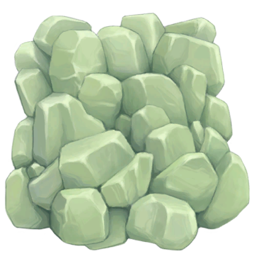
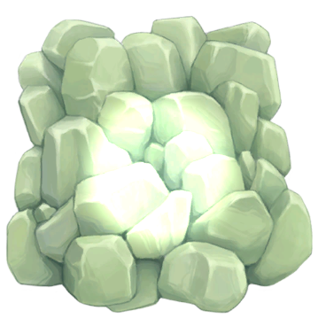
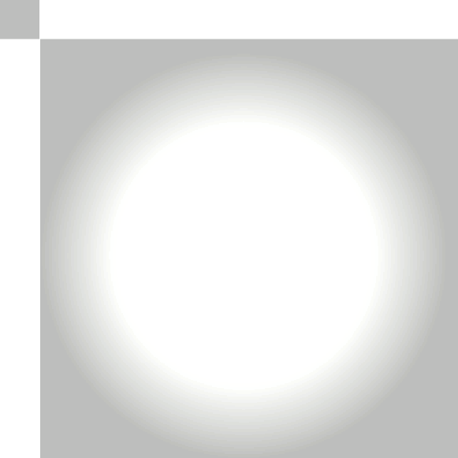

## HDR 模拟缩放

**2D 光照系统** 中的所有光源都支持 **HDR**。  
在 **RGBA32 颜色通道** 中，颜色值的范围通常为 `0 ~ 1`，而 **HDR 颜色通道** 可以超出 `1`。

|  |  |
| ---------------------------------------- | ------------------------------------------------------------ |
| 普通光源 RGB(1,1,1)                     | HDR 光源 RGB(1,1,1) + 光源 RGB(2,2,2)                      |

然而，并非所有平台都原生支持 HDR 纹理。  
**HDR 模拟缩放（HDR Emulation Scale）** 允许这些平台通过减少可表达的颜色数量来换取额外的光照强度范围。

### HDR Emulation Scale 的作用：
- 控制额外的光照强度范围。
- 数值过高 可能会导致 颜色条带化（Banding） 现象。

### 光照强度缩放示例：

|  |  |
| ----------------------------------- | ---------------------------------------------- |
| **HDR 参考**                        | **光照强度缩放 1（无 HDR）**                    |
|  |  |
| **光照强度缩放 4**                   | **光照强度缩放 12**                          |

### 如何选择 HDR Emulation Scale 的数值？

开发者应根据场景中**所有光源的最大亮度**来设定该数值，以确保合适的光照强度范围，并避免颜色条带化问题。