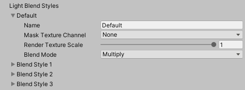
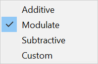
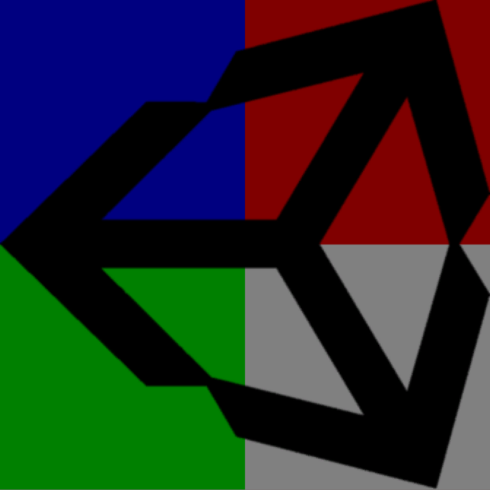
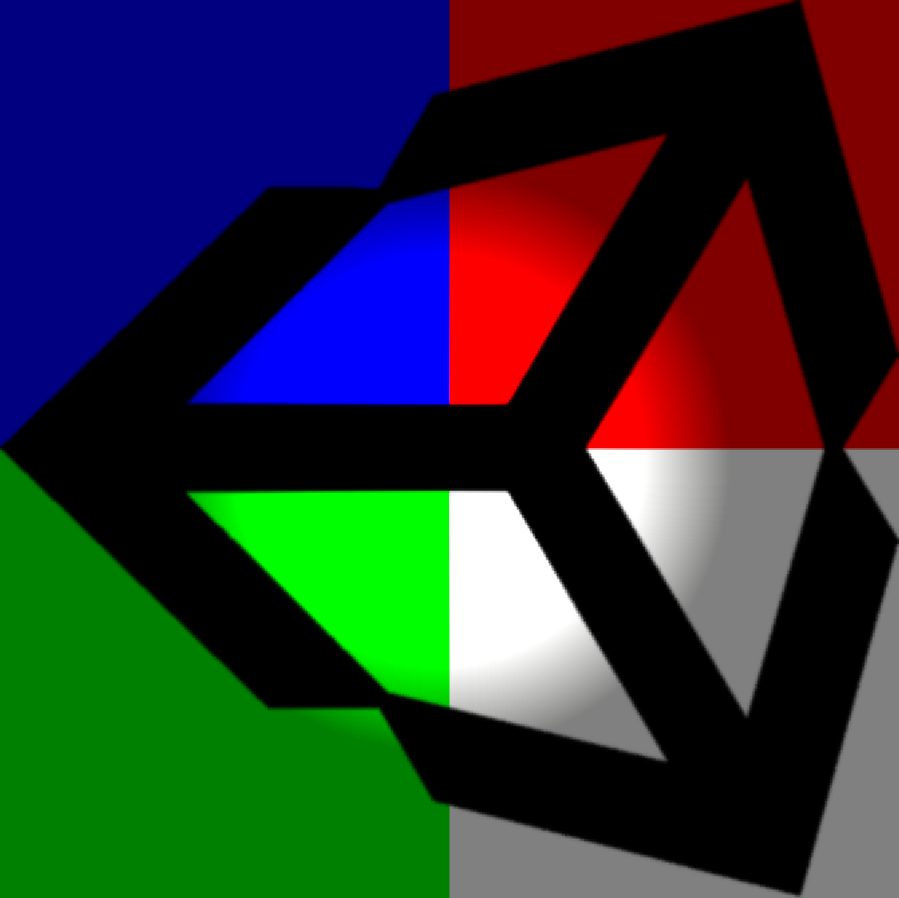
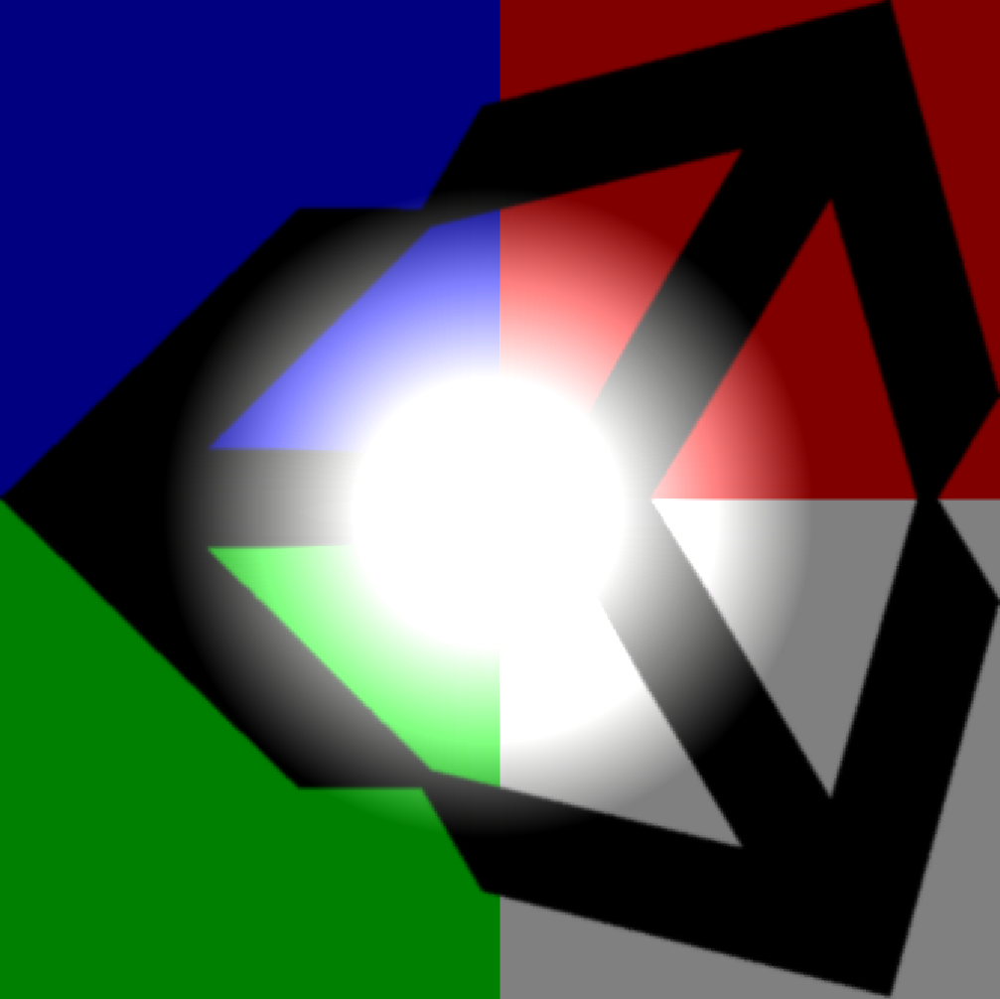
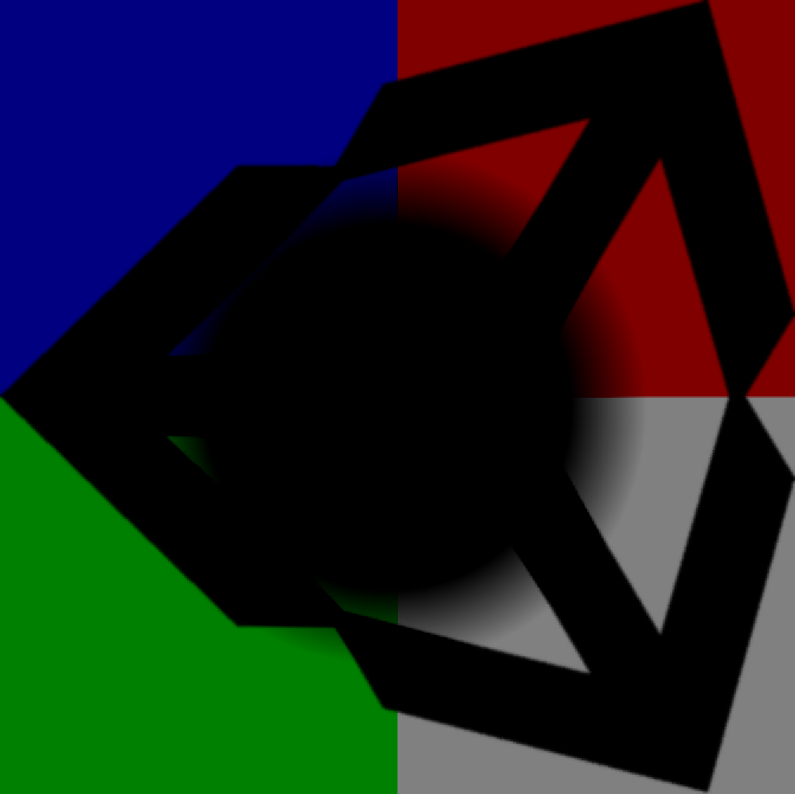
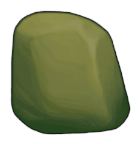
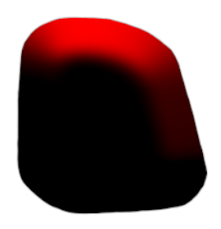
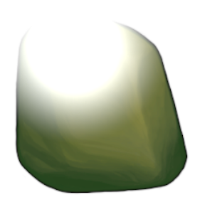
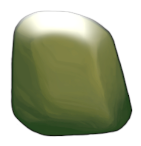

# 光照混合样式

**光照混合样式（Blend Styles）**决定了特定的光源如何与场景中的 Sprite 交互。场景中的所有光源必须从可用的 Blend Styles 中选择一个。URP 2D 资源 目前最多可以包含四种不同的 Light Blend Styles，默认情况下，会启用 “Default” 混合样式。

| 属性                 | 功能                                                   |
| ------------------------ | ------------------------------------------------------------ |
| **Name**                | 在 Light2D 组件中选择 Blend Style 时显示的名称。 |
| **Mask Texture Channel** | 选择用于此 Blend Style 的遮罩通道，以应用到 Sprite。 |
| **Render Texture Scale** | 该 Blend Style 所创建的 内部渲染纹理 的缩放比例。 |
| **Blend Mode**           | 当光源选择此 Blend Style 时，Light2D 采用的混合模式。 |

## 混合模式（Blend Mode）

混合模式决定了光照如何影响 Sprite。  
下方示例展示了 四种预设混合模式 的效果：

|  |     |
| ------------------------------------ | ----------------------------------- |
| 原始 Sprite                      | Multiply（乘法混合）             |
|   |  |
| Additive（加法混合）               | Subtractive（减法混合）           |

## 自定义混合模式（Custom Blend Modes）

所有可用的 混合模式 都可以通过自定义混合因子（Custom Blend Factors） 进行定义。  
下方列出了现有混合模式的因子设置：

- Multiplicative
  - Modulate = `1`
  - Additive = `0`
  
- Additive
  - Modulate = `0`
  - Additive = `1`
  
- Subtractive
  - Modulate = `0`
  - Additive = `-1`

## 遮罩纹理通道（Mask Texture Channel）

遮罩控制光照对 Sprite 影响的区域。  
可选择以下 4 个通道 作为遮罩通道：Red、Blue、Green 和 Alpha。  
在遮罩中：
- 最大值（max）= 100% 受光
- 最小值（min）= 0% 受光

|  |  |
| ---------------------------------- | ------------------------------ |
| 原始岩石颜色                    | 应用遮罩的岩石                 |
|  |  |
| 加法光照混合                      | 带遮罩的加法光照混合             |

## 渲染纹理缩放（Render Texture Scale）

Render Texture Scale 调整给定 Blend Mode 所使用的内部渲染纹理的大小。  

- 降低 Render Texture Scale 可以提高性能，并减少包含大光源的场景的内存占用。
- 降低过多 可能会导致视觉伪影或场景运动时的闪烁效果。

