## 自由形态（Freeform）

选择 __Freeform__ 光照类型，以使用可编辑的多边形和样条编辑器创建光源。要开始编辑形状，选择光源，并在其 Inspector 窗口中找到 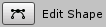 按钮。选择该按钮以启用形状编辑模式。

在内部多边形的轮廓上单击鼠标即可添加新的控制点。选择控制点并按 Delete 键可移除控制点。

__Freeform__ 光照类型具有以下额外属性：

| 属性                 | 功能                                                         |
| -------------------- | ------------------------------------------------------------ |
| __Falloff__         | 调整从形状中心到边缘的光照过渡（由实到透）的程度。           |
| __Falloff Intensity__ | 调整光照的衰减曲线。                                        |
| __Falloff Offset__  | 设置外部衰减形状的偏移量。                                   |

| 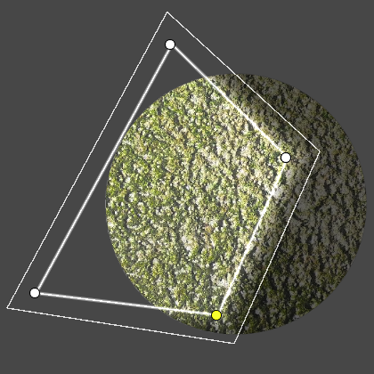 | 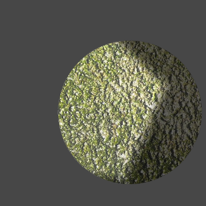 |
| ---------------------------------- | ------------------------------ |
| 自由形态光照的编辑模式             | 生成的光照效果                 |

在创建 __Freeform__ 光照时，请避免自交（Self-intersection），否则可能会导致意外的光照效果。自交可能发生在创建的轮廓边缘彼此交叉，或者在衰减范围过大导致其自身重叠时。为避免这些问题，建议调整光照形状，直至消除自交现象。

| 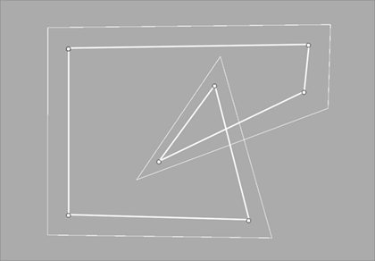 | 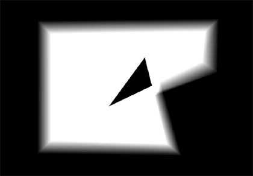 |
| ------------------------------------------------------ | ------------------------------------------------------ |
| 编辑模式下的轮廓自交                                   | 带有黑色三角伪影的光照效果                             |

| 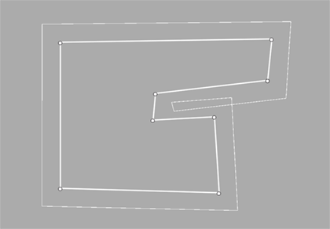 | 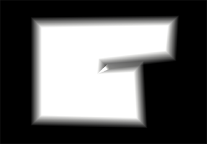 |
| ------------------------------------------------------ | ------------------------------------------------------ |
| 编辑模式下的衰减重叠                                   | 由于衰减重叠导致的双重照明区域                         |

## 参数化（Parametric）

__Parametric__ 光照类型已被弃用。要将现有的参数化光照转换为 __Freeform__ 光照，请前往 **Edit > Rendering > Lights > Upgrade Project/Scene URP Parametric Lights to Freeform**。

## 精灵（Sprite）

选择 __Sprite__ 光照类型，以基于选定的精灵（Sprite）创建光源。通过在附加的 __Sprite__ 属性中指定选定的精灵，即可完成光照设置。

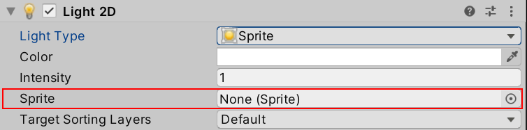

| 属性       | 功能                          |
| ---------- | ----------------------------- |
| __Sprite__ | 选择一个精灵作为光源。        |

| 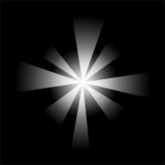 | 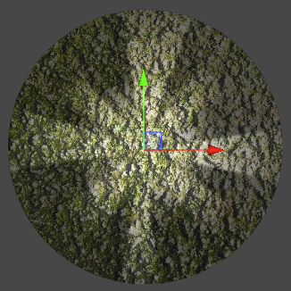 |
| -------------------------------- | -------------------------------- |
| 选定的精灵                       | 生成的光照效果                   |

## 聚光（Spot）

选择 __Spot__ 光照类型，以精确控制光源的角度和方向，并可调整以下额外属性：

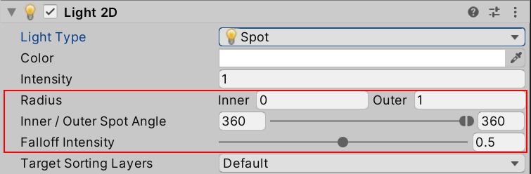

| 属性              | 功能                                                         |
| ---------------- | ------------------------------------------------------------ |
| **Radius Inner** | 通过此设置或使用操作柄（Gizmo）设置内半径。内半径范围内的光照将达到最大[强度](2DLightProperties.md#intensity)。 |
| __Radius Outer__ | 通过此设置或使用操作柄设置外半径。光照强度会在靠近外半径时逐渐降低至零。 |
| __Inner / Outer Spot Angle__  | 通过滑块或操作柄设置角度。内角和外角范围内的光照强度由内半径和外半径决定。 |

| 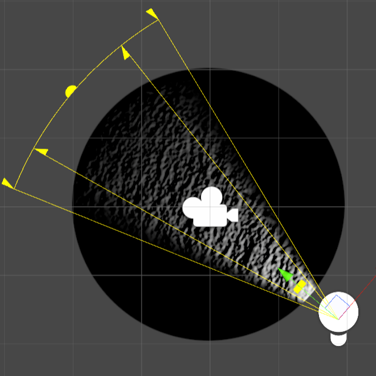 | 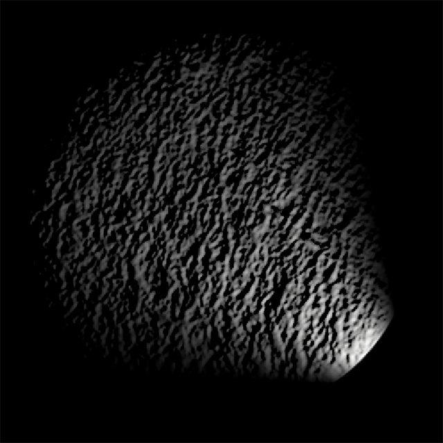 |
| ---------------------------------- | ---------------------------------- |
| 编辑模式下的点光源                 | 生成的光照效果                     |

## 全局（Global）

全局光照（Global Lights）会照亮所有位于[目标排序层](2DLightProperties.md#target-sorting-layers)的对象。每个 [Blend Style](LightBlendStyles.md) 以及每个排序层只能使用一个全局光照。
