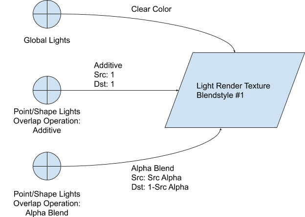
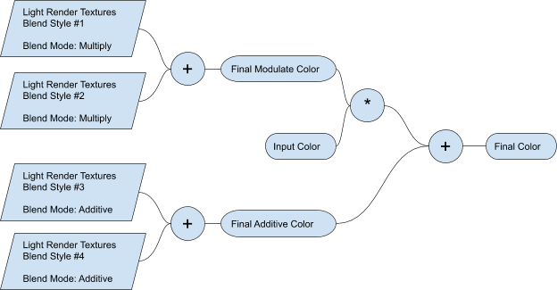

# 2D 光照系统简介
URP 提供的 2D 光照系统包含一组对美术友好的工具和运行时组件，帮助你通过 Unity 的核心组件（如 [Sprite Renderer](https://docs.unity.cn/cn/tuanjiemanual/Manual/class-SpriteRenderer.html)）和 2D 光照组件快速创建光照效果的 2D 场景。2D 光照组件是 3D 光照组件的 2D 对应版本。

这些工具被设计为与 2D 渲染器（如 [Sprite Renderer](https://docs.unity.cn/cn/tuanjiemanual/Manual/Sprites.html)、[Tilemap Renderer](https://docs.unity.cn/cn/tuanjiemanual/Manual/class-Tilemap.html) 和 [Sprite Shape Renderer](https://docs.unity.cn/cn/tuanjiemanual/Manual/class-SpriteShapeRenderer.html)）无缝集成。此外，该系统的工具和组件针对移动设备进行了优化，并可在多个平台上运行。

## 2D 光源与 3D 光源的区别
2D 光源与 3D 光源在实现和行为上有几个关键区别，包括以下方面：

### 新的 2D 专用组件和渲染通道
2D 光照系统包含一组专门用于 2D 光照和渲染的 2D 光照组件、[Shader Graph](ShaderGraph.md) 子目标以及自定义的 2D 渲染通道。此外，编辑器工具也包含在该包中，以便配置 2D 光源和渲染通道。

### 共面
2D 光照模型专为共面和多层次的 2D 世界而设计。2D 光源不需要在其自身与所照亮的对象之间存在深度分离。2D 阴影系统同样适用于共面环境，并且不需要深度分离。

### 非物理光照
2D 光源的光照计算并不像 3D 光源那样基于物理计算。光照模型的计算细节可以在相关文档中找到。

### 无法与 3D 光源和 3D 渲染器互操作
3D 和 2D 光源分别只会影响 3D 和 2D 渲染器。2D 光照不会影响 3D 渲染器（如 [Mesh Renderer](https://docs.unity.cn/cn/tuanjiemanual/Manual/class-MeshRenderer.html)），同样，3D 光照也不会影响 2D 渲染器（如 [Sprite Renderer](https://docs.unity.cn/cn/tuanjiemanual/Manual/class-SpriteRenderer.html)）。目前，若需要在同一场景中结合使用 2D 和 3D 光源以及 2D 和 3D 渲染器，可以使用多个相机，并让其中一个相机渲染到 [Render Texture](https://docs.unity.cn/cn/tuanjiemanual/Manual/class-RenderTexture.html)，然后在另一个相机的材质中采样该纹理。

## 2D 光照渲染管线的技术细节
2D 光照渲染管线的渲染过程可分为两个不同的阶段：
1. 绘制光照渲染纹理
2. 绘制渲染器

光照渲染纹理是 [Render Textures](https://docs.unity.cn/cn/tuanjiemanual/Manual/class-RenderTexture.html)，其中包含光源的颜色和形状信息，以屏幕空间存储。

这两个阶段仅会针对每组独立照明的光照层重复执行。换句话说，如果 [Sorting Layers](https://docs.unity.cn/cn/tuanjiemanual/Manual/class-TagManager.html#SortingLayers) 1 到 4 具有完全相同的光源集合，则上述操作只会执行一次。

默认设置允许在绘制渲染器之前预先绘制一定数量的 [批次](https://docs.unity.cn/cn/tuanjiemanual/Manual/DrawCallBatching.html)，以减少目标切换。理想情况下，渲染管线会先渲染所有批次的光照渲染纹理，然后再绘制渲染器，以避免频繁加载和卸载颜色目标。详细信息请参考 [优化](#优化)。

### <a name="pre-phase">预处理阶段：计算排序层批处理</a>
在进入渲染阶段之前，2D 光照渲染管线会首先分析场景，以评估哪些层可以合并到同一个绘制操作中。满足以下条件的层可以进行合批：
1. 这些层是连续的。
2. 这些层共享完全相同的光源集合。

强烈建议尽可能多地合批层，以最小化光照渲染纹理的绘制次数并提高性能。

### 阶段 1：绘制光照渲染纹理
在预处理阶段完成批处理后，渲染管线会为该批次绘制光照纹理。这实际上是在 Render Texture 上绘制光源的形状。光源的颜色和形状可以根据光源设置使用“加法”或“Alpha 混合”模式混合到目标光照渲染纹理上。

值得注意的是，光照渲染纹理仅在至少有一个 2D 光源指向它时才会创建。例如，如果某一层的所有光源仅使用 **Blendstyle #1**，则只会创建一个光照渲染纹理。

### 阶段 2：绘制渲染器
在绘制完所有光照渲染纹理后，渲染管线会继续绘制渲染器。系统会跟踪哪些渲染器使用了哪些光照渲染纹理，并在 [预处理阶段](#pre-phase) 进行关联。

当渲染器被绘制时，它可以访问所有可用的光照渲染纹理（每种混合风格对应一个）。在 Shader 中，最终颜色是通过输入颜色与光照渲染纹理的颜色按照指定操作组合计算得出的。

上图展示了一个使用四种混合风格的示例，说明了如何组合多个混合风格。在大多数情况下，通常只需要两种混合风格来实现所需的效果。

## 优化
除了减少绘制调用、剔除和优化 Shader 等标准优化技术外，2D 光照渲染管线还具有几种独特的优化方法和考虑因素。

### 混合风格的数量
提高渲染性能的最简单方法是减少混合风格的数量。每种混合风格都会创建一个需要渲染并上传的 Render Texture。

减少混合风格的数量可以直接提高性能。对于简单场景，单个混合风格可能就足够了，而在一般情况下，场景中最多使用 2 种混合风格较为常见。

### 光照渲染纹理的比例
2D 光照系统依赖于屏幕空间的光照渲染纹理来捕捉光照贡献。这意味着需要大量的 Render Texture 进行绘制和上传。选择合适的 Render Texture 大小会直接影响性能。

默认情况下，该比例设定为屏幕分辨率的 0.5 倍。较小的光照渲染纹理尺寸可以提高性能，但可能会产生视觉伪影。半屏幕大小的分辨率通常能提供较好的性能，并且在大多数情况下几乎不会出现可察觉的伪影。

建议根据项目需求进行调整和实验。

### 层批处理
为了进一步减少光照渲染纹理的数量，确保 Sorting Layer 可批处理非常重要。共享相同光源集合的层可以合批，而独立照明的层将拥有自己的光照渲染纹理，从而增加工作量。

### 预渲染光照渲染纹理
多个光照渲染纹理可以在绘制渲染器之前提前渲染。在理想情况下，所有光照渲染纹理都会先行渲染，然后再绘制渲染器到最终颜色输出，从而减少最终颜色输出的加载/卸载/重新加载操作。

### 法线贴图
使用法线贴图模拟深度目前是一个非常昂贵的操作。如果启用该功能，则会在深度预处理阶段创建一个完整大小的 Render Texture，并将渲染器绘制到其中，每个层批处理都需要执行此操作。

如果不需要法线贴图来模拟深度感知，请确保所有光源的法线贴图选项均已禁用。
