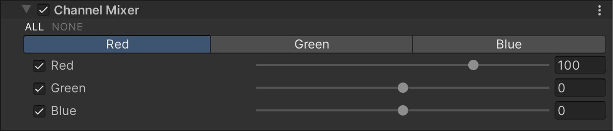

# Channel Mixer

Channel Mixer 效果可修改每个输入颜色通道对最终输出通道的影响。例如，如果增加绿色通道对红色通道的影响，最终图像中所有绿色区域（包括中性/单色区域）都会呈现更偏红的色调。

## 使用 Channel Mixer

**Channel Mixer** 使用 [Volume](Volumes.md) 框架，因此要启用和修改 **Channel Mixer** 的属性，必须在场景中的 [Volume](Volumes.md) 组件中添加 **Channel Mixer** 覆盖。

### 在 Volume 中添加 Channel Mixer：

1. 在 **Scene** 视图或 **Hierarchy** 视图中，选择包含 Volume 组件的 GameObject，以在 Inspector 中查看。
2. 在 **Inspector** 窗口中，点击 **Add Override > Post-processing**，然后选择 **Channel Mixer**。  
   **Universal Render Pipeline** 会将 **Channel Mixer** 应用于该 Volume 影响的所有相机。

## 属性

### 输出通道（Output Channels）

在修改输入通道的影响之前，必须先选择要调整的输出颜色通道。  
点击相应的通道按钮，即可设置其影响程度。

| **属性** | **描述**                                                     |
| -------- | ------------------------------------------------------------ |
| **Red**  | 通过滑块调整红色通道对选定输出通道的影响。 |
| **Green** | 通过滑块调整绿色通道对选定输出通道的影响。 |
| **Blue** | 通过滑块调整蓝色通道对选定输出通道的影响。 |
