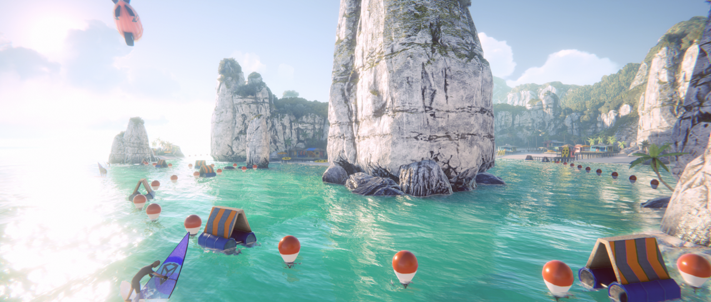
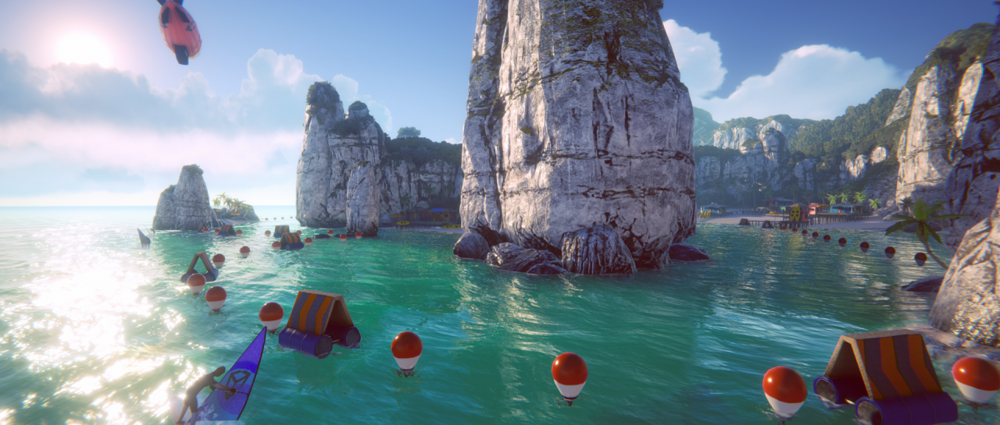
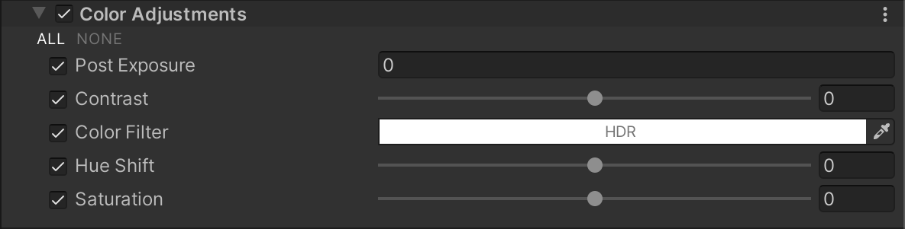

# 颜色调整（Color Adjustments）

使用此效果可调整最终渲染图像的整体色调、亮度和对比度。

  
_未启用 Color Adjustments 效果的场景。_

  
_启用 Color Adjustments 效果的场景。_

## 使用 Color Adjustments

**Color Adjustments** 使用 [Volume](Volumes.md) 框架，因此要启用和修改 **Color Adjustments** 的属性，必须在场景中的 [Volume](Volumes.md) 组件中添加 **Color Adjustments** 覆盖。

### 在 Volume 中添加 Color Adjustments：

1. 在 **Scene** 视图或 **Hierarchy** 视图中，选择包含 Volume 组件的 GameObject，以在 Inspector 中查看。
2. 在 **Inspector** 窗口中，点击 **Add Override > Post-processing**，然后选择 **Color Adjustments**。  
   **Universal Render Pipeline** 会将 **Color Adjustments** 应用于该 Volume 影响的所有相机。

## 属性

| **属性**          | **描述**                                                     |
| ---------------- | ------------------------------------------------------------ |
| **Post Exposure** | 调整场景的整体曝光度（单位为 EV）。URP 在 HDR 效果之后、色调映射（Tonemapping）之前应用此调整，因此不会影响处理链中的前置效果。 |
| **Contrast**      | 通过滑块扩展或缩小整体色调范围。较大的正值可扩展色调范围，而较低的负值会收缩色调范围。 |
| **Color Filter**  | 选择颜色滤镜，使整个渲染结果乘以该颜色，并调整最终画面色调。 |
| **Hue Shift**     | 使用滑块调整所有颜色的色相（Hue）。 |
| **Saturation**    | 使用滑块调整所有颜色的饱和度（Saturation）。 |
