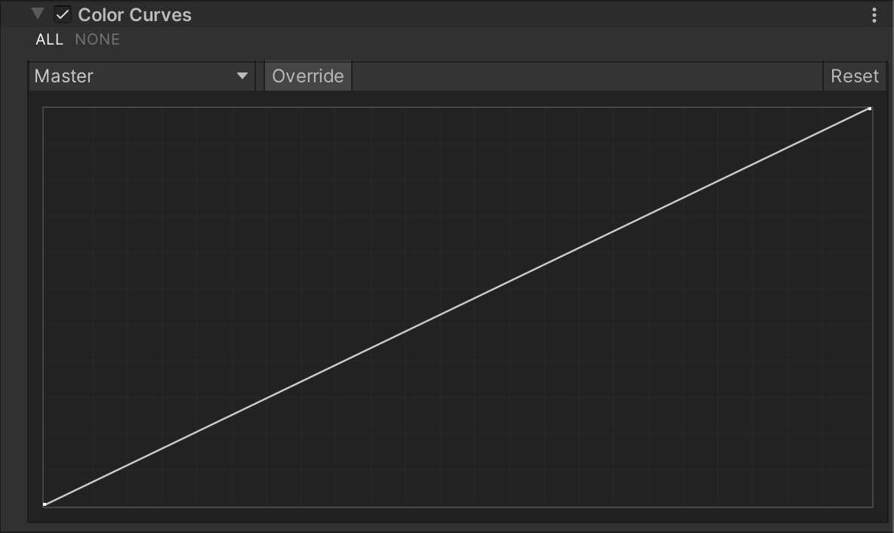

# 颜色曲线（Color Curves）

颜色分级曲线（Grading Curves）是一种高级调整方式，可针对特定的色相（Hue）、饱和度（Saturation）或亮度（Luminosity）进行微调。你可以使用八种不同的曲线来实现特定色相替换、降低特定亮度范围的饱和度等效果。

## 使用 Color Curves

**Color Curves** 使用 [Volume](Volumes.md) 框架，因此要启用和修改 **Color Curves** 的属性，必须在场景中的 [Volume](Volumes.md) 组件中添加 **Color Curves** 覆盖。

### 在 Volume 中添加 Color Curves：

1. 在 **Scene** 视图或 **Hierarchy** 视图中，选择包含 Volume 组件的 GameObject，以在 Inspector 中查看。
2. 在 **Inspector** 窗口中，点击 **Add Override > Post-processing**，然后选择 **Color Curves**。  
   **Universal Render Pipeline** 会将 **Color Curves** 应用于该 Volume 影响的所有相机。

## 属性

| **曲线**        | **描述**                                                     |
| -------------- | ------------------------------------------------------------ |
| **Master**     | 影响整个图像的亮度（Luminance）。图表的 x 轴表示输入亮度，y 轴表示输出亮度。可用于同时调整所有颜色通道的对比度和亮度。 |
| **Red**        | 影响整个图像的红色通道强度。图表的 x 轴表示输入强度，y 轴表示红色通道的输出强度。 |
| **Green**      | 影响整个图像的绿色通道强度。图表的 x 轴表示输入强度，y 轴表示绿色通道的输出强度。 |
| **Blue**       | 影响整个图像的蓝色通道强度。图表的 x 轴表示输入强度，y 轴表示蓝色通道的输出强度。 |
| **Hue Vs Hue** | 调整输入色相（x 轴）对应的输出色相（y 轴）。可用于微调特定范围内的色相或进行颜色替换。 |
| **Hue Vs Sat** | 根据输入色相（x 轴）调整饱和度（y 轴）。可用于降低特定颜色的饱和度，或创建单色调场景，仅保留主色调。 |
| **Sat Vs Sat** | 根据输入饱和度（x 轴）调整输出饱和度（y 轴）。可用于微调通过 [Color Adjustments](Post-Processing-Color-Adjustments.md) 进行的饱和度调整。 |
| **Lum Vs Sat** | 根据输入亮度（x 轴）调整饱和度（y 轴）。可用于降低暗部区域的饱和度，从而创造视觉对比效果。 |
