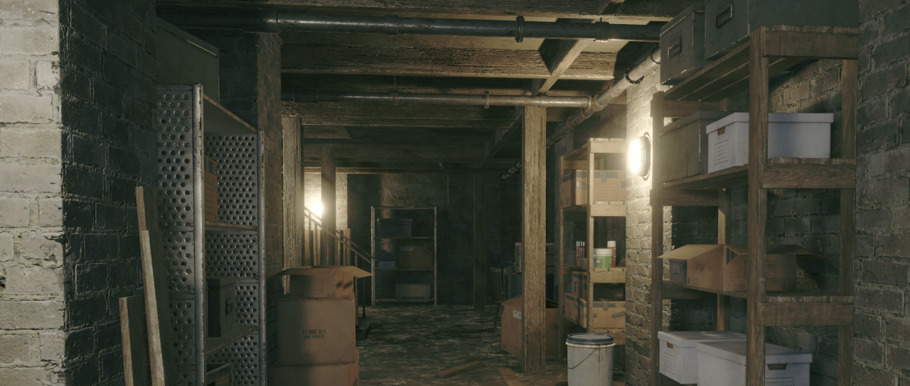
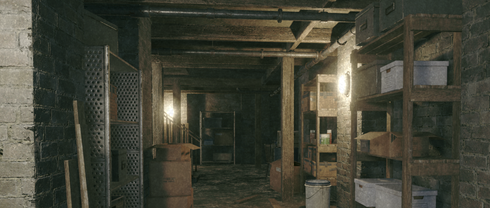
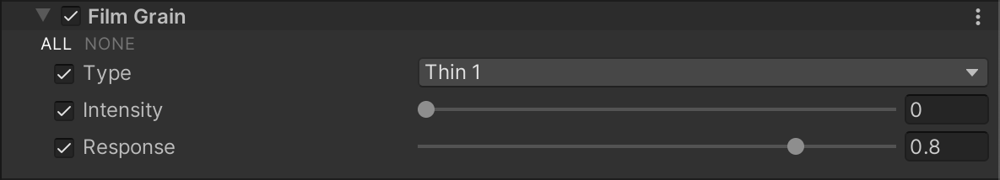
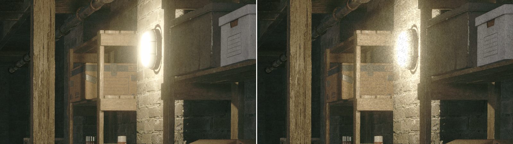

# 胶片颗粒（Film Grain）

  
_未启用 Film Grain 效果的场景。_

  
_启用 Film Grain 效果的场景。_

**Film Grain** 效果模拟了胶片摄影中的随机光学颗粒纹理，通常是由于物理胶片上存在微小颗粒而导致的。

## 使用 Film Grain

**Film Grain** 使用 [Volume](Volumes.md) 框架，因此要启用和修改 **Film Grain** 的属性，必须在场景中的 [Volume](Volumes.md) 组件中添加 **Film Grain** 覆盖。

### 在 Volume 中添加 Film Grain：

1. 在 **Scene** 视图或 **Hierarchy** 视图中，选择包含 Volume 组件的 GameObject，以在 Inspector 中查看。
2. 在 **Inspector** 窗口中，点击 **Add Override > Post-processing**，然后选择 **Film Grain**。  
   **Universal Render Pipeline** 会将 **Film Grain** 应用于该 Volume 影响的所有相机。

## 属性

| **属性**     | **描述**                                                     |
| ----------- | ------------------------------------------------------------ |
| **Type**    | 选择要使用的颗粒类型。可以从 URP 预设的颗粒类型中选择，或选择 **Custom** 以提供自定义颗粒纹理。 |
| **Texture** | 选择一个自定义的颗粒纹理作为 Film Grain 效果的基础。仅当 **Type** 设为 **Custom** 时可用。 |
| **Intensity** | 通过滑块调整 Film Grain 效果的强度。 |
| **Response** | 通过滑块调整颗粒噪声响应曲线。值越高，亮部区域的颗粒噪声越少。  _左侧：Response 值为 1，右侧：Response 值为 0。_ |
