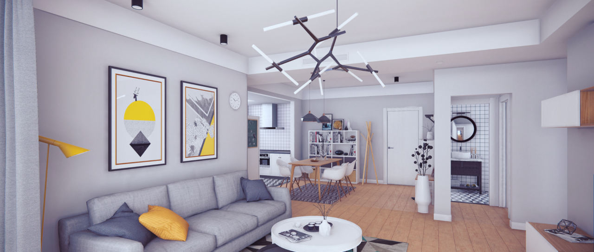
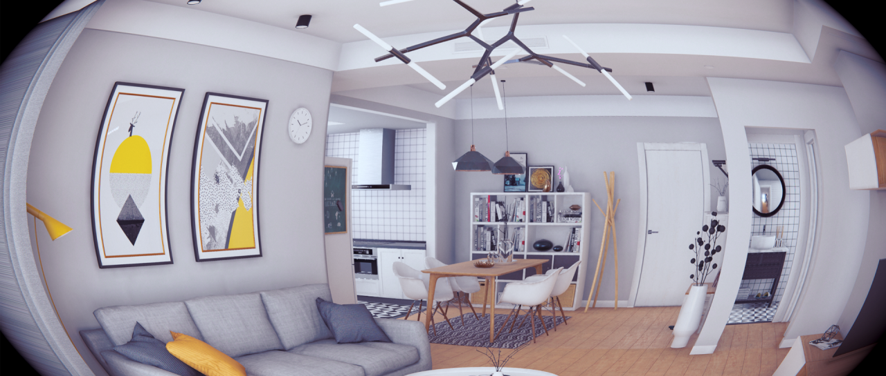
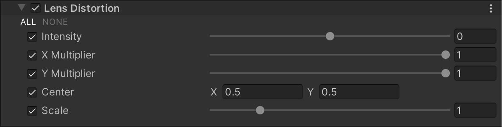

# 镜头畸变（Lens Distortion）

  
_未启用 Lens Distortion 效果的场景。_

  
_启用 Lens Distortion 效果的场景。_

**Lens Distortion** 效果可对最终渲染的画面进行变形，以模拟真实世界相机镜头的形状和光学特性。

## 使用 Lens Distortion

**Lens Distortion** 使用 [Volume](Volumes.md) 框架，因此要启用和修改 **Lens Distortion** 的属性，必须在场景中的 [Volume](Volumes.md) 组件中添加 **Lens Distortion** 覆盖。

### 在 Volume 中添加 Lens Distortion：

1. 在 **Scene** 视图或 **Hierarchy** 视图中，选择包含 Volume 组件的 GameObject，以在 Inspector 中查看。
2. 在 **Inspector** 窗口中，点击 **Add Override > Post-processing**，然后选择 **Lens Distortion**。  
   **Universal Render Pipeline** 会将 **Lens Distortion** 应用于该 Volume 影响的所有相机。

## 属性

| **属性**         | **描述**                                                     |
| -------------- | ------------------------------------------------------------ |
| **Intensity**  | 通过滑块调整整体畸变效果的强度。 |
| **X Multiplier** | 通过滑块调整 x 轴方向的畸变强度。该值为乘数，可将其设为 0 以禁用该轴上的畸变。 |
| **Y Multiplier** | 通过滑块调整 y 轴方向的畸变强度。该值为乘数，可将其设为 0 以禁用该轴上的畸变。 |
| **Center**     | 设置畸变效果在屏幕上的中心点。 |
| **Scale**      | 通过滑块调整全局屏幕缩放，以放大渲染画面并隐藏屏幕边缘的畸变像素。当畸变强度较高时，屏幕边界的像素可能会破损，因为这些像素依赖于屏幕外不存在的信息。此属性可用于隐藏屏幕边缘的损坏像素。 |
