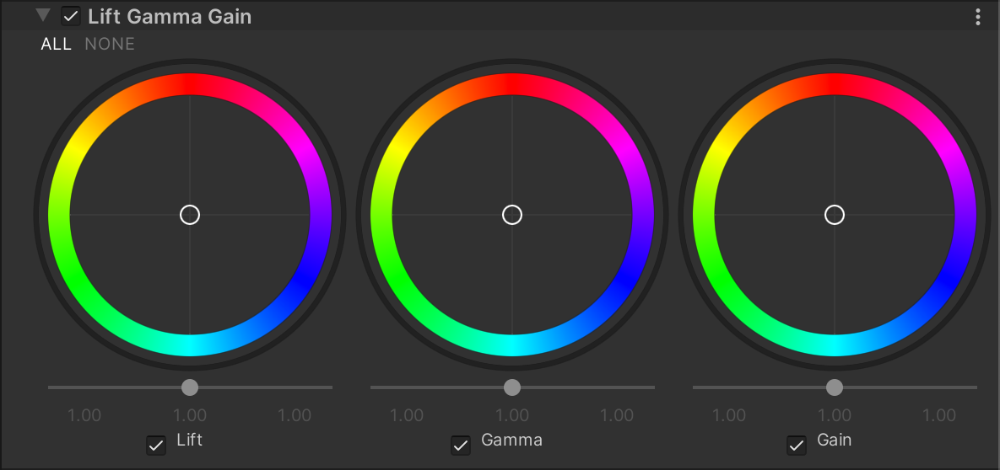

# Lift Gamma Gain

该效果允许你进行三向色彩分级（Three-way Color Grading）。**Lift Gamma Gain** 采用 [ASC CDL](https://en.wikipedia.org/wiki/ASC_CDL) 标准，使用轨迹球（Trackball）调整图像色调。  
当你调整轨迹球的位置时，它会将图像的色调朝选定颜色方向偏移，影响特定的色调范围。使用不同的轨迹球可以调整图像的不同色调范围，并通过轨迹球下方的滑块调整该色调范围的亮度偏移。

## 使用 Lift Gamma Gain

**Lift Gamma Gain** 使用 [Volume](Volumes.md) 框架，因此要启用和修改 Lift、Gamma 或 Gain 的设置，必须在场景中的 [Volume](Volumes.md) 组件中添加 **Lift Gamma Gain** 覆盖。

### 在 Volume 中添加 Lift Gamma Gain：

1. 在 **Scene** 视图或 **Hierarchy** 视图中，选择包含 Volume 组件的 GameObject，以在 Inspector 中查看。
2. 在 **Inspector** 窗口中，点击 **Add Override > Post-processing**，然后选择 **Lift Gamma Gain**。  
   **Universal Render Pipeline** 会将 **Lift Gamma Gain** 应用于该 Volume 影响的所有相机。

## 属性

| **属性**  | **描述**                                                     |
| -------- | ------------------------------------------------------------ |
| **Lift**  | 控制暗部色调，对阴影区域的影响更明显。<ul><li>使用轨迹球选择 URP 应将暗部色调偏移到的颜色。</li><li>使用滑块调整轨迹球颜色的亮度偏移。</li></ul> |
| **Gamma** | 控制中间调色彩，采用幂函数进行调整。<ul><li>使用轨迹球选择 URP 应将中间调色调偏移到的颜色。</li><li>使用滑块调整轨迹球颜色的亮度偏移。</li></ul> |
| **Gain**  | 增加信号强度，使高光部分更亮。<ul><li>使用轨迹球选择 URP 应将高光色调偏移到的颜色。</li><li>使用滑块调整轨迹球颜色的亮度偏移。</li></ul> |
