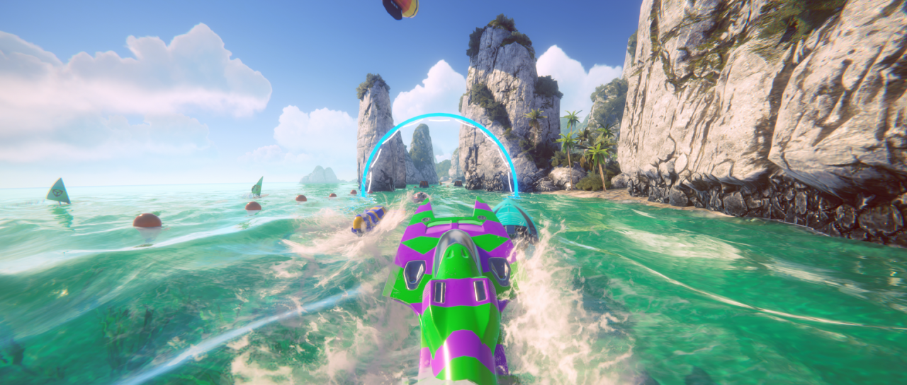
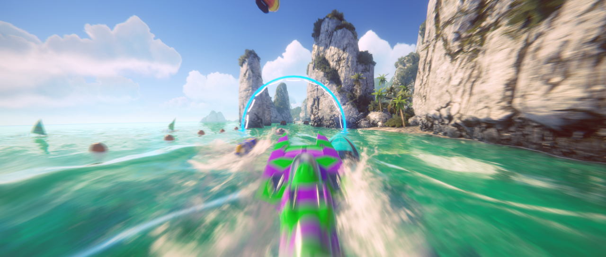
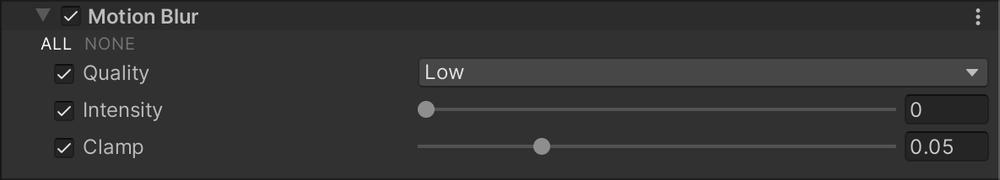

# 运动模糊（Motion Blur）

  
_未启用 Motion Blur 效果的场景。_

  
_启用 Motion Blur 效果的场景。_

**Motion Blur** 效果模拟了现实世界中相机在拍摄运动速度超过曝光时间的物体时产生的模糊。这通常发生在快速移动的物体或长曝光时间的情况下。

**Universal Render Pipeline（URP）仅支持相机运动模糊，而不支持物体运动模糊。**

## 使用 Motion Blur

**Motion Blur** 使用 [Volume](Volumes.md) 系统，因此要启用和修改 **Motion Blur** 的属性，必须在场景中的 [Volume](Volumes.md) 组件中添加 **Motion Blur** 覆盖。

### 在 Volume 中添加 Motion Blur：

1. 在 **Scene** 视图或 **Hierarchy** 视图中，选择包含 Volume 组件的 GameObject，以在 Inspector 中查看。
2. 在 **Inspector** 窗口中，点击 **Add Override > Post-processing**，然后选择 **Motion Blur**。  
   **Universal Render Pipeline** 会将 **Motion Blur** 应用于该 Volume 影响的所有相机。

## 属性

| **属性**     | **描述**                                                     |
| ----------- | ------------------------------------------------------------ |
| **Quality** | 设置运动模糊的质量。较低的预设可提高性能，但视觉质量会降低。 |
| **Intensity** | 设置运动模糊的强度，范围为 0 到 1。值越高，模糊效果越强，但可能会影响性能，具体取决于 **Clamp** 参数。 |
| **Clamp**   | 设置相机旋转导致的最大速度模糊长度，以限制高速度下的模糊效果，避免性能开销过高。该值以屏幕分辨率的比例测量，范围为 0 到 0.2，默认值为 0.05。 |

## 性能优化建议

要降低 Motion Blur 对性能的影响，可以：

- **降低** __Quality__ 级别。较低的质量设置可以提高性能，但可能会出现更多视觉伪影。
- **减少** __Clamp__ 值，以降低 Unity 计算的最大运动模糊速度。较低的值可提高性能。
