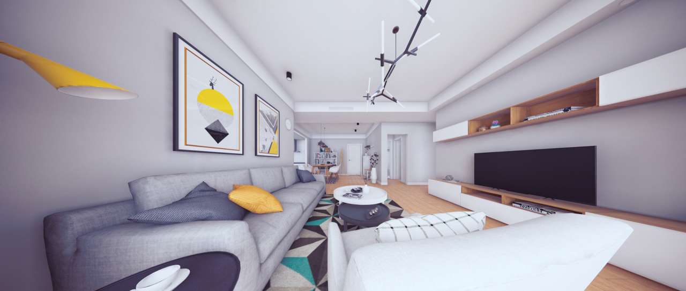
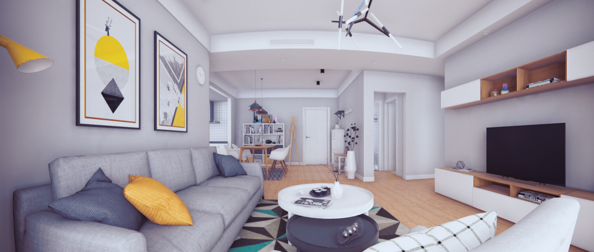
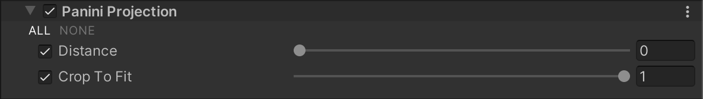

# 帕尼尼透视（Panini Projection）

  
_未启用 Panini Projection 效果的场景。_

  
_启用 Panini Projection 效果的场景。_

**Panini Projection** 适用于在视场角（Field of View）非常大的场景中渲染透视视图。  
帕尼尼投影是一种**柱状投影（Cylindrical Projection）**，它能够保持垂直直线的直立性，同时与其他柱状投影不同，它还能保持通过图像中心的放射状直线不发生弯曲。

有关 Panini Projection 的详细信息，请参考 [PanoTools 的 Panini 投影文档](https://wiki.panotools.org/The_General_Panini_Projection)。

## 使用 Panini Projection

**Panini Projection** 使用 [Volume](Volumes.md) 框架，因此要启用和修改 **Panini Projection** 的属性，必须在场景中的 [Volume](Volumes.md) 组件中添加 **Panini Projection** 覆盖。

### 在 Volume 中添加 Panini Projection：

1. 在 **Scene** 视图或 **Hierarchy** 视图中，选择包含 Volume 组件的 GameObject，以在 Inspector 中查看。
2. 在 **Inspector** 窗口中，点击 **Add Override > Post-processing**，然后选择 **Panini Projection**。  
   **Universal Render Pipeline** 会将 **Panini Projection** 应用于该 Volume 影响的所有相机。

## 属性

| **属性**        | **描述**                                                     |
| -------------- | ------------------------------------------------------------ |
| **Distance**   | 通过滑块调整 Panini 投影的变形强度。 |
| **Crop to Fit** | 通过滑块裁剪投影变形以适应屏幕。值为 1 时，变形会被裁剪到屏幕边缘，但如果 **Distance** 设置较高，可能会导致中心区域的精度损失。 |
