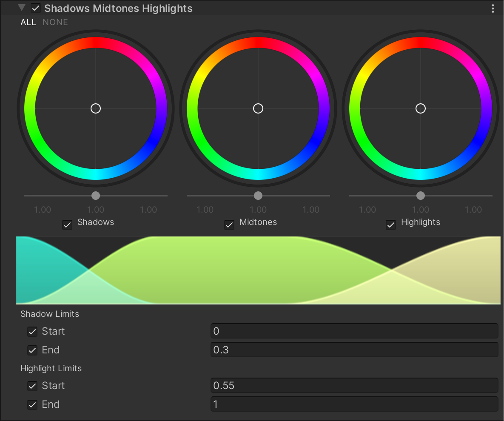

# Shadows Midtones Highlights

**Shadows Midtones Highlights** 效果可分别控制渲染图像中的阴影、中间调和高光。与 [Lift, Gamma, Gain](Post-Processing-Lift-Gamma-Gain.md) 不同，此效果允许你精确定义阴影、中间调和高光的色调范围。

## 使用 Shadows Midtones Highlights

**Shadows Midtones Highlights** 使用 [Volume](Volumes.md) 框架，因此要启用和修改渲染图像中的阴影、中间调或高光，必须在场景中的 [Volume](Volumes.md) 组件中添加 **Shadows Midtones Highlights** 覆盖。

### 在 Volume 中添加 Shadows Midtones Highlights：

1. 在 **Scene** 视图或 **Hierarchy** 视图中，选择包含 Volume 组件的 GameObject，以在 Inspector 中查看。
2. 在 **Inspector** 窗口中，点击 **Add Override > Post-processing**，然后选择 **Shadows Midtones Highlights**。  
   **Universal Render Pipeline** 会将 **Shadows Midtones Highlights** 应用于该 Volume 影响的所有相机。

## 属性

| **属性**      | **描述**                                                     |
| ------------- | ------------------------------------------------------------ |
| **Shadows**   | 用于控制阴影。使用轨迹球选择 URP 应将阴影的色调偏移到的颜色，并通过滑块调整该颜色的亮度偏移。 |
| **Midtones**  | 用于控制中间调。使用轨迹球选择 URP 应将中间调的色调偏移到的颜色，并通过滑块调整该颜色的亮度偏移。 |
| **Highlights**| 用于控制高光。使用轨迹球选择 URP 应将高光的色调偏移到的颜色，并通过滑块调整该颜色的亮度偏移。 |

### 图形视图

此图显示了 **Shadows**（蓝色）、**Midtones**（绿色）和 **Highlights**（黄色）的整体贡献，有助于直观展示各色调区域之间的过渡。

### 阴影限制

| **属性** | **描述**                                                     |
| -------- | ------------------------------------------------------------ |
| **Start**| 设置渲染中阴影与中间调过渡的起始点。                           |
| **End**  | 设置渲染中阴影与中间调过渡的终点。                             |

### 高光限制

| **属性** | **描述**                                                     |
| -------- | ------------------------------------------------------------ |
| **Start**| 设置渲染中中间调与高光过渡的起始点。                           |
| **End**  | 设置渲染中中间调与高光过渡的终点。                             |
