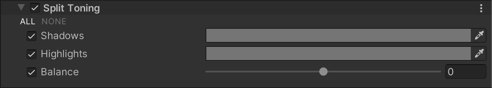

# 分离色调（Split Toning）

分离色调（Split Toning）效果可根据亮度值为图像的不同区域添加色调，从而帮助你实现更独特的视觉风格。通过这一效果，可以为场景中的阴影和高光部分添加不同的颜色。

## 使用 Split Toning

**Split Toning** 使用 [Volume](Volumes.md) 框架，因此要启用和修改分离色调属性，必须在场景中的 [Volume](Volumes.md) 组件中添加 **Split Toning** 覆盖。

### 在 Volume 中添加 Split Toning：

1. 在 **Scene** 视图或 **Hierarchy** 视图中，选择包含 Volume 组件的 GameObject，以在 Inspector 中查看。
2. 在 **Inspector** 窗口中，点击 **Add Override > Post-processing**，然后选择 **Split Toning**。  
   **Universal Render Pipeline** 会将 **Split Toning** 应用于该 Volume 影响的所有相机。

## 属性

调整各属性的颜色选择器时，应主要调节 **Hue**（色相）和 **Saturation**（饱和度）。  
**Value**（亮度）会影响整体图像的亮度变化。

| **属性**      | **描述**                                                     |
| ------------- | ------------------------------------------------------------ |
| **Shadows**   | 使用颜色选择器选择 URP 用于给阴影着色的颜色。                 |
| **Highlights**| 使用颜色选择器选择 URP 用于给高光着色的颜色。                 |
| **Balance**   | 使用滑块调整阴影和高光的色调平衡。较低的值使阴影色调更为显著，而高光色调较弱；较高的值则使高光色调更为显著，而阴影色调较弱。 |
