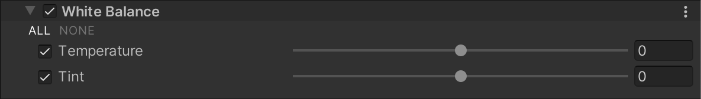

# 白平衡（White Balance）

白平衡组件可以去除不自然的色彩偏移，使现实生活中本应显示为白色的物体在最终渲染中确实显示为白色。您还可以使用白平衡为最终渲染创建整体偏冷或偏暖的效果。

## 使用 White Balance

**White Balance** 使用 [Volume](Volumes.md) 框架，因此要启用和修改 **White Balance** 属性，必须将 **White Balance** 覆盖添加到场景中的 [Volume](Volumes.md) 中。

要将 **White Balance** 添加到 Volume：

1. 在 Scene 或 Hierarchy 视图中，选择一个包含 Volume 组件的游戏对象，以便在 Inspector 中查看它。
2. 在 Inspector 中，导航到 **Add Override > Post-processing** 并点击 **White Balance**。URP 会将 **White Balance** 应用于该 Volume 影响的任何相机。

## 属性

| **属性**         | **描述**                                              |
| ---------------- | ------------------------------------------------------------ |
| **Temperature** | 使用滑块设置白平衡为自定义的色温。较高的值会产生较暖的色温，较低的值会产生较冷的色温。更多信息，请参阅 [Wikipedia: Color balance](https://en.wikipedia.org/wiki/Color_balance)。 |
| **Tint**        | 使用滑块补偿绿色或品红色的色偏。    |
