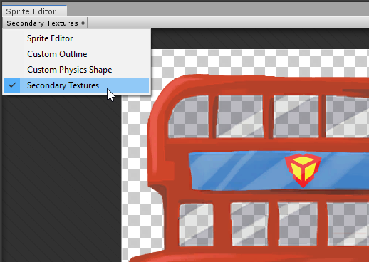
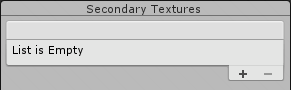
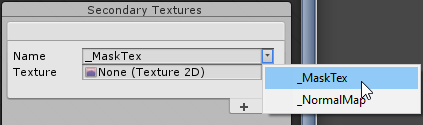
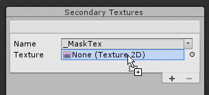
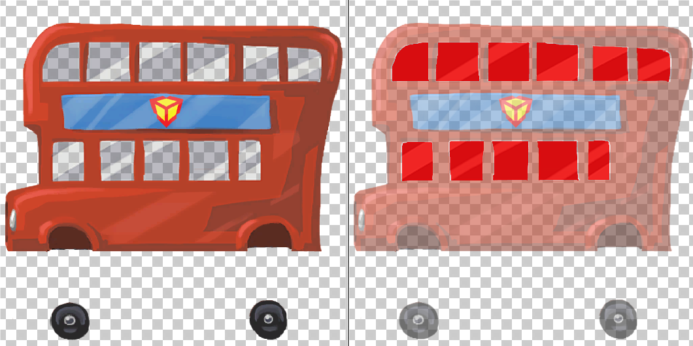
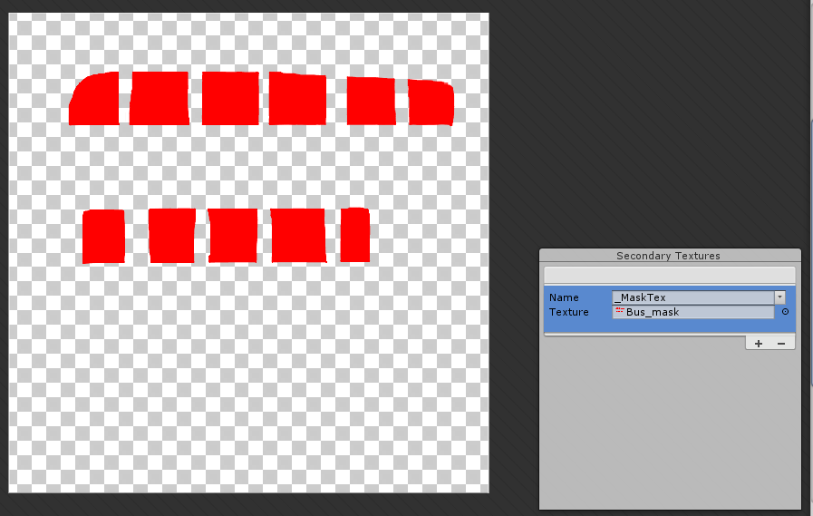
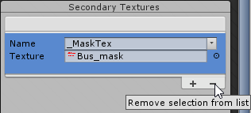
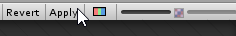

# 设置法线贴图和遮罩贴图

2D 灯光可以与与 Sprite 相关联的 __normal map__ 和 __mask__ 交互，从而创建高级照明效果，例如 [法线贴图](https://en.wikipedia.org/wiki/Normal_mapping)。通过 [Sprite 编辑器](https://docs.unity.cn/cn/tuanjiemanual/Manual/SpriteEditor.html) 的 [Secondary Textures](https://docs.unity.cn/cn/tuanjiemanual/Manual/SpriteEditor-SecondaryTextures.html) 模块分配这些额外的贴图给 Sprite。首先选择一个 Sprite，然后从其 Inspector 窗口打开 [Sprite 编辑器](https://docs.unity.cn/cn/tuanjiemanual/Manual/SpriteEditor.html)。然后从编辑器窗口左上角的下拉菜单中选择 __Secondary Textures__ 模块。

## 添加 Secondary Texture

在 Secondary Textures 编辑器中，选择一个 Sprite 来添加 Secondary Textures。选中 Sprite 后，__Secondary Textures__ 面板会显示在编辑器窗口的右下角。该面板显示了当前分配给选中 Sprite 的 Secondary Textures 列表。要向 Sprite 添加新的 Secondary Texture，请选择列表右下角的 +。

这会在列表中添加一个新条目，并带有“名称”和“纹理”框。输入一个自定义名称到名称框中，或者选择名称框右侧的箭头以打开建议名称的下拉列表。这些建议名称可能来自安装的 Unity 包，因为 Secondary Textures 可能需要具有特定的名称才能正确与这些包中的 Shader 交互并生成其效果。

2D 灯光包建议使用名称“MaskTex”和“NormalMap”。选择与所选贴图功能匹配的名称——选择“MaskTex”用于遮罩贴图，选择“NormalMap”用于法线贴图。正确命名这些贴图可以使它们与 2D 灯光 Shader 交互，从而正确生成各种照明效果。

要为此 Secondary Texture 条目选择贴图资源，直接将贴图资源拖到贴图字段中，或者选择贴图框右侧的圆圈以打开 __对象选择器__ 窗口。

Secondary Textures 与所选 Sprite 的纹理使用相同的 UV 坐标进行采样。将 Secondary Textures 与主 Sprite 纹理对齐，以确保附加的纹理效果正确显示。

要在 __Sprite 编辑器__ 窗口中预览 Secondary Texture，请选择列表中的一个条目。这会自动隐藏 Sprite 的主纹理。点击 Secondary Textures 列表外部取消选择条目，主 Sprite 纹理会再次可见。

## 删除 Secondary Texture

要删除 Secondary Texture，请从列表中选择它，然后选择窗口右下角的 -。这会自动移除该条目。

## 应用

选择编辑器顶部的 __Apply__ 以保存你的条目。没有名称或未分配贴图的无效条目在应用更改时会自动移除。

