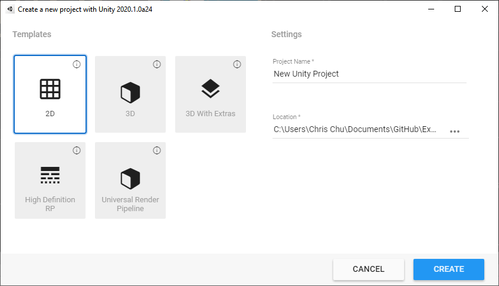
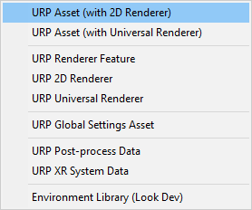
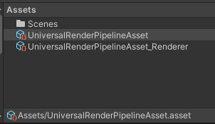
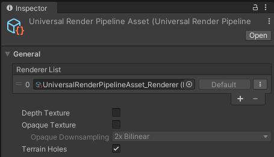
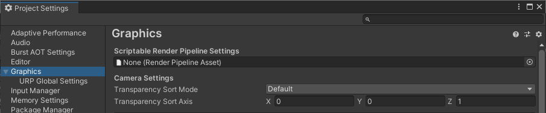
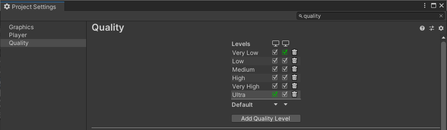
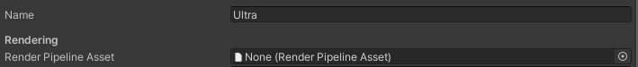

# 要求和设置

要开始使用 __2D Renderer__，请安装以下版本的编辑器和软件包：

- __Unity 2021.2.0b1__ 或更高版本

- __Universal Render Pipeline__ 版本 10 或更高（可通过软件包管理器获取）

## 2D Renderer 设置
1. 使用 [2D 模板](https://docs.unity.cn/cn/tuanjiemanual/Manual/ProjectTemplates.html) 创建一个新项目。
   

2. 通过菜单选择 __Assets > Create > Rendering > URP Asset (with 2D Renderer)__，创建一个新的 __Pipeline Asset__ 和 __Renderer Asset__。
   
    

3. 为 Pipeline 和 Renderer Asset 输入名称。名称会自动应用到两者，Renderer Asset 的名称会加上 "_Renderer" 后缀。
   
    

4. Renderer Asset 会自动分配给 Pipeline Asset。
   
    

5. 设定图形质量设置，有以下两个选项：

   __选项 1: 为所有平台统一设置__
   1. 打开 __Edit > Project Settings__，选择 __Graphics__ 分类。
      
       
   2. 将之前创建的 __Pipeline Asset__ 拖动到 __Scriptable Render Pipeline Settings__ 框中，并调整质量设置。
       

   __选项 2: 按质量级别设置__
   1. 打开 __Edit > Project Settings__，选择 [Quality](https://docs.unity.cn/cn/tuanjiemanual/Manual/class-QualitySettings.html) 分类。
      
       
   2. 选择要包含在项目中的质量级别。
   3. 将之前创建的 __Pipeline Asset__ 拖动到 __Rendering__ 框中。
      
       
   4. 对项目中每个质量级别和平台重复步骤 2-3。

现在，你的项目已配置好 __2D Renderer__。

__注意:__ 如果你在项目中使用 __2D Renderer__，则 __Universal Render Pipeline Asset__ 中与 3D 渲染相关的某些选项将不会对最终的应用或游戏产生影响。
