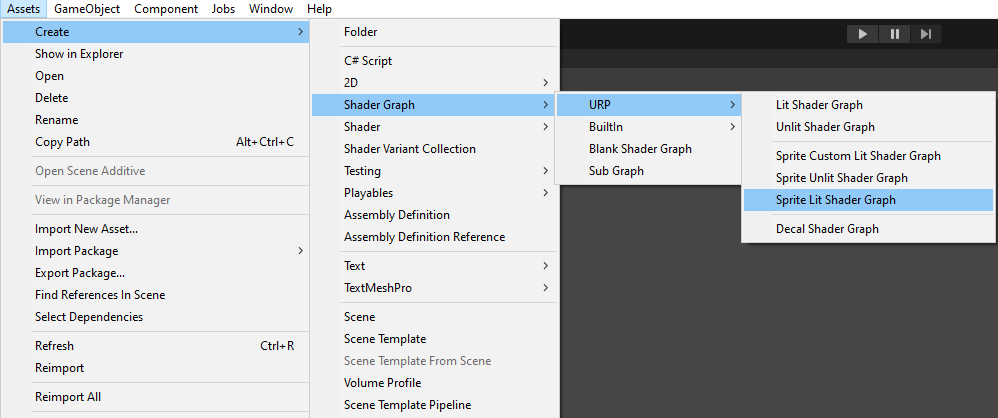
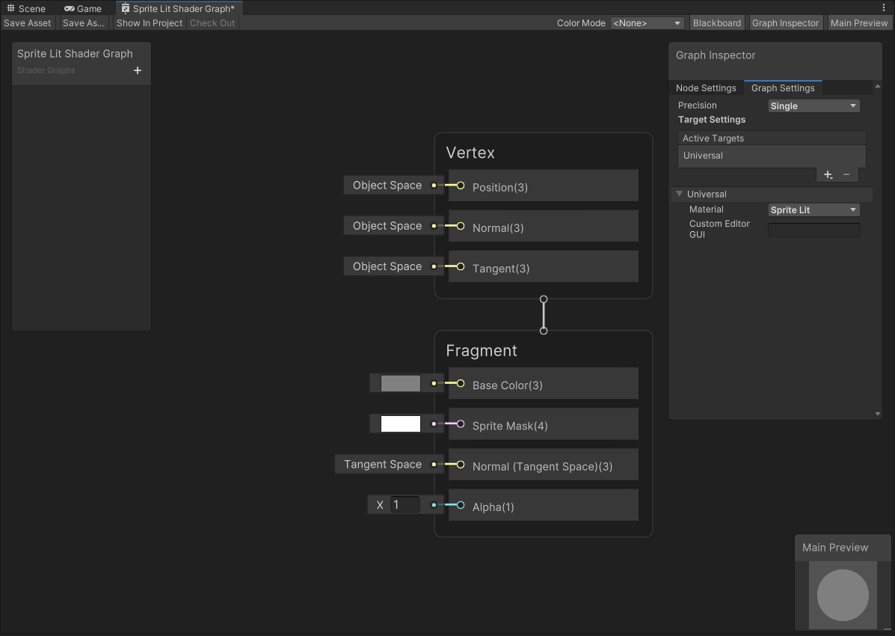
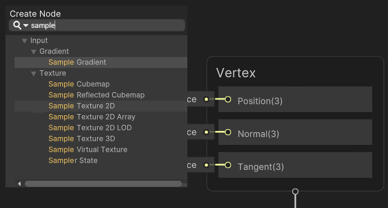
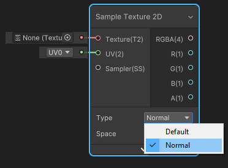
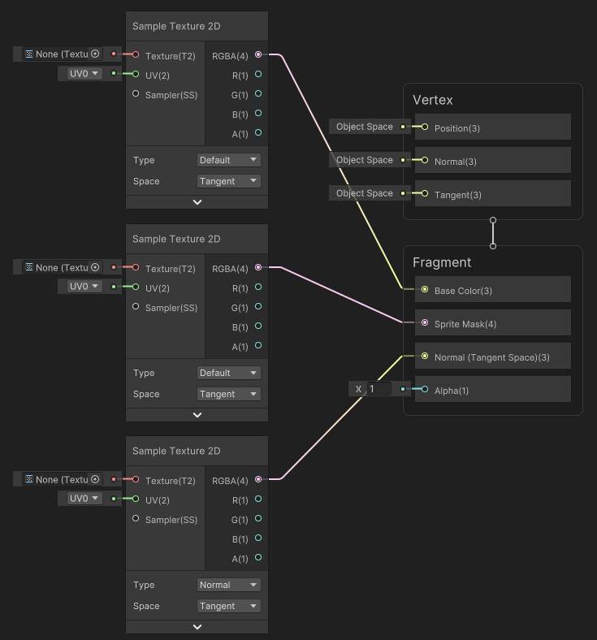
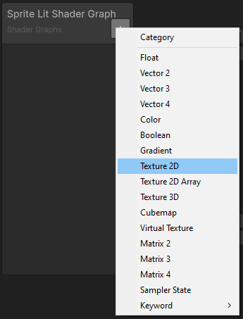
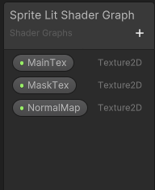
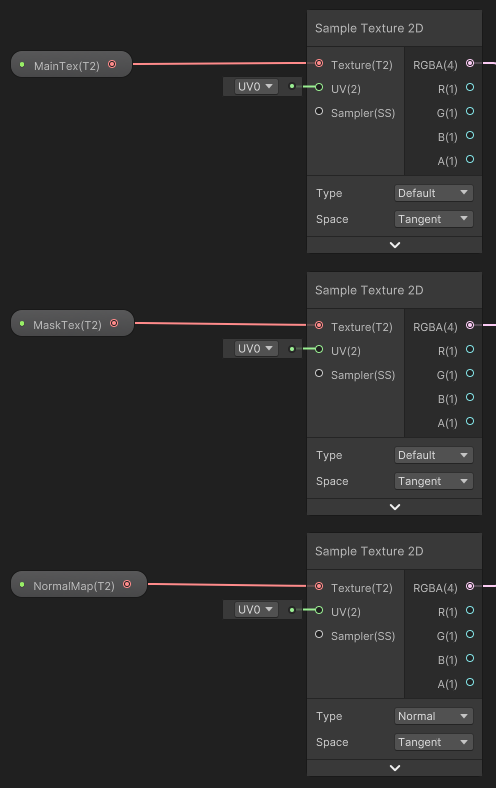
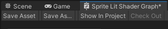

# 2D Renderer 与 Shader Graph

## 创建一个 Lit Shader

1. 在 Unity 菜单中选择 **Assets > Create > Shader Graph > URP > Sprite Lit Shader Graph** 来创建新的 Shader Graph 资源，生成后的资源会显示在项目视图（Asset Window）中。
   
    

2. 双击新建的 Shader Graph 资源以打开 **Shader Graph** 窗口。
   
    

3. 在 Shader Graph 窗口中，右键点击空白处并选择 **Create Node**。在弹出的搜索框中搜索 **Sample Texture 2D** 并选择该节点。创建三个 **Sample Texture 2D** 节点。
   
    

4. 将其中一个节点的 **Type** 属性修改为 **Normal**。
   
    

5. 如下图所示，将两个 **Default Type** 节点的 RGBA(4) **输出插槽（Output Slot）** 连接到相应的输入插槽，同时注意将 **Normal Type** 节点的输出插槽连接到 **Normal(Tangent Space)(3)** 输入插槽。
   
    

6. 在 [Blackboard](http://docs.unity3d.com/Packages/com.unity.shadergraph@12.0/manual/Blackboard.html) 面板上点击 **+** 并选择 **Texture 2D**，创建三个新的贴图属性。此示例中命名为 “MainTex”、“MaskTex” 和 “NormalMap”。
    
    

7. 将创建好的 **Texture 2D** 属性从 Blackboard 拖拽到编辑窗口，并分别连接到对应的 Sample Texture 2D 节点输入插槽，如下图所示。注意将 “NormalMap” 属性只连接到 **Normal Type** 节点。
   
    

8. 选择 **Save Asset** 以保存此 Shader。
   

现在你可以将新建的 Shader 应用于材质上了。
