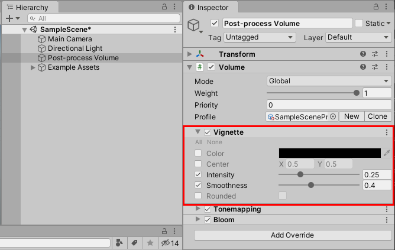
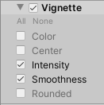
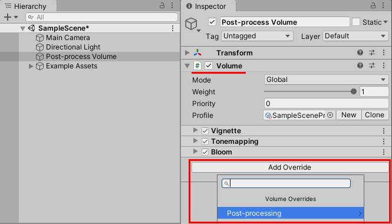

# Volume Overrides

**Volume Overrides** 允许你更改或扩展 [Volume Profile](Volume-Profile.md) 中的默认属性。

URP 将后处理效果实现为 Volume Overrides。例如，以下图像显示了在 URP 模板 SampleScene 中的 Vignette 后处理效果。

在 Volume Override 中，每个属性左侧都有复选框，允许你启用或禁用特定属性。如果禁用某个属性，URP 会使用 Volume 的默认值。要打开或关闭所有属性，可以使用属性列表上方的 **All** 或 **None** 快捷方式。

## 如何将 Volume Override 添加到 Volume 组件

要将 Volume Override 添加到 Volume 组件：

1. 选择一个包含 Volume 组件的 GameObject。

2. 在 Inspector 窗口中，点击 **Add Override**。

    

    使用搜索框搜索 Override，或者从菜单中选择一个 Override。