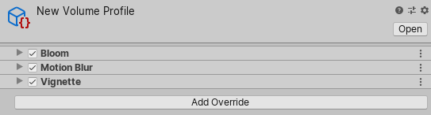
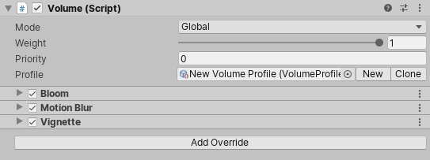

# Volume Profile

Volume Profile 是一个 [Scriptable Object](https://docs.unity.cn/cn/tuanjiemanual/Manual/class-ScriptableObject.html)，包含 Volumes 用来决定如何渲染它们所影响的 Camera 环境的属性。一个 Volume 在其 **Profile** 字段中引用一个 Volume Profile，并使用它引用的 Volume Profile 中的值。

Volume Profile 将其属性组织成多个结构体，这些结构体控制不同的环境设置。所有这些结构体都有默认值，你可以使用这些默认值，但你也可以使用 [Volume Overrides](VolumeOverrides.md) 来覆盖这些值并自定义环境设置。

## 创建和自定义 Volume Profile

有多种方法可以创建 Volume Profile。Unity 在你创建一个 **Scene Settings** GameObject 时会自动创建并链接一个 Volume Profile（菜单：**Rendering > Scene Settings**）。你也可以手动创建一个 Volume Profile。导航到菜单：**Assets > Create > Volume Profile**。

在 Inspector 中打开 Volume Profile 来编辑其属性。你可以通过以下两种方式来执行此操作：

&#8226; 选择 Assets 文件夹中的 Volume Profile。

&#8226; 选择一个具有 Volume 组件的 GameObject，该组件的 **Profile** 字段已设置 Volume Profile。

当你在 Inspector 中查看 Volume Profile 时，只能看到 Volume Profile 包含的 Volume overrides 中的值；Volume Profile 会隐藏所有其他值。你必须添加 Volume override 组件才能编辑 Volume Profile 的默认属性。

要添加 Volume override 组件，请点击 **Add Override** 按钮，并选择你想要添加到 Volume Profile 的 Volume override。

例如，点击 **Add Override** 按钮并选择 **Motion Blur** Volume override。这将暴露与 URP 中的 [Motion Blur](Post-processing-Motion-Blur.md) 效果相关的属性。
