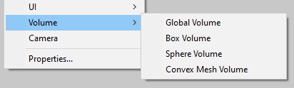
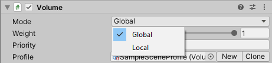
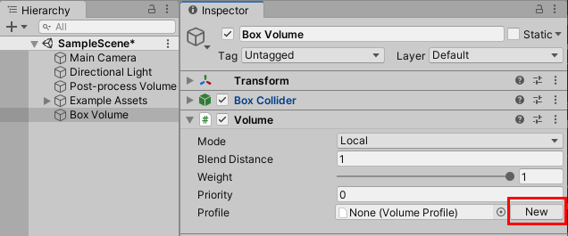
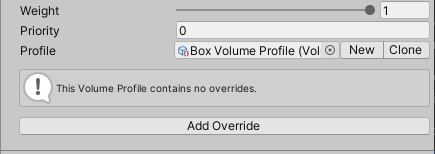
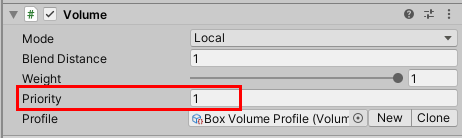
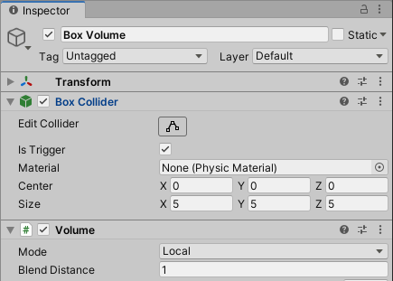

# Volumes

Universal Render Pipeline (URP) 使用 Volume 框架。Volumes 可以根据 Camera 相对于每个 Volume 的位置覆盖或扩展场景属性。

URP 使用 Volume 框架来实现 [后处理](integration-with-post-processing.md#post-proc-how-to) 效果。

URP 提供专门的 Volume GameObject 类型：**Global Volume**、**Box Volume**、**Sphere Volume**、**Convex Mesh Volume**。

Volume 组件包含 **Mode** 属性，该属性定义 Volume 是全局的还是局部的。

当 **Mode** 设置为 **Global** 时，Volume 会影响场景中的所有 Camera。当 **Mode** 设置为 **Local** 时，Volume 仅在 Camera 进入其 Collider 范围时生效。有关更多信息，请参考 [如何使用 Local Volumes](#volume-local)。

你可以将 __Volume__ 组件添加到任何 GameObject。一个场景可以包含多个带有 Volume 组件的 GameObject。你也可以在一个 GameObject 上添加多个 Volume 组件。

Volume 组件引用一个 [Volume Profile](VolumeProfile.md)，其中包含场景属性。Volume Profile 为所有属性提供默认值，并默认隐藏它们。[Volume Overrides](VolumeOverrides.md) 允许你更改或扩展 [Volume Profile](VolumeProfile.md) 中的默认属性。

在运行时，URP 会遍历场景中所有启用的 Volume 组件，并确定每个 Volume 对最终场景设置的贡献。URP 使用 Camera 位置和 Volume 组件的属性来计算贡献值，并对所有贡献不为零的 Volumes 进行插值计算最终属性值。

## Volume 组件属性

Volume 组件包含控制其如何影响 Camera 以及如何与其他 Volumes 交互的属性。

| 属性           | 描述                                                  |
| :----------------- | :----------------------------------------------------------- |
| **Mode**           | 选择 URP 用于计算该 Volume 是否影响 Camera 的方法： &#8226; **Global**：该 Volume 没有边界，并影响场景中的所有 Camera。 &#8226; **Local**：允许你指定 Volume 的边界，使其仅影响边界内的 Camera。添加 Collider 到 Volume 的 GameObject 并使用它来设置边界。 |
| **Blend Distance** | URP 开始从 Volume 的 Collider 边界进行混合的最大距离。值为 0 时，URP 立即应用该 Volume 的 Overrides。 此属性仅在 **Mode** 设为 **Local** 时可见。 |
| **Weight**         | 该 Volume 对场景的影响程度。URP 将该值作为乘数，应用于它基于 Camera 位置和 Blend Distance 计算的值。 |
| **Priority**       | 当多个 Volumes 对场景具有相等影响时，URP 使用该值来决定优先级。URP 优先使用优先级较高的 Volume。 |
| **Profile**        | 该 Volume 组件所引用的 [Volume Profile](VolumeProfile.md) 资源，存储 URP 用于处理该 Volume 的属性。 |

## Volume Profiles

__Profile__ 字段存储一个 [Volume Profile](VolumeProfile.md)，它是一个 Asset，其中包含 URP 用于渲染场景的属性。你可以编辑该 Volume Profile，或在 **Profile** 字段中分配一个不同的 Volume Profile。你还可以通过点击 **New** 或 **Clone** 按钮来创建新的 Volume Profile 或克隆当前的 Volume Profile。

## 如何使用 Local Volumes

本节描述如何使用 Local Volume 来实现基于位置的后处理效果。

在本示例中，URP 在 Camera 进入某个 Box Collider 内时应用后处理效果。

1. 在场景中创建一个新的 Box Volume（**GameObject > Volume > Box Volume**）。

2. 选择 Box Volume。在 Inspector 窗口的 **Volume** 组件中，点击 **New**。

    

    Unity 创建新的 Volume Profile 并在 Volume 组件中添加 **Add Override** 按钮。

    

3. 如果场景中存在其他 Volumes，请调整 **Priority** 属性的值，以确保该 Volume 的 Overrides 比其他 Volumes 具有更高的优先级。

    

4. 点击 [Add Override](VolumeOverrides.md#volume-add-override)，在 Volume Overrides 对话框中选择一个后处理效果。

5. 在 Collider 组件中调整 **Size** 和 **Center** 属性，使 Collider 覆盖你希望局部后处理效果生效的区域。

    

    确保 **Is Trigger** 复选框已选中。

现在，当 Camera 进入 Volume 的 Box Collider 范围时，URP 将使用该 Box Volume 的 Volume Overrides。
