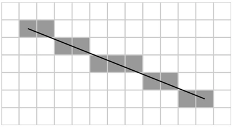

# 通用渲染管线（URP）中的抗锯齿

**锯齿（Aliasing）** 是数字采样器在采样真实世界的信息并尝试将其数字化时产生的副作用。例如，在音频或视频采样时，锯齿意味着数字信号的形状与原始信号的形状不匹配。在 Unity 中，当渲染一条线条时，如果像素不能完美对齐屏幕上的路径，就可能会出现锯齿状边缘。

 *光栅化过程导致锯齿的示例。*

为了防止锯齿，通用渲染管线（URP） 提供了多种抗锯齿方法，每种方法在效果和资源消耗上有所不同。

可用的抗锯齿方法包括：

- [通用渲染管线（URP）中的抗锯齿](#通用渲染管线urp中的抗锯齿)
  - [快速近似抗锯齿（FXAA）](#快速近似抗锯齿fxaa)
  - [子像素形态抗锯齿（SMAA）](#子像素形态抗锯齿smaa)
  - [时间抗锯齿（TAA）](#时间抗锯齿taa)
  - [多重采样抗锯齿（MSAA）](#多重采样抗锯齿msaa)

## 快速近似抗锯齿（FXAA）

FXAA 通过全屏处理逐像素平滑边缘。这是 URP 中计算开销最小的抗锯齿技术。

为 Camera 选择 FXAA：

1. 在 Scene 视图 或 Hierarchy 窗口中选择 Camera，并在 Inspector 中查看。
2. 转到 **Rendering** > **Anti-aliasing**，然后选择 **Fast Approximate Anti-aliasing (FXAA)**。

## 子像素形态抗锯齿（SMAA）

SMAA 通过识别图像边界上的模式，并根据这些模式混合边界像素。这种抗锯齿方法比 FXAA 产生更清晰的结果。

为 Camera 选择 SMAA：

1. 在 Scene 视图 或 Hierarchy 窗口中选择 Camera，并在 Inspector 中查看。
2. 转到 **Rendering** > **Anti-aliasing**，然后选择 **Subpixel Morphological Anti-aliasing (SMAA)**。

## 时间抗锯齿（TAA）

TAA 使用颜色历史缓冲区的多个帧数据来平滑边缘。这意味着运动中的边缘更加平滑，并减少了闪烁。然而，由于 TAA 依赖时间累积计算，在极端情况下（例如，当一个 GameObject 以高速经过与其颜色对比明显的表面时），可能会出现**重影（ghosting）** 伪影。

为 Camera 选择 TAA：

1. 在 Scene 视图 或 Hierarchy 窗口中选择 Camera，并在 Inspector 中查看。
2. 转到 **Rendering** > **Anti-aliasing**，然后选择 **Temporal Anti-aliasing (TAA)**。

以下功能无法与 TAA 共同使用：

- 多重采样抗锯齿（MSAA）
- [Camera Stacking](camera-stacking.md)
- [动态分辨率](https://docs.unity.cn/cn/tuanjiemanual/Manual/DynamicResolution.html)

## 多重采样抗锯齿（MSAA）

MSAA 通过对每个像素的深度和模板值进行多次采样，并将这些样本组合生成最终像素。这种方法专门用于解决空间锯齿（spatial aliasing） 问题，并比其他抗锯齿技术更适用于三角形边缘的锯齿处理。然而，它无法修复诸如高光或纹理 产生的锯齿问题。

MSAA 在大多数硬件上比其他抗锯齿方法更消耗资源。然而，在瓦片式 GPU（Tiled GPU）上运行，并且未使用后处理抗锯齿或自定义渲染功能时，MSAA 可能比其他抗锯齿方法更节省资源。

MSAA 是一种硬件抗锯齿方法，因此可以与其他后处理抗锯齿方法（如 FXAA 和 SMAA）同时使用。但 TAA 不能与 MSAA 共同使用。

启用 MSAA：

1. 在 Inspector 中打开 [URP 资源（URP Asset）](universalrp-asset.md)。
2. 转到 **Quality** > **Anti Aliasing (MSAA)**，然后选择所需的 MSAA 级别。

有关可用设置的详细信息，请参阅 [URP 资源中的 MSAA 设置](universalrp-asset.md#quality)。

> 注意  
> 在不支持 [StoreAndResolve](https://docs.unity.cn/cn/tuanjiemanual/ScriptReference/Rendering.RenderBufferStoreAction.StoreAndResolve.html) 存储操作的移动平台上，如果 URP 资源 中启用了 **Opaque Texture**，Unity 在运行时会忽略 **MSAA** 选项（即 **MSAA** 将被视为 **Disabled**）。
