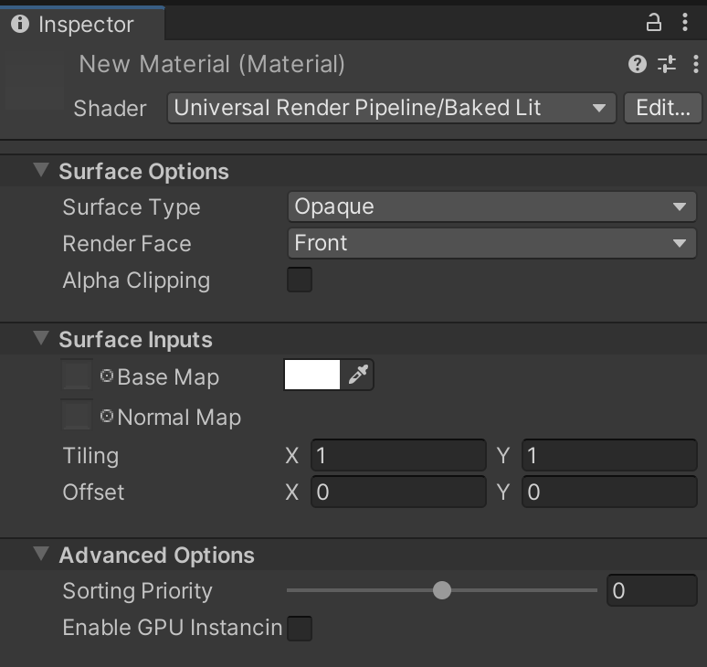

# Baked Lit Shader（预烘焙光照 Shader）

在 **通用渲染管线（URP）** 中，可以使用 **Baked Lit Shader** 进行风格化游戏或应用，该 Shader 仅支持 [烘焙光照](https://docs.unity.cn/cn/tuanjiemanual/Manual/LightMode-Baked.html)，并通过 [光照贴图（Lightmaps）](https://docs.unity.cn/cn/tuanjiemanual/Manual/Lightmapping.html) 和 [光照探针（Light Probes）](https://docs.unity.cn/cn/tuanjiemanual/Manual/LightProbes.html) 实现照明。本 Shader **不使用** [基于物理的光照（Physically Based Shading）](shading-model.md#physically-based-shading)，也**不支持** 实时光照，因此所有与实时光照相关的 Shader 关键字和变体都会被 **剥离（stripped）**，从而提高计算效率。

## 在编辑器中使用 Baked Lit Shader

要选择并使用此 Shader：

1. 在您的 **Project** 中，创建或找到要使用该 Shader 的 **Material**，然后选中它。**Inspector** 窗口将打开。
2. 点击 **Shader**，然后选择 **Universal Render Pipeline** > **Baked Lit**。

## UI 预览

该 Shader 的 **Inspector** 窗口包含以下内容：

- __[Surface Options](#surface-options)__（表面选项）
- __[Surface Inputs](#surface-inputs)__（表面输入）
- __[Advanced](#advanced)__（高级设置）

### 表面选项（Surface Options）

**Surface Options** 控制 **Material** 在屏幕上的渲染方式。

| **属性**            | **描述** |
| ------------------ | ------------------------------------------------------------ |
| **Surface Type**   | 选择 **Material** 的表面类型： - **Opaque**（不透明）：材质始终完全可见，不受背景影响，URP 会优先渲染不透明材质。 - **Transparent**（透明）：材质受到背景影响，URP 会在渲染完不透明对象后再渲染透明材质。选择 **Transparent** 后，将显示 **Blending Mode**（混合模式）选项。 |
| **Blending Mode**  | 选择 Unity 计算透明 **Material** 每个像素颜色的方式。  **Source** 指当前 **Material**，**Destination** 指该 **Material** 重叠的背景内容。 |
|&#160;&#160;&#160;&#160;Alpha |  *Alpha 混合模式。*  **Alpha** 使用 **Material** 的 Alpha 值来控制透明度，0 为完全透明，1 为完全不透明。 混合方程式： *OutputRGBA* = (*SourceRGB* × *SourceAlpha*) + (*DestinationRGB* × (1 − *SourceAlpha*)) |
|&#160;&#160;&#160;&#160;Premultiply |  *Premultiply 混合模式。*  **Premultiply** 先将 **Material** 的 RGB 乘以 Alpha，然后再进行类似 **Alpha** 的混合。 该模式可减少透明和不透明像素之间的边缘伪影。 混合方程式： *OutputRGBA* = *SourceRGB* + (*DestinationRGB* × (1 − *SourceAlpha*)) |
|&#160;&#160;&#160;&#160;Additive |  *Additive 混合模式。*  **Additive** 将 **Material** 和背景的颜色值相加。Alpha 值决定源 **Material** 颜色的强度。 混合方程式： *OutputRGBA* = (*SourceRGB* × *SourceAlpha*) + *DestinationRGB* |
|&#160;&#160;&#160;&#160;Multiply |  *Multiply 混合模式。*  **Multiply** 将 **Material** 颜色与背景颜色相乘，产生类似彩色玻璃的暗化效果。 Alpha 值决定混合程度，Alpha 为 1 时颜色完全相乘，较低的值会将颜色混合到更接近白色。 混合方程式： *OutputRGBA* = *SourceRGB* × *DestinationRGB* |
| **Render Face**    | 选择渲染几何体的哪一面： - **Front Face**（默认）：渲染前面，剔除背面。 - **Back Face**：渲染背面，剔除前面。 - **Both**：同时渲染正反两面，适用于如树叶等薄片物体。 |
| **Alpha Clipping** | 使 **Material** 表现为 **Cutout Shader**（裁剪模式）。 URP 不会渲染 Alpha 低于 **Threshold**（阈值） 的像素，以实现硬边透明效果，如草叶。 滑块范围：**0 ~ 1**，默认值 **0.5**。 |

### 表面输入（Surface Inputs）

**Surface Inputs** 描述 **Material** 表面的外观，例如湿润、干燥、粗糙或光滑。

| **属性**     | **描述** |
| ----------- | ------------------------------------------------------------ |
| **Base Map** | 为表面添加颜色（漫反射贴图）。 点击对象选择器以分配贴图，或使用颜色选择器调整色调。 当 **Surface Type** 设为 **Transparent** 或启用 **Alpha Clipping** 时，**Material** 将使用贴图的 Alpha 通道。 |
| **Normal Map** | 为表面添加法线贴图，可模拟表面细节如凹凸、划痕和凹槽。 法线贴图会影响环境光照效果。 |
| **Tiling**   | 贴图在 U 和 V 轴上的缩放系数。默认值为 1（无缩放）。较高值使贴图重复，较低值使贴图拉伸。 |
| **Offset**   | 调整贴图在 U 和 V 轴上的偏移量。 |

### 高级（Advanced）

**Advanced** 选项影响底层渲染计算，不直接影响 **Material** 外观。

| **属性**                 | **描述** |
| ------------------------ | ------------------------------------------------------------ |
| **Enable GPU Instancing** | 允许 **URP** 批量渲染具有相同几何体和材质的 **Mesh**，提高渲染性能。 当材质不同或硬件不支持 GPU Instancing 时，无法合批渲染。 |
| **Sorting Priority** | 设定 **Material** 的渲染顺序。较低值的 **Material** 会先渲染。 在前景渲染 **Material** 时，可减少 GPU 过度绘制（Overdraw），优化性能。类似于 [Render Queue](https://docs.unity.cn/cn/tuanjiemanual/ScriptReference/Material-renderQueue.html)。 |
