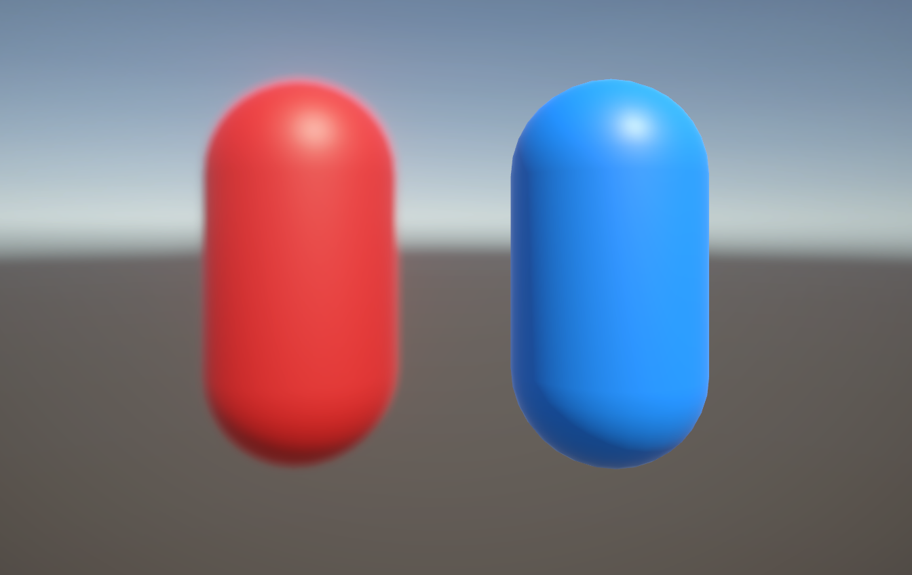

# 设置相机堆栈（Set up a camera stack）

本页面介绍如何使用 相机堆栈（Camera Stack） 将多个相机的输出叠加到同一个渲染目标上。  
有关相机堆栈的更多信息，请参考 [理解相机堆栈](cameras/camera-stacking-concepts.md)。

 *一个使用相机堆栈的示例场景：红色胶囊体应用了后处理效果，而蓝色胶囊体未应用后处理。*

按照以下步骤设置相机堆栈：

1. [创建相机堆栈](#create-a-camera-stack)。
2. [设置图层和剔除遮罩（Culling Masks）](#set-up-layers-and-culling-masks)。

## 创建相机堆栈（Create a camera stack）

创建相机堆栈需要包含一个 Base 相机 和一个或多个 Overlay 相机。

有关详细的操作步骤，请参考 [向相机堆栈添加相机](cameras/add-and-remove-cameras-in-a-stack.md#add-a-camera-to-a-camera-stack)。

## 设置图层和剔除遮罩（Set up layers and culling masks）

创建相机堆栈后，你需要将 Overlay 相机 需要渲染的 GameObjects 分配到特定的 图层（Layer），然后设置相机的 **Culling Mask** 以匹配相应的图层。

按照以下步骤操作：

1. 根据项目需求，添加所需的图层。有关如何操作，请参考 [添加新图层](xref:create-layers)。
2. 将需要 Overlay 相机 渲染的 GameObjects 分配到相应的图层中。
3. 选择 相机堆栈 中的 Base 相机，然后在 Inspector 窗口 中转到 **Rendering > Culling Mask**。
4. 移除不需要 Base 相机 渲染的图层，例如只应由 Overlay 相机 渲染的对象所在的图层。
5. 选择 相机堆栈 中的第一个 Overlay 相机，然后在 Inspector 窗口 中转到 **Rendering > Culling Mask**。
6. 仅保留包含该相机需要渲染的 GameObjects 的图层，并移除其他图层。
7. 对相机堆栈中的 每个 Overlay 相机 重复步骤 5 和 6。

> 注意  
> 你不一定需要手动配置 **Culling Mask**，但在 URP 中，相机默认渲染所有图层。如果移除不必要的图层，可以提升渲染效率。
