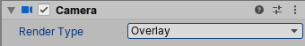

# 相机渲染类型

在 通用渲染管线（URP） 中，相机分为两种类型：

- [Base Camera](#base-camera)（基础相机）：通用相机，可渲染到目标（屏幕或 [Render Texture](https://docs.unity.cn/cn/tuanjiemanual/Manual/class-RenderTexture.html)）。
- [Overlay Camera](#overlay-camera)（叠加相机）：渲染到另一个相机的输出之上。可将 Base Camera 的输出与一个或多个 Overlay Camera 组合，这称为 [相机堆栈（Camera Stacking）](camera-stacking.md)。

通过 Camera 组件的 **Render Type** 属性可设置相机类型为 Base 或 Overlay。

### 在 Unity 编辑器中更改相机类型：

1. 在场景中创建或选择 Camera。
2. 在 Camera Inspector 窗口中，使用 Render Type 下拉菜单选择相机类型：
   - **Base**：设置相机为 Base Camera。
   - **Overlay**：设置相机为 Overlay Camera。



### 在脚本中更改相机类型：
可以通过 `Universal Additional Camera Data` 组件的 `renderType` 属性更改相机类型：

```c#
var cameraData = camera.GetUniversalAdditionalCameraData();
cameraData.renderType = CameraRenderType.Base;
```


<a name="base-camera"></a>

## Base Camera（基础相机）

Base Camera 是 URP 的默认相机类型。它是一个通用相机，可以渲染到指定的渲染目标。

在 URP 中，至少需要一个 Base Camera 才能进行渲染。你可以在场景中使用多个 Base Camera，它们可以单独使用，也可以用于 [相机堆栈（Camera Stacking）](camera-stacking.md)。  
有关在 URP 中使用多个相机的详细信息，请参考 [使用多个相机](cameras-multiple.md)。

当场景中有激活的 Base Camera 时，该相机的 Gizmo 旁边会显示以下图标：


有关 Base Camera 在 Inspector 窗口中公开的属性，请参考 [Camera 组件参考](camera-component-reference.md)。


<a name="overlay-camera"></a>

## Overlay Camera（叠加相机）

Overlay Camera 渲染到另一个相机的输出之上。可用于实现 3D 物体在 2D UI 中的渲染，或在载具游戏中显示驾驶舱视角等效果。

Overlay Camera 必须与 Base Camera 结合使用，并通过 [相机堆栈（Camera Stacking）](camera-stacking.md) 进行管理，不能单独使用。  
未被添加到 相机堆栈 中的 Overlay Camera 不会执行任何渲染步骤，被称为 孤立相机（Orphan Camera）。

> 注意  
> 在当前版本的 URP 中，Overlay Camera 和 相机堆栈 仅在 Universal Renderer 中受支持。

当场景中有激活的 Overlay Camera 时，该相机的 Gizmo 旁边会显示以下图标：


### Overlay Camera 受限的属性

在 相机堆栈 中，Base Camera 决定了大部分相机属性。由于 Overlay Camera 必须作为 相机堆栈 的一部分使用，URP 仅使用 Overlay Camera 的以下属性进行渲染：

- Projection（投影）
- FOV Axis（视场轴）
- Field of View（视场角）
- Physical Camera（物理相机属性）
- Clipping Planes（裁剪平面）
- Renderer（渲染器）
- Clear Depth（清除深度）
- Render Shadows（渲染阴影）
- Culling Mask（剔除遮罩）
- Occlusion Culling（遮挡剔除）

在 Inspector 窗口中，Unity 会隐藏 Overlay Camera 其他未使用的属性。  
你仍然可以在脚本中访问这些属性，但它们不会影响 相机堆栈 的最终渲染效果。

> 注意  
> 虽然可以对 相机堆栈 中的 Overlay Camera 应用 后处理（Post-processing），但该后处理效果会影响整个相机堆栈，即它会同时影响所有在 Overlay Camera 之前渲染的相机输出。这与 Base Camera 独立应用后处理的方式不同。

有关 Overlay Camera 在 Inspector 窗口中公开的属性，请参考 [Camera 组件参考](camera-component-reference.md)。