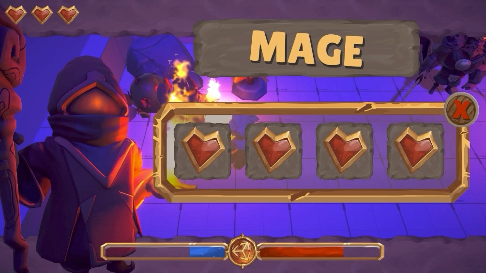

# 使用多个相机（Use multiple cameras）

在 **通用渲染管线（URP）** 中，你可以使用多个 **Camera** 处理不同的渲染目标、输出分辨率以及后处理效果。

> **注意**  
> 使用多个相机可能会降低渲染性能。即使某个 **Camera** 不渲染任何内容，它仍然会执行完整的渲染循环。

 *URP 相机堆栈的效果示例。*

你可以结合多种方式来实现更复杂的渲染效果。例如，可以定义两个 **相机堆栈（Camera Stacks）**，然后将它们分别渲染到同一渲染目标（Render Target）的不同区域。

有关多个相机的渲染顺序，请参考 [理解相机渲染顺序](cameras-advanced.md)。

| **页面** | **描述** |
|----------------------|------------------------------------------------------------|
| [理解相机堆栈](cameras/camera-stacking-concepts.md) | 了解相机堆栈的基本概念。 |
| [设置相机堆栈](camera-stacking.md) | 堆叠多个相机，以将其输出合成为单一画面。 |
| [在相机堆栈中添加和移除相机](cameras/add-and-remove-cameras-in-a-stack.md) | 添加、移除和重新排序相机堆栈中的相机。 |
| [设置分屏渲染](rendering-to-the-same-render-target.md) | 通过将多个相机输出渲染到同一渲染目标，实现分屏渲染等效果。 |
| [将相机输出渲染到 Render Texture](rendering-to-a-render-texture.md) | 渲染到 **Render Texture**，以实现游戏内监控摄像头（CCTV）等效果。 |
