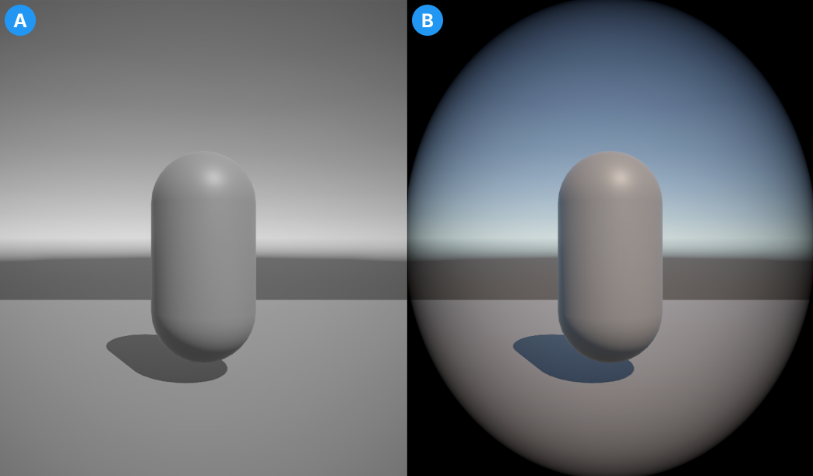

# 将不同的后处理效果应用于不同的相机

在通用渲染管线（URP）中，您可以为同一场景中的不同相机应用独立的后处理效果。

 *两个相机的输出。图像A显示了一个应用了色彩调整覆盖的相机。图像B显示了第二个相机应用了镜头晕影效果。*

## 设置场景

要为不同相机设置多个后处理效果，请按照以下步骤操作：

1. 在场景中创建多个相机（**GameObject** > **Camera**）。
2. 为每个相机启用 **Post Processing**。
3. 为每个您想要的单独后处理效果创建一个空的 GameObject。
4. 向每个空 GameObject 添加一个 volume 组件。为此，请选择 GameObject，在 Inspector 窗口中选择 **Add Component** > **Volume**。
5. 为每个空 GameObject 创建一个 volume 配置文件。在 GameObject 的 **Volume** 组件中，找到 **Profile** 属性并选择 **New**。
6. 为每个后处理效果创建新的层。有关更多信息，请参阅 [Layers](xref:Layers)。

## 将不同的后处理效果应用于每个相机

设置好场景后，按照以下步骤为场景中的每个相机创建并应用后处理效果。

1. 选择一个带有 volume 组件的 GameObject，并选择 **Add Override**。
2. 从下拉菜单中选择一个 [后处理效果](../EffectList.md)。
3. 选择 **Layer** 下拉菜单并选择设置场景时创建的一个层。
4. 选择您希望应用该效果的相机。
5. 在 Inspector 窗口中，找到 **Environment** > **Volume Mask** 并选择与 GameObject 相同的层。
6. 对场景所需的每个 GameObject 和相机对，重复步骤 1-5。

    > [!NOTE]
    > 一些效果默认会应用于场景中的所有相机。因此，您可能需要将相同的效果添加到每个 volume 中。这会用您设置的新值覆盖其他 volume 中的效果，以便对单个相机应用新的设置。

每个相机现在会根据与其 volume mask 相同层的 GameObject 为其分配的后处理效果进行处理。

> [!NOTE]
> 场景相机可能会显示来自默认层的某些后处理效果。为了避免这种情况并创建清晰的场景视图，请在场景视图中的视图选项覆盖中打开 Effects 下拉菜单，并关闭 **Post Processing**。
