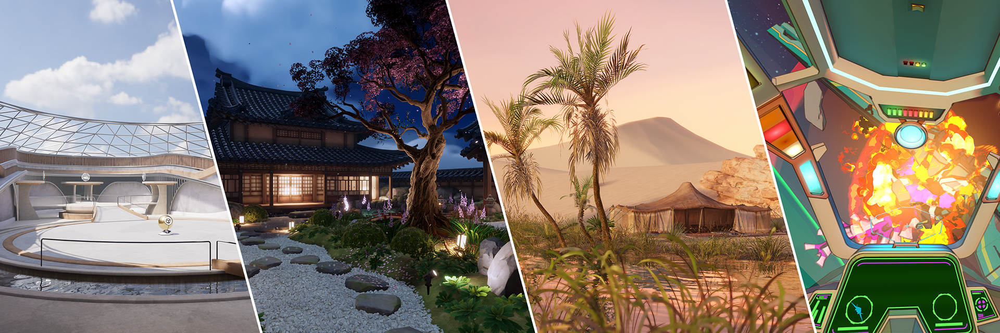

# 使用 URP 创建项目

Unity Hub 提供以下模板，可用于创建预配置的通用渲染管线（URP）项目。

| **Template** | **Description** |
|---|---|
| 2D URP | 适用于 2D 应用的空项目。URP 预配置为 2D renderer。 |
| 3D (URP) | 适用于 3D 应用的空项目。URP 预配置为 3D renderer。 |
| 3D&#160;Sample&#160;Scenes (URP) | 此示例包含四个环境，展示了 URP 的多功能性、可扩展性和自定义能力。该项目演示了不同的美术风格、渲染路径和场景复杂度。每个场景都展示了如何针对不同平台（从移动设备和无线设备到高端 PC 和游戏主机）定制项目。 |

## 使用 URP 模板创建新项目

1. 打开 Unity Hub。

2. 选择 **Projects** 选项卡，然后选择 **New project**。

3. 选择一个 URP 模板。

4. 填写 **Project settings** 相关字段，然后选择 **Create project**。Unity 将创建一个预配置的 URP 项目。