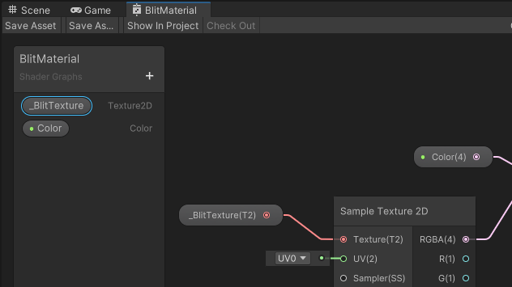

# 将相机颜色纹理 Blit 到 RTHandle

本页描述了将相机颜色纹理 blit 到输出纹理并将输出纹理设置为全局属性的操作。场景中的着色器使用该全局纹理。描述使用了 URP 包示例中的 [BlitToRTHandle](../package-sample-urp-package-samples.md#renderer-features) 场景。

本页的代码示例来自 [URP 包示例](../package-sample-urp-package-samples.md) 中的以下场景：

    * Assets > Samples > Universal RP > 14.0.9 > URP Package Samples > RendererFeatures > BlitToRTHandle

示例场景使用以下资源来执行 blit 操作：

* 一个 [可编程渲染器特性](xref:UnityEngine.Rendering.Universal.ScriptableRendererFeature)，它将一个 [渲染通道](xref:UnityEngine.Rendering.Universal.ScriptableRenderPass) 加入执行队列。

* 一个 [渲染通道](xref:UnityEngine.Rendering.Universal.ScriptableRenderPass)，它将相机颜色纹理 blit 到输出纹理，并将输出纹理设置为全局属性。

导入 [URP 包示例](../package-sample-urp-package-samples.md) 以访问完整的源代码和场景。

有关 blit 操作的一般信息，请参阅 [URP blit 最佳实践](../customize/blit-overview.md)。

## 在渲染通道中定义 RTHandle

示例实现中的 [ScriptableRenderPass](xref:UnityEngine.Rendering.Universal.ScriptableRenderPass) 定义了用于存储输入和输出纹理的 `RTHandle` 变量。

```C#
private RTHandle m_InputHandle;
private RTHandle m_OutputHandle;
```

## 配置输入和输出纹理

本节描述了示例如何使用 `RTHandle` 变量来配置输入和输出纹理。

### 输入纹理

在此示例中，[渲染器特性](xref:UnityEngine.Rendering.Universal.ScriptableRendererFeature) 使用渲染通道中的 `SetInput` 方法来设置输入纹理：

```C#
public void SetInput(RTHandle src)
{
    // 渲染器特性使用此变量来设置输入 RTHandle。
    m_InputHandle = src;
}
```

渲染器特性在 `SetupRenderPasses` 方法中调用 `SetInput` 方法：

```C#
public override void SetupRenderPasses(ScriptableRenderer renderer, in RenderingData renderingData)
{
    if (renderingData.cameraData.cameraType != CameraType.Game)
        return;
    
    m_CopyColorPass.SetInput(renderer.cameraColorTargetHandle);
}
```

> [!NOTE]
> 要在渲染通道中直接设置 `m_InputHandle` 变量而不调用 `SetInput` 方法，请在 `Execute` 方法中使用以下代码：
> ```C#
> m_InputHandle = renderingData.cameraData.renderer.cameraColorTargetHandle;
> ```

### 输出纹理

`Configure` 方法为 blit 操作配置输出纹理。

`ReAllocateIfNeeded` 方法在 RTHandle 系统中创建临时渲染纹理。

```C#
public override void Configure(CommandBuffer cmd, RenderTextureDescriptor cameraTextureDescriptor)
{
    // 配置自定义 RTHandle
    var desc = cameraTextureDescriptor;
    desc.depthBufferBits = 0;
    desc.msaaSamples = 1;
    RenderingUtils.ReAllocateIfNeeded(ref m_OutputHandle, desc, FilterMode.Bilinear, TextureWrapMode.Clamp, name: k_OutputName );
    
    // 将 RTHandle 设置为输出目标
    ConfigureTarget(m_OutputHandle);
}
```

## 使用 Blitter API 绑定源纹理

默认情况下，**Blitter** API 在 `Blitter.BlitCameraTexture` 方法中绑定名为 `_BlitTexture` 的源纹理。示例使用此纹理作为 `m_InputHandle` 变量。

渲染器特性使用的材质的 Shader Graph 包含 `_BlitTexture` 属性：

<br/>*Shader Graph 中的 _BlitTexture 属性*

> [!NOTE]
> 在此特定示例中，您可以使用 **URP Sample Buffer** 节点而不是 **Sample Texture 2D** 节点来实现相同的效果。在 **URP Sample Buffer** 节点中，将 **Source Buffer** 设置为 `BlitSource`，并将输入值设置为 `Default`。

> [!NOTE]
> 如果您想在不应用任何效果的情况下直接复制输入纹理，则无需将材质作为参数提供给 `BlitCameraTexture` 方法。您可以使用以下代码代替示例中的 `Blitter.BlitCameraTexture` 行：
> ```C#
> Blitter.BlitCameraTexture(cmd, m_InputHandle, m_OutputHandle, 0, true);
> ```

有关 **Blitter** API 的更多信息，请参阅以下页面：[UnityEngine.Rendering.Blitter](xref:UnityEngine.Rendering.Blitter)。

## 执行 blit 操作

在渲染通道中，[Blitter API](xref:UnityEngine.Rendering.Blitter) 的 `BlitCameraTexture` 方法执行 blit 操作。

```C#
using (new ProfilingScope(cmd, m_ProfilingSampler))
{
    // 将输入 RTHandle blit 到输出 RTHandle
    Blitter.BlitCameraTexture(cmd, m_InputHandle, m_OutputHandle, m_Material, 0);

    // 使输出纹理可供场景中的着色器使用
    cmd.SetGlobalTexture(m_OutputId, m_OutputHandle.nameID);
}
```

## 其他资源

* [在 URP 中执行全屏 blit](../renderer-features/how-to-fullscreen-blit.md)

    本页描述了基本的 blit 操作，并提供了完整的逐步实现说明。

* [在屏幕上绘制多个 RTHandle 纹理](blit-multiple-rthandles.md)

    本页描述了使用多个定义为 `RTHandle` 的纹理的更复杂的 blit 操作。