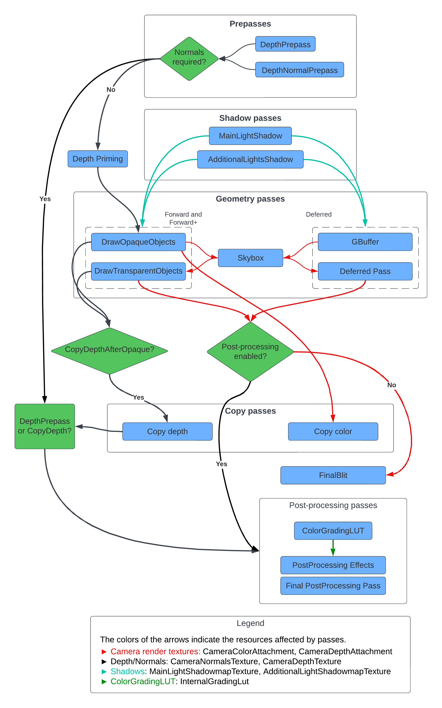

# 注入点

URP 包含多个注入点，允许您将渲染通道注入到帧渲染循环中，并在不同事件上执行它们。

注入点为自定义渲染通道提供了对 URP 缓冲区的访问权限。渲染通道在每个注入点上对所有缓冲区具有读写访问权限。

Unity 在渲染循环中提供了以下事件。您可以使用这些事件来注入自定义通道。

| **注入点** | **描述** |
|---------------------|-----------------|
| BeforeRendering | 在当前相机的管道中渲染任何其他通道之前执行 `ScriptableRenderPass` 实例。此时相机矩阵和立体渲染尚未设置。您可以使用此注入点绘制稍后在管道中使用的自定义输入纹理，例如 LUT 纹理。 |
| BeforeRenderingShadows | 在渲染阴影贴图（**MainLightShadow**、**AdditionalLightsShadow** 通道）之前执行 `ScriptableRenderPass` 实例。 此时相机矩阵和立体渲染尚未设置。 |
| AfterRenderingShadows | 在渲染阴影贴图（**MainLightShadow**、**AdditionalLightsShadow** 通道）之后执行 `ScriptableRenderPass` 实例。 此时相机矩阵和立体渲染尚未设置。 |
| BeforeRenderingPrePasses | 在渲染预通道（**DepthPrepass**、**DepthNormalPrepass** 通道）之前执行 `ScriptableRenderPass` 实例。 此时相机矩阵和立体渲染已经设置。 |
| AfterRenderingPrePasses | 在渲染预通道（**DepthPrepass**、**DepthNormalPrepass** 通道）之后执行 `ScriptableRenderPass` 实例。 此时相机矩阵和立体渲染已经设置。 |
| BeforeRenderingGbuffer | 在渲染 **GBuffer** 通道之前执行 `ScriptableRenderPass` 实例。 |
| AfterRenderingGbuffer | 在渲染 **GBuffer** 通道之后执行 `ScriptableRenderPass` 实例。 |
| BeforeRenderingDeferredLights | 在渲染 **Deferred** 通道之前执行 `ScriptableRenderPass` 实例。 |
| AfterRenderingDeferredLights | 在渲染 **Deferred** 通道之后执行 `ScriptableRenderPass` 实例。 |
| BeforeRenderingOpaques | 在渲染不透明对象（**DrawOpaqueObjects** 通道）之前执行 `ScriptableRenderPass` 实例。 |
| AfterRenderingOpaques | 在渲染不透明对象（**DrawOpaqueObjects** 通道）之后执行 `ScriptableRenderPass` 实例。 |
| BeforeRenderingSkybox | 在渲染天空盒（**Camera.RenderSkybox** 通道）之前执行 `ScriptableRenderPass` 实例。 |
| AfterRenderingSkybox | 在渲染天空盒（**Camera.RenderSkybox** 通道）之后执行 `ScriptableRenderPass` 实例。 |
| BeforeRenderingTransparents | 在渲染透明对象（**DrawTransparentObjects** 通道）之前执行 `ScriptableRenderPass` 实例。 |
| AfterRenderingTransparents | 在渲染透明对象（**DrawTransparentObjects** 通道）之后执行 `ScriptableRenderPass` 实例。 |
| BeforeRenderingPostProcessing | 在渲染后处理效果（**Render PostProcessing Effects** 通道）之前执行 `ScriptableRenderPass` 实例。 |
| AfterRenderingPostProcessing | 在渲染后处理效果之后但在最终 blit、后处理抗锯齿效果和颜色分级之前执行 `ScriptableRenderPass` 实例。 |
| AfterRendering | 在所有其他通道渲染之后执行 `ScriptableRenderPass` 实例。 |

下图显示了 URP 帧中的通道和帧资源的流程：

