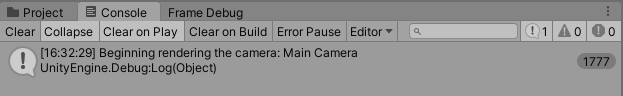
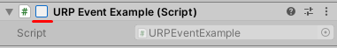

# 通过脚本注入渲染通道

Unity 在每帧渲染每个活动相机之前会触发 [beginCameraRendering](https://docs.unity.cn/cn/tuanjiemanual/ScriptReference/Rendering.RenderPipelineManager-beginCameraRendering.html) 事件。如果相机处于非活动状态（例如，如果相机 GameObject 上的 **Camera** 组件复选框未选中），Unity 不会为该相机触发 `beginCameraRendering` 事件。

当您将方法订阅到此事件时，可以在 Unity 渲染相机之前执行自定义逻辑。自定义逻辑的示例包括将额外的相机渲染到渲染纹理，并使用这些纹理来实现平面反射或监控相机视图等效果。

[RenderPipelineManager](https://docs.unity.cn/cn/tuanjiemanual/ScriptReference/Rendering.RenderPipelineManager.html) 类中的其他事件提供了更多自定义 URP 的方式。您也可以将本文中描述的原则与这些事件一起使用。

## 使用 RenderPipelineManager API

1. 将方法订阅到 [RenderPipelineManager](https://docs.unity.cn/cn/tuanjiemanual/ScriptReference/Rendering.RenderPipelineManager.html) 类中的某个事件。

2. 在订阅的方法中，使用 `ScriptableRenderer` 实例的 `EnqueuePass` 方法将自定义渲染通道注入到 URP 帧渲染中。

示例代码：

```C#
public class EnqueuePass : MonoBehaviour
{
    [SerializeField] private BlurSettings settings;    
    private BlurRenderPass blurRenderPass;

    private void OnEnable()
    {
        ...
        blurRenderPass = new BlurRenderPass(settings);
        // 将 OnBeginCamera 方法订阅到 beginCameraRendering 事件。
        RenderPipelineManager.beginCameraRendering += OnBeginCamera;
    }

    private void OnDisable()
    {
        RenderPipelineManager.beginCameraRendering -= OnBeginCamera;
        blurRenderPass.Dispose();
        ...
    }

    private void OnBeginCamera(ScriptableRenderContext context, Camera cam)
    {
        ...
        // 使用 EnqueuePass 方法注入自定义渲染通道
        cam.GetUniversalAdditionalCameraData()
            .scriptableRenderer.EnqueuePass(blurRenderPass);
    }
}
```

## 示例

此示例演示了如何将方法订阅到 `beginCameraRendering` 事件。

要遵循此示例中的步骤，请使用 **Universal Project Template** 创建一个 [新的 Unity 项目](../creating-a-new-project-with-urp.md)。

1. 在场景中创建一个立方体。将其命名为 Example Cube。
2. 在您的项目中创建一个 C# 脚本。将其命名为 `URPCallbackExample`。
3. 将以下代码复制并粘贴到脚本中。
    ```C#
    using UnityEngine;
    using UnityEngine.Rendering;

    public class URPCallbackExample : MonoBehaviour
    {
        // 当 Unity 启用此组件时，会自动调用此方法
        private void OnEnable()
        {
            // 将 WriteLogMessage 添加为 RenderPipelineManager.beginCameraRendering 事件的委托
            RenderPipelineManager.beginCameraRendering += WriteLogMessage;
        }

        // 当 Unity 禁用此组件时，会自动调用此方法
        private void OnDisable()
        {
            // 将 WriteLogMessage 从 RenderPipelineManager.beginCameraRendering 事件的委托中移除
            RenderPipelineManager.beginCameraRendering -= WriteLogMessage;
        }

        // 当此方法作为 RenderPipeline.beginCameraRendering 事件的委托时，Unity 每次触发 beginCameraRendering 事件时都会调用此方法
        void WriteLogMessage(ScriptableRenderContext context, Camera camera)
        {
            // 将文本写入控制台
            Debug.Log($"Beginning rendering the camera: {camera.name}");
        }
    }
    ```
    > **注意**：当您订阅事件时，您的处理程序方法（在此示例中为 `WriteLogMessage`）必须接受事件委托中定义的参数。在此示例中，事件委托是 `RenderPipeline.BeginCameraRendering`，它期望以下参数：`<ScriptableRenderContext, Camera>`。

4. 将 `URPCallbackExample` 脚本附加到 Example Cube。

5. 选择 **Play**。Unity 每次触发 `beginCameraRendering` 事件时都会在控制台窗口中打印脚本中的消息。

    

6. 要触发对 `OnDisable()` 方法的调用：在播放模式下，选择 Example Cube 并清除脚本组件标题旁边的复选框。Unity 将 `WriteLogMessage` 从 `RenderPipelineManager.beginCameraRendering` 事件中取消订阅，并停止在控制台窗口中打印消息。

    