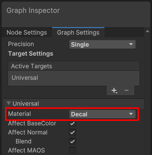
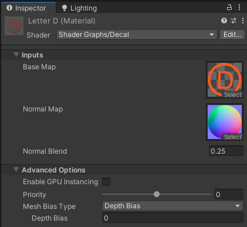
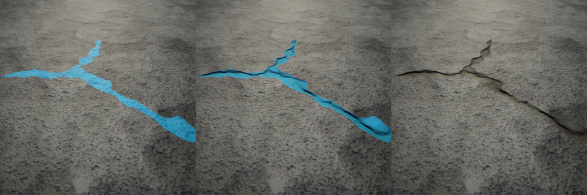
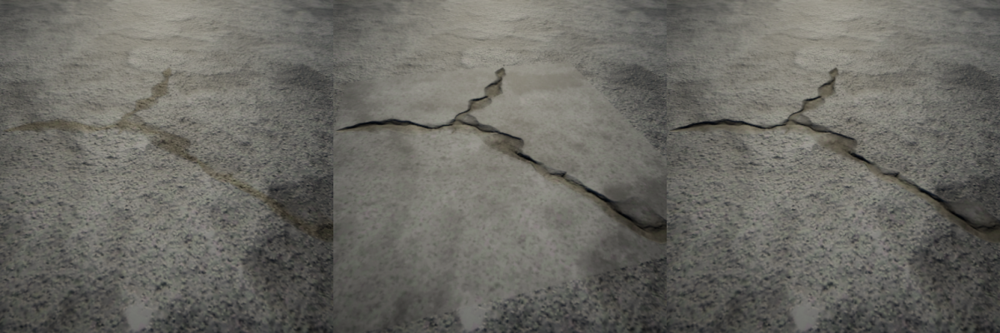
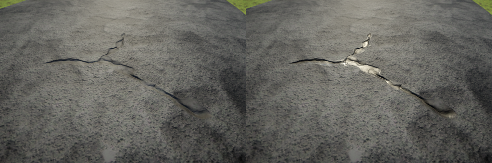
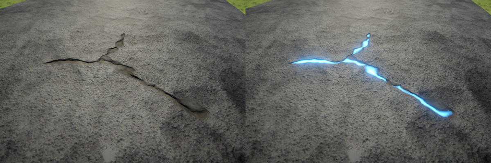
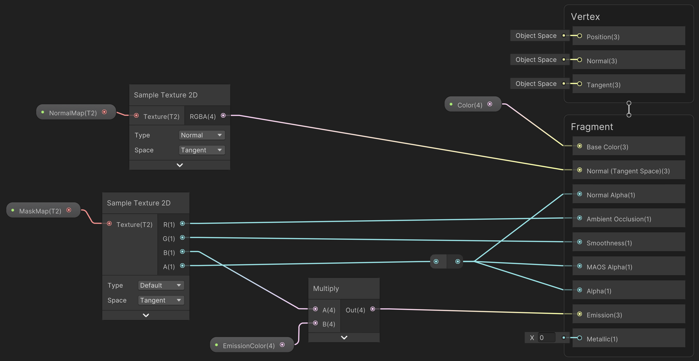
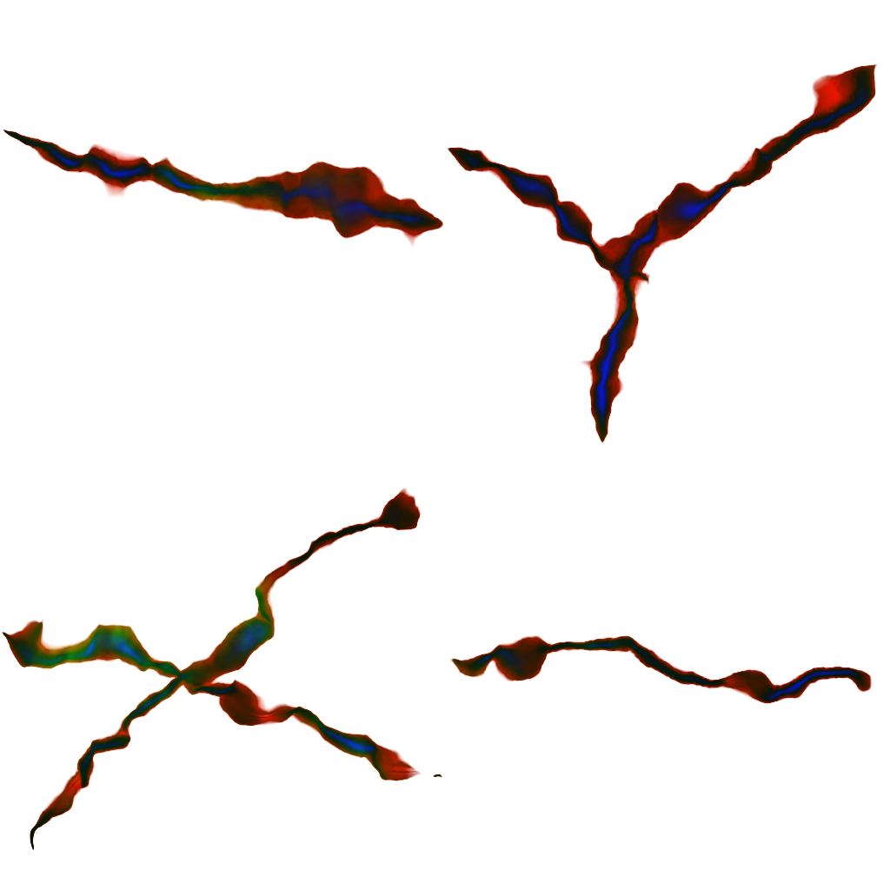

# Decal Shader Graph

在 URP 中，[Decal Projector](renderer-feature-decal.md#decal-projector-component) 组件可以将使用 Decal 材质类型 的 Shader Graph 投射为 Decal。

 *使用 Decal 材质类型的 Shader Graph*

URP 提供了预构建的 Decal Shader（`Shader Graphs/Decal`）。

 *Decal 材质属性及高级选项*

你可以直接将使用 Decal Shader Graph 的 Material 赋予 GameObject。  
例如，可以 [使用 Quad 作为 Decal GameObject](renderer-feature-decal.md#decal-gameobject)。

## 预构建 Decal Shader 的属性

- **Base Map**：材质的基础贴图。
- **Normal Map**：材质的法线贴图。
- **Normal Blend**：定义 Normal Map 贴图与被投射 Decal 的材质法线 之间的混合比例。
  - `0`：Decal 不影响原始材质的法线。
  - `1`：Decal 的法线完全替换原始材质的法线。

你可以 [创建自定义 Decal Shader Graph](#create-decal-shaders)，以更适合你的项目需求。

上述 Decal 材质属性 由 预构建的 Shader Graph 定义，  
而自定义 Decal 材质的属性则取决于自定义的 Shader Graph。

## 高级选项（Advanced Options）

下表描述了 Decal Shader 的通用高级属性。

| 属性 | 描述 |
|---|---|
| **Enable GPU Instancing** | 启用 GPU 实例化，以便 URP 在可能的情况下，将多个具有相同 Mesh 和材质 的对象合并为一个批次进行渲染，提高性能。 URP 无法合批渲染具有不同 材质 的 Mesh，或在硬件不支持 GPU Instancing 时。 |
| **Priority** | 设置 URP 在场景中绘制 Decal 的顺序。优先级较低 的 Decal 会先绘制，优先级较高 的 Decal 会覆盖 优先级较低 的 Decal。 如果场景中有多个 Decal 材质 具有相同的 Priority，URP 会按照材质创建的顺序进行渲染。 |
| **Mesh Bias Type** | 选择 Mesh 偏移类型，用于防止 Decal GameObject 和其覆盖的 GameObject 之间的 Z-Fighting（深度闪烁）。 此属性仅适用于 [直接赋予 Decal 材质的 GameObjects](renderer-feature-decal.md#decal-gameobject)，Decal Projectors 不受影响。 |
| View Bias | 以 世界坐标（米） 为单位的视图偏移。当绘制 Decal GameObject 时，Unity 沿 视角向量（View Vector） 移动 每个像素，以减少 Z-Fighting。 正值 使像素朝 相机 移动，使 Decal 贴在覆盖物上。 Decal Projectors 不受此属性影响。 |
| Depth Bias | 当绘制 Decal GameObject 时，Unity 调整 每个像素的深度值，以减少 Z-Fighting。 负值 使像素朝 相机 移动，使 Decal 贴在覆盖物上。 Decal Projectors 不受此属性影响。 |

## 创建自定义 Decal Shader

URP 预构建的 `Shader Graphs/Decal` 只是一个简单示例。你可以创建自定义 Decal Shader Graph，以适应项目需求。

### 创建 Decal Shader Graph
在 Shader Graph 中，将 Material 选项设为 **Decal**。

启用下列属性之一，会覆盖 材质表面 上的 Lit Shader 对应属性。

| 属性 | 描述 |
|---|---|
| **Affect BaseColor** | 影响基础颜色。大多数 Decals 都会使用该选项。 特殊情况如 表面损坏效果（例如划痕或损坏贴图），可能不影响颜色，而是修改其他属性（如法线）。  *从左到右：仅影响颜色、影响所有属性、影响所有属性但不影响颜色。* |
| **Affect Normal** | 影响法线，适用于 表面损坏效果（如子弹孔、裂缝）。 Blend 选项可控制 Decal 法线 与 表面法线 之间的混合程度： - 关闭 Blend：Decal 完全覆盖 表面法线。 - 启用 Blend：Decal 与表面法线混合。  *从左到右：未启用 Affect Normal，启用 Affect Normal（Blend 关闭），启用 Affect Normal（Blend 开启）。* |
| **Affect MAOS** | MAOS 代表 金属度（Metallic）、环境光遮蔽（AO） 和 光滑度（Smoothness），这些属性被打包在一张 贴图 中，以减少内存占用。 - 修改 Smoothness：模拟 水坑 或 湿漆。 - 降低 Metallic 值：模拟 生锈效果。 - 修改 AO：增强 Decal 立体感。  *左：Decal 不影响 MAOS。右：Decal 影响 MAOS。* |
| **Affect Emission** | 影响发光属性，可用于模拟自发光或受光照影响的光效。  *左：未启用 Affect Emission。右：启用 Affect Emission。* |

## 优化 Decal Shader 以提高性能

为了提高性能，应将不同的表面属性数据打包进单个纹理，这样 Shader 减少采样次数，节省存储空间。

下图展示了一个 Decal Shader Graph，其中：
- 法线贴图（Normal Map）
- 遮罩贴图（Mask Map）  
  - R 通道：AO（环境光遮蔽）
  - G 通道：Smoothness（光滑度）
  - B 通道：Emission（自发光强度）
  - A 通道：Decal Alpha 透明度

该 Decal 用于道路损坏效果，并硬编码了 0 的粗糙度（Roughness）。

下图展示了 遮罩贴图（Mask Map），用于存储 AO、光滑度、Emission 和透明度 信息：

 *Decal 遮罩贴图：将 AO、光滑度、Emission 和 Alpha 数据打包到单个纹理中。*
