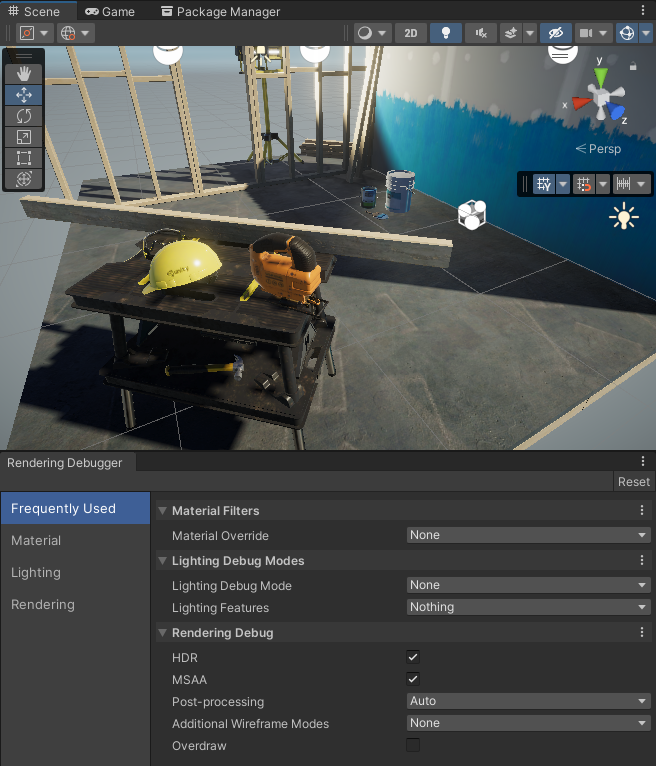
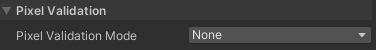

# 渲染调试器

**Rendering Debugger** 窗口可视化各种光照、渲染和材质属性。这些可视化工具可以帮助您识别渲染问题并优化场景和渲染配置。

本节包含以下内容：

* [如何访问 Rendering Debugger](#how-to-access)

    介绍如何在 Editor、Playmode 和 Development Build 的 Runtime 中访问 **Rendering Debugger** 窗口。

* [Runtime 导航](#navigation-at-runtime)

    介绍如何在 Runtime 运行时导航 **Rendering Debugger** 界面。

* [Rendering Debugger 窗口部分](#ui-sections)

    介绍 **Rendering Debugger** 窗口中的各个元素和属性。

## 如何访问 Rendering Debugger

Rendering Debugger 窗口可用于以下模式：

| 模式       | 平台            | 可用性                         | 如何打开 Rendering Debugger |
| ---------- | -------------- | ------------------------------ | ------------------ |
| Editor     | 所有            | 是（在 Editor 窗口中）           | 选择 **Window > Analysis > Rendering Debugger** |
| Playmode   | 所有            | 是（在 Game 视图中作为 Overlay） | 在桌面或笔记本电脑上，按 **LeftCtrl+Backspace**（macOS 上为 **LeftCtrl+Delete**） 在游戏手柄上，按 L3 和 R3（Left Stick 和 Right Stick） |
| Runtime    | Desktop/Laptop | 是（仅限 Development Build）   | 按 **LeftCtrl+Backspace**（macOS 上为 **LeftCtrl+Delete**） |
| Runtime    | Console        | 是（仅限 Development Build）   | 按 L3 和 R3（Left Stick 和 Right Stick） |
| Runtime    | Mobile         | 是（仅限 Development Build）   | 使用三指双击 |

要在构建的应用程序中启用 **Rendering Debugger** 的所有部分，请在 **Project Settings > Graphics > URP Global Settings** 中禁用 **Strip Debug Variants**。否则，您只能使用 [Display Stats](#display-stats) 部分。

要禁用 Runtime UI，可以使用 [enableRuntimeUI](https://docs.unity.cn/cn/Packages-cn/com.unity.render-pipelines.core@latest/api/UnityEngine.Rendering.DebugManager.html#UnityEngine_Rendering_DebugManager_enableRuntimeUI) 属性。

> [!NOTE]
> 在 Development Build 中使用 **Rendering Debugger** 窗口时，请确保在 **Project Settings > Graphics > URP Global Settings** 中取消选中 **Strip Debug Variants** 选项。

## Runtime 导航

### Keyboard

| 操作                                             | 控制方式                                                                                   |
|--------------------------------------------------|-------------------------------------------------------------------------------------------|
| **更改当前活动项**                               | 使用方向键                                                                                |
| **更改当前选项卡**                               | 使用 Page Up 和 Page Down 键（MacOS 上分别使用 Fn + Up 和 Fn + Down）                       |
| **独立显示当前活动项（脱离调试窗口）**           | 按下右 Shift 键                                                                            |

### Xbox Controller

| 操作                                             | 控制方式                                                                                   |
|--------------------------------------------------|-------------------------------------------------------------------------------------------|
| **更改当前活动项**                               | 使用方向键（D-Pad）                                                                       |
| **更改当前选项卡**                               | 使用 Left Bumper 和 Right Bumper                                                          |
| **独立显示当前活动项（脱离调试窗口）**           | 按下 X 按钮                                                                              |

### PlayStation Controller

| 操作                                             | 控制方式                                                                                   |
|--------------------------------------------------|-------------------------------------------------------------------------------------------|
| **更改当前活动项**                               | 使用方向按钮                                                                             |
| **更改当前选项卡**                               | 使用 L1 和 R1 按钮                                                                       |
| **独立显示当前活动项（脱离调试窗口）**           | 按下 Square 按钮                                                                         |

## Rendering Debugger 窗口部分

**Rendering Debugger** 窗口包含以下部分：

* [Display Stats](#display-stats)

* [Frequently Used](#frequently-used)

* [Material](#material)

* [Lighting](#lighting)

* [Rendering](#rendering)

下图展示了 **Rendering Debugger** 窗口在 Scene 视图中的显示效果。

### Display Stats

**Display Stats** 面板显示与调试项目性能问题相关的统计信息。您只能在 **Playmode** 下查看 **Rendering Debugger** 的这一部分。

使用 [Runtime 快捷键](#navigation-at-runtime) 在 Scene 视图中打开 Display Stats 窗口。

### Frame Stats

**Frame Stats** 部分显示每个属性的平均值、最小值和最大值。HDRP 计算 Frame Stats 的值基于最近 30 帧的数据。

| **属性**                     | **描述**                                                  |
|------------------------------|----------------------------------------------------------|
| **Frame Rate**               | 当前相机视图的帧率（帧/秒）。                            |
| **Frame Time**               | 当前相机视图的总帧时间。                                |
| **CPU Main Thread Frame**    | 从帧开始到主线程完成作业所用的总时间（毫秒）。          |
| **CPU Render Thread Frame**  | 渲染线程开始工作到 Unity 等待渲染当前帧所用的时间（毫秒）。 |
| **CPU Present Wait**         | CPU 在上一帧等待 Unity 渲染当前帧（[Gfx.PresentFrame](https://docs.unity3d.com/2022.1/Documentation/Manual/profiler-markers.html)）的时间（毫秒）。 |
| **GPU Frame**                | GPU 渲染当前帧所用的时间（毫秒）。                      |
| **Debug XR Layout**          | 显示 XR Passes 的调试信息。 该模式仅在 Editor 和 Development Build 中可用。 |

### Bottlenecks

Bottleneck 指的是某个进程的执行速度明显慢于其他组件，而其他组件又依赖于它的情况。

**Bottlenecks** 部分描述了最近 60 帧在 CPU 和 GPU 之间的分布情况。只有在设备上构建 Player 后，您才能看到 Bottleneck 信息。

**注意**: Vsync 会根据设备屏幕的刷新率限制 **Frame Rate**。这意味着当 Vsync 开启时，**Present Limited** 类别在大多数情况下都会达到 100%。要关闭 Vsync，请前往 **Edit** > **Project Settings** > **Quality** > **Current Active Quality Level**，然后将 **Vsync Count** 设置为 **Don't Sync**。

#### Bottleneck 分类

| **类别**           | **描述**                                                  |
|-------------------|----------------------------------------------------------|
| **CPU**          | 最近 60 帧中，由 CPU 限制帧时间的帧数百分比。               |
| **GPU**          | 最近 60 帧中，由 GPU 限制帧时间的帧数百分比。               |
| **Present limited** | 最近 60 帧中，由以下呈现约束（presentation constraints）限制帧时间的帧数百分比： &bull; **Vertical Sync (Vsync)**：Vsync 使渲染与显示器的刷新率同步。 &bull; [Target framerate](https://docs.unity3d.com/ScriptReference/Application-targetFrameRate.html)：用于手动限制应用程序帧率的函数。如果帧在目标帧率指定的时间之前准备好，Unity 会等待一段时间后再呈现该帧。 |
| **Balanced**     | 最近 60 帧中，不受上述任何类别限制的帧数百分比。**Balanced** 达到 100% 表示 CPU 和 GPU 的处理时间基本相等。 |

#### Bottleneck 示例

如果 Vsync 限制了最近 60 帧中的 20 帧，那么 **Bottlenecks** 部分可能会显示如下数据：

* **CPU** 0.0%：表示在最近 60 帧中，HDRP 没有任何帧在 CPU 上渲染受限。
* **GPU** 66.6%：表示 HDRP 渲染的最近 60 帧中，有 66.6% 受到 GPU 限制。
* **Present Limited** 33.3%：表示最近 60 帧中，有 33.3% 受到呈现约束（Vsync 或 [target framerate](https://docs.unity3d.com/ScriptReference/Application-targetFrameRate.html)）的限制。
* **Balanced** 0.0%：表示最近 60 帧中，没有帧的 CPU 处理时间和 GPU 处理时间相等。

在此示例中，瓶颈（bottleneck）在于 **GPU**。

### Detailed Stats

**Detailed Stats** 部分显示了每个渲染步骤在 CPU 和 GPU 上所花费的时间（以毫秒计）。HDRP 每帧更新这些值，基于上一帧的计算结果。

| **属性**                     | **描述**                                                  |
|-----------------------------|----------------------------------------------------------|
| Update every second with average | 计算一秒钟内的平均值，并每秒更新一次。                  |
| Hide empty scopes           | 隐藏 CPU 和 GPU 处理时间为 0.00ms 的分析范围（profiling scopes）。 |
| Debug XR Layout             | 启用后，在 **Editor** 和 **Development Builds** 中显示 [XR](https://docs.unity3d.com/Manual/XR.html) pass 的调试信息。 |

### Frequently Used

此部分包含了一些用户常用的属性，这些属性来自 **Rendering Debugger** 窗口中的其他部分。有关这些属性的详细信息，请参阅 [Material](#material)、[Lighting](#lighting) 和 [Rendering](#rendering) 章节。

### Material

此部分的属性可用于可视化不同的 Material 属性。

#### Material Filters

| **属性** | **描述** |
| --- | --- |
| **Material&#160;Override** | 选择一个 Material 属性，在屏幕上的每个 GameObject 上进行可视化。 可用选项包括：<ul><li>Albedo</li><li>Specular</li><li>Alpha</li><li>Smoothness</li><li>AmbientOcclusion</li><li>Emission</li><li>NormalWorldSpace</li><li>NormalTangentSpace</li><li>LightingComplexity</li><li>Metallic</li><li>SpriteMask</li></ul>选择 **LightingComplexity** 时，Unity 将显示有多少 Lights 影响屏幕空间的区域。 |
| **Vertex&#160;Attribute** | 选择一个 GameObject 的顶点属性进行屏幕可视化。 可用选项包括：<ul><li>Texcoord0</li><li>Texcoord1</li><li>Texcoord2</li><li>Texcoord3</li><li>Color</li><li>Tangent</li><li>Normal</li></ul> |

#### Material Validation

| **属性** | **描述** |
| --- | --- |
| **Material&#160;Validation Mode** | 选择要可视化的 Material 属性：Albedo 或 Metallic。选择其中一个属性后，将显示新的上下文菜单。 |
| &#160;&#160;&#160;&#160;**Validation&#160;Mode:&#160;Albedo** | 选择 **Albedo** 后，Material&#160;Validation Mode 属性会显示 **Albedo Settings** 部分，其中包括以下属性： **Validation&#160;Preset**：选择一个预配置材质，或选择 **Default Luminance** 以可视化亮度范围。 **Min Luminance**：Unity 用红色绘制亮度低于该值的像素。 **Max Luminance**：Unity 用蓝色绘制亮度高于该值的像素。 **Hue Tolerance**：仅在选择预设材质时可用。Unity 在最小和最大亮度值上添加色调容差。 **Saturation Tolerance**：仅在选择预设材质时可用。Unity 在最小和最大亮度值上添加饱和度容差。 |
| &#160;&#160;&#160;&#160;**Validation&#160;Mode:&#160;Metallic** | 选择 **Metallic** 后，Material&#160;Validation Mode 属性会显示 **Metallic Settings** 部分，其中包括以下属性： **Min Value**：Unity 用红色绘制金属度低于该值的像素。 **Max Value**：Unity 用蓝色绘制金属度高于该值的像素。 |

### Lighting

此部分的属性可用于可视化与光照系统相关的不同设置和元素，例如阴影级联、反射、主光源和附加光源的贡献等。

#### Lighting Debug Modes

| **属性** | **描述** |
| ----------------------- | ------------------------------------------------------------ |
| **Lighting Debug Mode** | 指定要在屏幕上覆盖的光照和阴影信息，以进行调试。可用选项包括：<ul><li>**None**：正常渲染场景，无调试叠加。</li><li>**Shadow Cascades**：覆盖阴影级联信息，以便查看每个像素使用的阴影级联。可用于调试阴影级联距离。有关颜色与阴影级联的对应关系，请参阅 [URP 资源的阴影部分](../universalrp-asset.md#shadows)。</li><li>**Lighting Without Normal Maps**：渲染场景以可视化光照。此模式使用中性材质并禁用法线贴图。此模式和 **Lighting With Normal Maps** 模式有助于调试由法线贴图引起的光照问题。</li><li>**Lighting With Normal Maps**：渲染场景以可视化光照。此模式使用中性材质并允许法线贴图。</li><li>**Reflections**：渲染场景以可视化反射。此模式对每个 Mesh Renderer 应用完全平滑的反射材质。</li><li>**Reflections With Smoothness**：渲染场景以可视化反射。此模式对每个 GameObject 应用具有原始平滑度的反射材质。</li></ul> |
| **Lighting Features**   | 指定哪些光照特性会影响最终的光照结果。可用于查看和调试场景中特定的光照特性。可用选项包括：<ul><li>**Nothing**：快捷方式，禁用所有标志。</li><li>**Everything**：快捷方式，启用所有标志。</li><li>**Global Illumination**：是否渲染 [全局光照](https://docs.unity3d.com/Manual/realtime-gi-using-enlighten.html)。</li><li>**Main Light**：主方向光 [Light](../light-component.md) 是否对光照有贡献。</li><li>**Additional Lights**：主方向光以外的光源是否对光照有贡献。</li><li>**Vertex Lighting**：使用顶点光照的附加光源是否对光照有贡献。</li><li>**Emission**：发光材质（[emissive](https://docs.unity3d.com/Manual/StandardShaderMaterialParameterEmission.html)）是否对光照有贡献。</li><li>**Ambient Occlusion**：是否启用 [环境光遮蔽](../post-processing-ssao.md)。</li></ul> |

### Rendering

此部分的属性可用于可视化不同的渲染功能。

#### Rendering Debug

| **属性**                     | **描述** |
|------------------------------|------------------------------------------------------------|
| **Map Overlays**             | 指定要在屏幕上覆盖的渲染管线纹理。可选项包括：<ul><li>**None**：正常渲染场景，无纹理覆盖。</li><li>**Depth**：在屏幕上覆盖相机的深度纹理。</li><li>**Additional Lights Shadow Map**：在屏幕上覆盖包含主方向光以外的光源投射的阴影的 [shadow map](https://docs.unity3d.com/Manual/shadow-mapping.html)。</li><li>**Main Light Shadow Map**：在屏幕上覆盖包含主方向光投射的阴影的 shadow map。</li></ul> |
| **&nbsp;&nbsp;Map Size**     | 叠加纹理的宽度和高度，以 URP 在视图窗口中显示的百分比表示。例如，值 **50** 代表纹理占据屏幕的四分之一（宽度的 50% 和高度的 50%）。 |
| **HDR**                      | 指示是否使用 [高动态范围 (HDR)](https://docs.unity3d.com/Manual/HDR.html) 渲染场景。仅当您在 URP 资源中启用了 **HDR** 时，该属性才会生效。 |
| **MSAA**                     | 指示是否使用 [Multisample Anti-aliasing (MSAA)](./../anti-aliasing.md#msaa) 渲染场景。仅当满足以下条件时，该属性才会生效：<ul><li>您在 URP 资源中的 **Anti Aliasing (MSAA)** 选项设为 **Disabled** 以外的值。</li><li>您使用的是 Game 视图。MSAA 对 Scene 视图无效。</li></ul> |
| **Post-processing**          | 指定 URP 如何应用后处理。可选项包括：<ul><li>**Disabled**：禁用后处理。</li><li>**Auto**：Unity 根据当前激活的调试模式决定是否启用后处理。如果后处理的颜色变化会影响调试模式的像素意义，Unity 会禁用后处理。如果没有激活调试模式，或者后处理的颜色变化不会影响调试模式的像素，Unity 会启用后处理。</li><li>**Enabled**：对相机捕获的图像应用后处理。</li></ul> |
| **Additional Wireframe Modes** | 指定是否以及如何为场景中的网格渲染线框。可选项包括：<ul><li>**None**：不渲染线框。</li><li>**Wireframe**：仅渲染场景中网格的边缘。在此模式下，即使被其他网格遮挡，仍然可以看到网格的线框。</li><li>**Solid Wireframe**：仅渲染网格的边缘和面。在此模式下，每个线框网格的面会遮挡后方的边缘。</li><li>**Shaded Wireframe**：将网格的边缘作为覆盖层渲染。在此模式下，Unity 以颜色渲染场景，并在顶部叠加线框。</li></ul> |
| **Overdraw**                 | 指示是否渲染 Overdraw 调试视图。这对于查看 Unity 在同一像素位置多次绘制内容的情况非常有用。 |

#### Pixel Validation

 *Pixel Validation 子部分。*

| **属性**                     | **描述** |
|------------------------------|------------------------------------------------------------|
| **Pixel Validation Mode**     | 指定 Unity 用于验证像素颜色值的模式。可选项包括：<ul><li>**None**：正常渲染场景，不验证像素。</li><li>**Highlight NaN, Inf and Negative Values**：高亮显示具有 NaN、Inf 或负值的像素。</li><li>**Highlight Values Outside Range**：高亮显示超出特定范围的像素。使用 **Value Range Min** 和 **Value Range Max** 来定义范围。</li></ul> |
| **&nbsp;&nbsp;Channels**     | 指定用于像素值范围验证的通道。可选项包括：<ul><li>**RGB**：使用由红、绿、蓝颜色通道计算出的亮度值进行验证。</li><li>**R**：使用红色通道的值进行验证。</li><li>**G**：使用绿色通道的值进行验证。</li><li>**B**：使用蓝色通道的值进行验证。</li><li>**A**：使用 Alpha 通道的值进行验证。</li></ul>此属性仅在 **Pixel Validation Mode** 设为 **Highlight Values Outside Range** 时可用。 |
| **&nbsp;&nbsp; Value Range Min** | 最小有效颜色值。Unity 会高亮显示低于该值的颜色值。  此属性仅在 **Pixel Validation Mode** 设为 **Highlight Values Outside Range** 时可用。 |
| **&nbsp;&nbsp; Value Range Max** | 最大有效颜色值。Unity 会高亮显示高于该值的颜色值。  此属性仅在 **Pixel Validation Mode** 设为 **Highlight Values Outside Range** 时可用。 |
