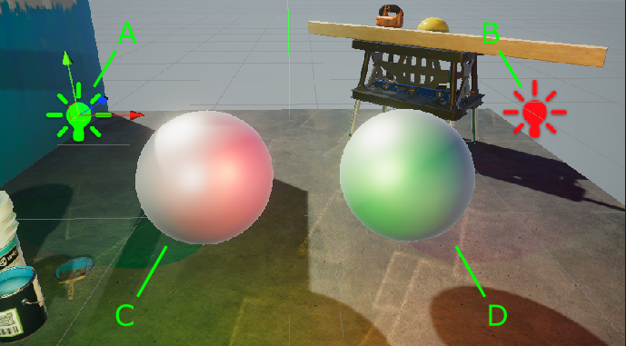
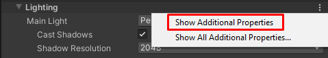
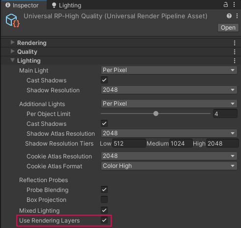
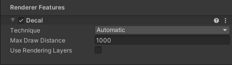
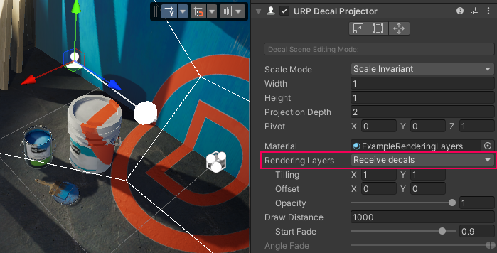
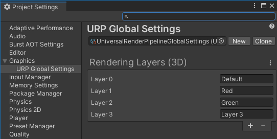
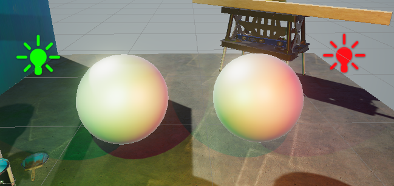
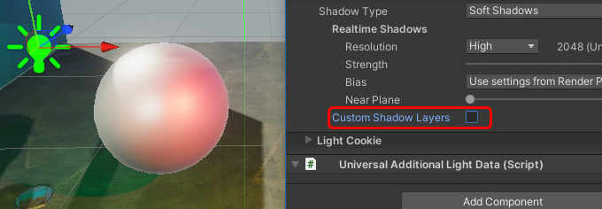
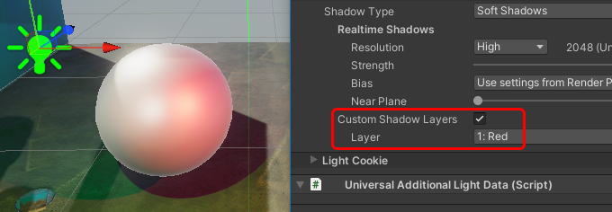
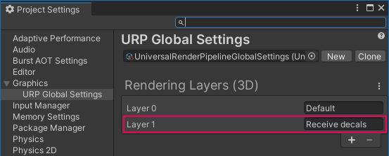

# Rendering Layers

Rendering Layers 功能允许您配置特定的 Lights 仅影响特定的 GameObjects。

例如，在下图中，光源 `A` 影响球体 `D`，但不影响球体 `C`。光源 `B` 影响球体 `C`，但不影响球体 `D`。

要了解如何实现此示例，请参考 [如何使用 Rendering Layers](#how-to-rendering-layers)。

## 启用 Rendering Layers 以用于 Lights

要在项目中启用 Rendering Layers 以用于 Lights，请按照以下步骤操作：

1. 在 [URP Asset](../universalrp-asset.md) 中，进入 **Lighting** 部分，点击垂直省略号图标 (&vellip;) 并选择 **Show Additional Properties**。

    

2. 在 [URP Asset](../universalrp-asset.md) 中，进入 **Lighting** 部分，选中 **Use Rendering Layers**。

     *URP Asset > Lighting > Use Rendering Layers*

## 启用 Rendering Layers 以用于 Decals

要在项目中启用 Rendering Layers 以用于 Decals，请按照以下步骤操作：

1. 在 [Decal Renderer Feature](../renderer-feature-decal.md#decal-renderer-feature-properties) 中，启用 **Use Rendering Layers**。

     *Decal Renderer Feature, Inspector 视图。*

启用 Rendering Layers 以用于 Decals 后，Unity 会在每个 Decal Projector 上显示 **Rendering Layers** 属性：

## 如何编辑 Rendering Layer 名称

要编辑 Rendering Layer 的名称，请按照以下步骤操作：

1. 进入 **Project Settings** > **Graphics** > **URP Global Settings**。

2. 在 **Rendering Layers (3D)** 部分编辑 Rendering Layer 名称。

     *Graphics > URP Global Settings > Rendering Layers (3D)*

## 如何使用 Rendering Layers 以用于 Lights

本部分介绍如何配置以下应用示例：

* 场景包含两个 Point Lights（在示例图中标记为 `A` 和 `B`）以及两个球体 GameObjects（在示例图中标记为 `C` 和 `D`）。
* 光源 `A` 影响球体 `D`，但不影响球体 `C`。光源 `B` 影响球体 `C`，但不影响球体 `D`。

下图展示了示例效果：

 *光源 `A` 影响球体 `D`，但不影响球体 `C`。光源 `B` 影响球体 `C`，但不影响球体 `D`。*

要实现此示例，请执行以下操作：

1. [启用 Rendering Layers](#enable) 以用于项目。

2. 创建两个 Point Lights（命名为 `A` 和 `B`）和两个球体（命名为 `C` 和 `D`）。调整对象位置，使两个球体都处于 Lights 的照射范围内。

3. 进入 **Project Settings > Graphics > URP Global Settings**。将 Rendering Layer 1 重命名为 `Red`，Layer 2 重命名为 `Green`。

    

4. 选择光源 `A`，将其颜色更改为绿色。选择光源 `B`，将其颜色更改为红色。此时，两个 Lights 都影响两个球体。

    

5. 在 Lights 和球体上进行以下设置：

    - 光源 `A`：在 **Light > Rendering > Rendering Layers** 属性中，取消所有选项，仅选择 `Green`。
    - 光源 `B`：在 **Light > Rendering > Rendering Layers** 属性中，取消所有选项，仅选择 `Red`。
    - 球体 `C`：在 **Mesh Renderer > Additional Settings > Rendering Layer Mask** 属性中，选择所有选项，取消 `Green`。
    - 球体 `D`：在 **Mesh Renderer > Additional Settings > Rendering Layer Mask** 属性中，选择所有选项，取消 `Red`。

    现在，Point Light `A` 仅影响球体 `D`，而不影响球体 `C`。Point Light `B` 仅影响球体 `C`，而不影响球体 `D`。

    

## 如何使用 Custom Shadow Layers

在上图示例中，光源 `A` 不影响球体 `C`，且球体不会从光源 `A` 投射阴影。

**Custom Shadow Layers** 属性允许您配置场景，使球体 `C` 仅从光源 `A` 投射阴影，而不受其光照影响。

1. 选择光源 `A`。

2. 在 **Light > Shadows** 中，启用 **Custom Shadow Layers** 属性。Unity 将显示 **Layer** 属性。

3. 在 **Layer** 属性中，选择球体 `C` 所属的 Rendering Layer。

现在光源 `A` 不影响球体 `C`，但球体 `C` 仍然从光源 `A` 投射阴影。

下图展示了 **Custom Shadow Layers** 关闭和开启的场景对比：

## 如何使用 Rendering Layers 以用于 Decals

本部分介绍如何配置以下应用示例：

* 场景包含一个 Decal Projector。
* Decal Projector 在墙面和地面上投射贴花，但不会影响油漆桶。

下图展示了示例效果：

 *在图像 `1` 中，油漆桶勾选了 `Receive decals` 层。 在图像 `2` 中，它未勾选，因此 Decal Projector 不会在油漆桶上投射贴花。*

要实现此示例，请执行以下操作：

1. 在项目中[启用 Rendering Layers 以用于 Decals](#enable-decals)。

2. 在场景中[创建一个 Decal Projector](../renderer-feature-decal.md#how-to-use-the-feature)。

3. 进入 **Project Settings > Graphics > URP Global Settings**，添加一个名为 `Receive decals` 的 Rendering Layer。

    

4. 选择 Decal Projector，在 **Rendering Layers** 属性中选择 `Receive decals`。

    

5. 选择油漆桶 GameObject，在 **Rendering Layer Mask** 属性中，取消选择 `Receive decals` 层。现在 Decal Projector 不会影响该 GameObject。

## 性能影响

本部分提供 Rendering Layers 对性能影响的相关信息。

* 尽量保持 Rendering Layers 数量尽可能少，避免创建未在项目中使用的 Rendering Layers。

* 当 Rendering Layers 用于 Decals 时，增加层数会提高所需的内存带宽，并降低性能。

* 在 Forward 渲染路径中，仅对 Lights 使用 Rendering Layers 时，性能影响可以忽略不计。

* 当 Rendering Layers 数量超过 8 的倍数时，性能影响更明显。例如：从 8 层增加到 9 层的影响相对较大，而从 9 层增加到 10 层的影响相对较小。
