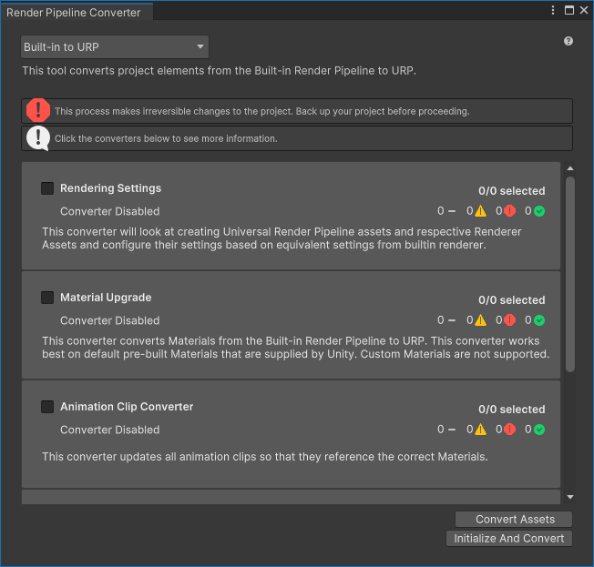
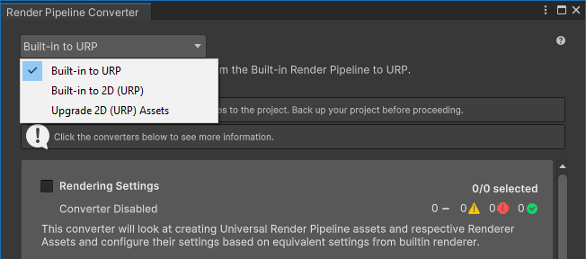
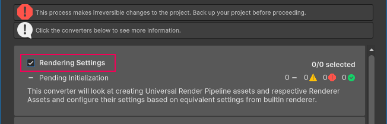
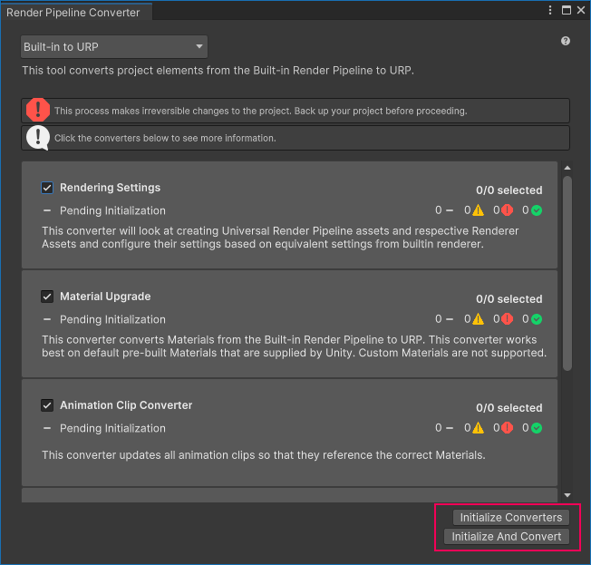
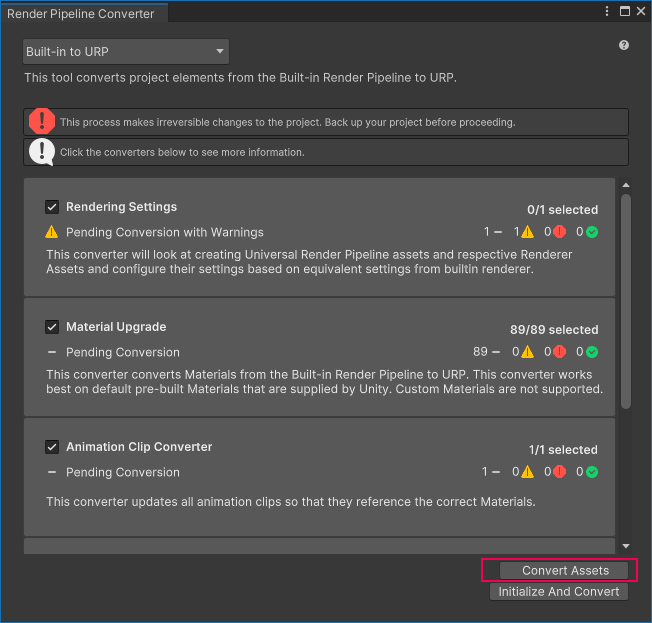
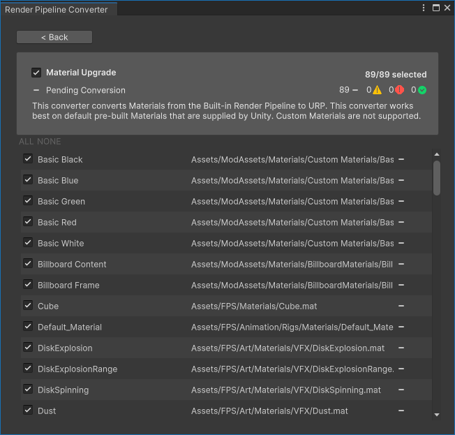
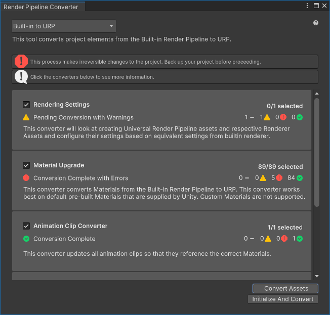
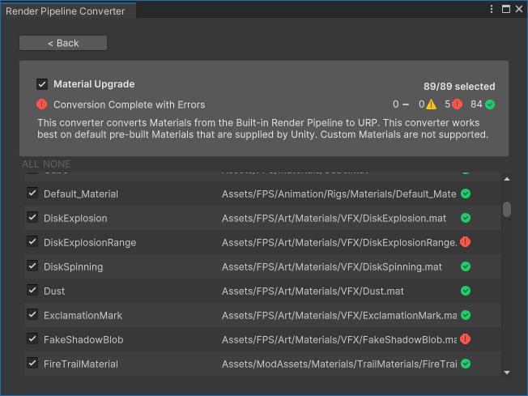

# Render Pipeline Converter

**Render Pipeline Converter** 可将为 Built-in Render Pipeline 项目创建的资源转换为兼容 URP 的资源。

> **注意：** 转换过程会对项目进行不可逆的更改。请在转换前备份您的项目。

## 如何使用 Render Pipeline Converter

要转换项目资源，请执行以下步骤：

1. 选择 **Window** > **Rendering** > **Render Pipeline Converter**。Unity 将打开 Render Pipeline Converter 窗口。

    

2. 选择转换类型。

    

3. 根据转换类型，对话框会显示可用的转换器。勾选或取消勾选转换器名称旁边的复选框，以启用或禁用转换器。

    

    可用转换器的列表请参考 [Converters](#converters) 部分。

4. 点击 **Initialize Converters**。Render Pipeline Converter 会预处理项目中的资源，并显示要转换的元素列表。勾选或取消勾选资源旁边的复选框，以包含或排除它们在转换过程中。

    

    下图展示了已初始化的转换器。

    

    点击一个转换器可查看即将转换的项目列表。

    

    **黄色图标**：如果元素旁边出现黄色图标，则表示可能需要用户操作才能进行转换。将鼠标悬停在图标上以查看问题描述。

5. 点击 **Convert Assets** 开始转换过程。

    > **注意：** 转换过程会对项目进行不可逆的更改。请在转换前备份您的项目。

    当转换完成后，窗口会显示每个转换器的状态。

    

    **绿色对勾**：转换无问题。

    **黄色图标**：转换完成但存在警告，可能需要用户操作。

    **红色图标**：转换失败。

6. 点击转换器可查看该转换器处理的项目列表。

    

    在审核转换后的项目后，关闭 Render Pipeline Converter 窗口。

## <a name="converters"></a>转换类型与转换器

Render Pipeline Converter 允许您选择以下转换类型之一：

* Built-in Render Pipeline 到 URP
* Built-in Render Pipeline 2D 到 URP 2D
* 升级 2D URP 资源

当您选择一个转换类型时，工具会显示可用的转换器。

以下部分描述了每种转换类型所提供的转换器。

### Built-in Render Pipeline to URP

此转换类型可将项目元素从 Built-in Render Pipeline 转换为 URP。

可用的转换器：

* **Rendering Settings**

    此转换器创建 URP Asset 和 Renderer 资源。然后，该转换器评估 Built-in Render Pipeline 项目中的设置，并将其转换为 URP 资源中的等效属性。

* **Material Upgrade**

    此转换器用于转换材质。它适用于 Unity 提供的预构建材质，不支持带有自定义 Shader 的材质。

* **Animation Clip Converter**

    此转换器用于转换动画片段。在 **Material Upgrade** 转换器完成后运行。

    > **注意：** 仅当项目包含影响材质属性或 Post-processing Stack v2（PPv2）属性的动画时，此转换器才可用。

* **Read-only Material Converter**

    此转换器用于转换预构建的只读材质，这些材质无法通过 **Material Upgrade** 转换器替换 Shader。此转换器会索引项目并创建一个临时 `.index` 文件，可能需要较长时间。

    只读材质的示例：`Default-Diffuse`、`Default-Line`、`Default-Terrain-Diffuse` 等。

* **Post-Processing Stack v2 Converter**

    此转换器将 PPv2 Volumes、Profiles 和 Layers 转换为 URP Volumes、Profiles 和 Cameras。此转换器会索引项目并创建一个临时 `.index` 文件，可能需要较长时间。

### Built-in Render Pipeline 2D to URP 2D

此转换类型可将项目元素从 Built-in Render Pipeline 2D 转换为 URP 2D。

可用的转换器：

* **Material and Material Reference Upgrade**

    此转换器将所有材质及材质引用从 Built-in Render Pipeline 2D 转换为 URP 2D。

### Upgrade 2D URP Assets

此转换类型可将 2D 项目中的资源从较早的 URP 版本升级到当前的 URP 版本。

可用的转换器：

* **Parametric to Freeform Light Upgrade**

    此转换器可将所有参数化光源转换为自由形态光源。

# 使用 API 或 CLI 运行转换

Render Pipeline Converter 实现了 [Converters](xref:UnityEditor.Rendering.Universal.Converters) 类，并提供了 [RunInBatchMode](xref:UnityEditor.Rendering.Universal.Converters.RunInBatchMode(UnityEditor.Rendering.Universal.ConverterContainerId)) 方法，可让您从命令行运行转换过程。

例如，以下脚本初始化并执行 **Material Upgrade** 和 **Read-only Material Converter** 转换器。

```C#
using System.Collections;
using System.Collections.Generic;
using UnityEditor;
using UnityEditor.Rendering.Universal;
using UnityEngine;

public class MyUpgradeScript : MonoBehaviour
{
    public static void ConvertBuiltinToURPMaterials()
    {
        Converters.RunInBatchMode(
            ConverterContainerId.BuiltInToURP
            , new List<ConverterId> {
                ConverterId.Material,
                ConverterId.ReadonlyMaterial
            }
            , ConverterFilter.Inclusive
        );
        EditorApplication.Exit(0);
    }
}
```

要从命令行运行示例转换，请使用以下命令：

```
"<path to Unity application> -projectPath <project path> -batchmode -executeMethod MyUpgradeScript.ConvertBuiltinToURPMaterials
```

有关更多信息，请参考：[Unity Editor 命令行参数](https://docs.unity3d.com/Manual/EditorCommandLineArguments.html)。