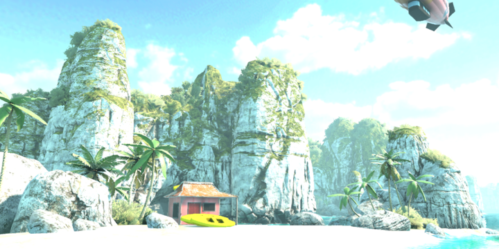
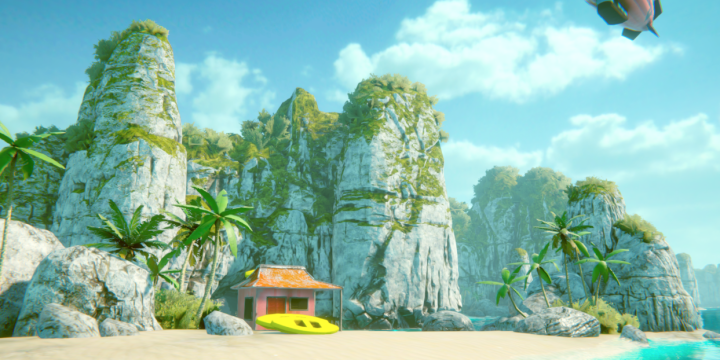
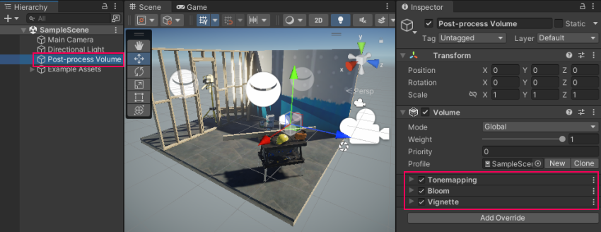
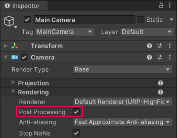
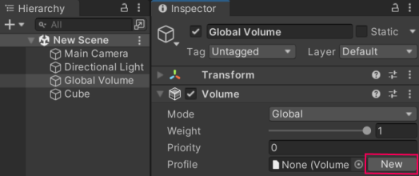

# 通用渲染管线中的后处理

通用渲染管线（URP） 集成了 [后处理](https://docs.unity.cn/cn/tuanjiemanual/Manual/PostProcessingOverview.html) 效果，无需额外安装后处理包。URP 不兼容 [Post Processing Stack v2](https://docs.unity3d.com/Packages/com.unity.postprocessing@latest/index.html) 包。

URP 使用 [Volume](Volumes.md) 框架管理后处理效果。

下图展示了启用和禁用 URP 后处理的场景效果：

未启用后处理：  

启用后处理：  

> 注意：URP 不支持 在 OpenGL ES 2.0 平台上使用后处理。

## 如何在 URP 中配置后处理效果

本节介绍在 URP 中配置后处理的方法。

### 在 URP 模板场景中使用后处理

URP 模板场景（SampleScene） 已预配置了后处理。

要查看预设的后处理效果，请在场景中选择 **Post-process Volume**。

如需添加额外效果，请 [在 Volume 组件中添加 Volume Overrides](VolumeOverrides.md#volume-add-override)。

如需基于位置应用不同的后处理效果，请参考 [如何使用局部 Volume](Volumes.md#volume-local)。

### 在新建的 URP 场景中配置后处理

在新建场景中配置后处理：

1. 选择 Camera，勾选 **Post Processing** 复选框。

   

2. 在场景中添加一个 包含 Volume 组件的 GameObject（添加 全局 Volume）：  
   **GameObject > Volume > Global Volume**。

3. 选择 **Global Volume** GameObject，在 Volume 组件 中创建一个 新的 Profile：
   - 在 Profile 属性右侧，点击 **New** 按钮。

   

4. 在 Volume 组件 中，[添加 Volume Overrides](VolumeOverrides.md#volume-add-override)，  
   这样你就可以添加并调整后处理效果。

现在，你可以使用 Volume Override 启用并调整后处理效果的参数。

> 注意：  
> 包含 Volume 组件的 GameObject 和 需要应用后处理的相机 必须在相同的 Layer 中。

详细信息请参考 [理解 Volume](Volumes.md)。

## URP 在移动设备上的后处理

后处理效果可能会消耗大量帧时间。在移动端使用 URP 时，以下后处理效果默认更适合移动设备：

- Bloom（需禁用 **High Quality Filtering**）
- Chromatic Aberration
- Color Grading
- Lens Distortion
- Vignette

> 注意：  
> - 对于景深（Depth of Field），低端设备建议使用 Gaussian Depth of Field，  
>   主机和 PC 平台 可使用 Bokeh Depth of Field。
> - 在移动设备上，推荐使用 FXAA 作为抗锯齿方案。

## URP 在 VR 设备上的后处理
在 VR 应用程序和游戏中，某些后期处理效果可能会导致恶心和迷失方向。为了减少快节奏或高速应用程序中的晕动症，请使用 VR 的渐变效果，并避免使用 VR 的镜头畸变、色差和运动模糊效果。
