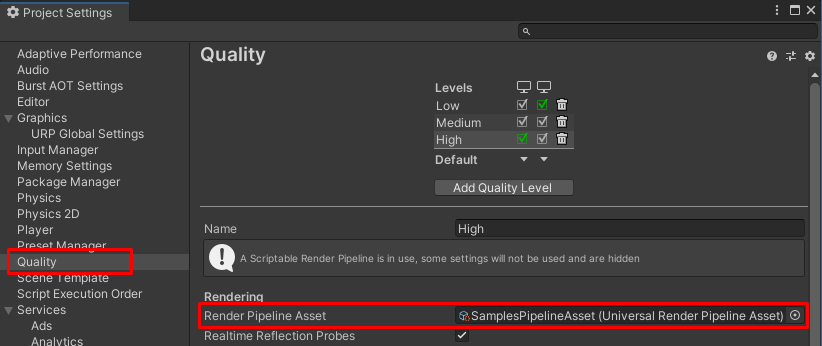
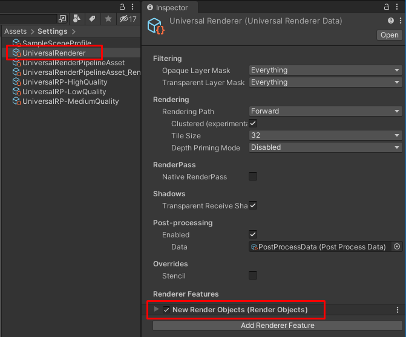

# 已知问题

本页面列出在使用 URP 时可能遇到的已知问题。

## 使用 Forward+ 渲染路径时构建时间过长

由于项目中的使用场景、目标平台、渲染器和功能的多样性，某些 URP 配置 可能会导致大量 Shader 变体，  
这会导致编译时间过长，影响构建时间和场景在编辑器中的渲染时间。

在 Forward+ 渲染路径 中，每个相机的可见光源上限会影响 Lit 和 Complex Lit Shader 变体 的编译时间：  
- 在 桌面平台 上，该上限为 256。

如需减少 Forward+ 渲染路径 的构建时间，请参考：
- [减少 Forward+ 渲染路径的构建时间](rendering/forward-plus-rendering-path.md#reduce-build-time)

## 导入 URP 示例包后，Unity 未正确设置 URP 资源

在导入 URP Package Samples 时，Unity 不会自动在 `Quality > Render Pipeline Asset` 中设置必要的 URP 资源，  
可能导致某些示例渲染效果无法正常工作。

解决方法：
1. 进入 Project Settings > Quality > Render Pipeline Asset。
2. 选择 `SamplesPipelineAsset`。

## 将 URP Renderer 资产重命名为 Renderer Feature 名称可能导致错误行为

如果 URP Renderer 资产 具有已分配的 Renderer Feature，  
将 Renderer 资产 重命名为与 Renderer Feature 同名可能会导致错误行为，  
URP Renderer 与 Renderer Feature 可能会互换位置，影响正常工作。

错误发生示例：
- 你的 URP Renderer 名为 `UniversalRenderer`。
- 该 Renderer 分配了 Renderer Feature：`NewRenderObjects`。

  

- 如果将 `UniversalRenderer` 重命名为 `NewRenderObjects`，可能会导致错误：
  - Renderer 与 Renderer Feature 互换位置，导致 URP Renderer 行为异常。

避免方法：
- 不要将 URP Renderer 资产命名为 Renderer Feature 的名称。

查看此问题的最新更新，请访问 [Unity Issue Tracker](https://issuetracker.unity3d.com/issues/parent-and-child-nested-scriptable-object-assets-switch-places-when-parent-scriptable-object-asset-is-renamed)。

## 升级 URP 版本时出现 `_AdditionalLights` 属性的警告

在某些情况下，升级 URP 到较新版本后，你可能会看到以下警告：
