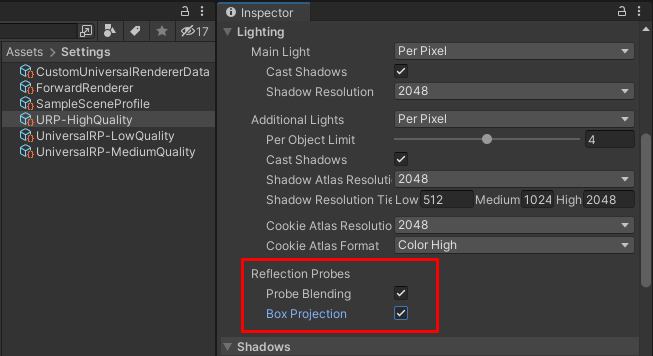

# 反射探针

本页面介绍 URP 中反射探针的特定行为。

关于反射探针的一般信息，请参考 [反射探针](https://docs.unity.cn/cn/tuanjiemanual/Manual/ReflectionProbes.html) 页面。

关于如何使用反射探针的示例，请参考 [URP 包示例中的光照示例](../package-sample-urp-package-samples.md#lighting)。

## 配置反射探针设置

要在 URP 资源中配置与反射探针相关的设置，请选择 **Lighting** > **Reflection Probes**。

 *反射探针设置。*

反射探针部分包含以下属性：

| **属性** | **描述** |
| --- | --- |
| **Probe Blending** | 选中此属性以启用 [反射探针混合](#reflection-probe-blending)。在低端移动平台上，禁用此属性可减少 CPU 处理时间。 |
| **Box Projection** | 选中此属性以启用反射探针的盒投影。在低端移动平台上，禁用此属性可减少 CPU 处理时间。 |

## 反射探针混合

反射探针混合可避免物体进入探针盒体时突然出现反射的情况。当启用反射探针混合时，Unity 会在反射物体从一个探针体积移动到另一个探针体积时，逐渐淡入淡出探针的立方体贴图。

URP 在所有渲染路径中均支持反射探针混合。

### 反射探针体积

每个反射探针都有一个盒体积。反射探针仅影响位于该盒体积内部的 GameObject 部分。当物体的像素位于所有反射探针体积之外时，Unity 使用天空盒反射。

在 URP 中，Unity 会根据像素相对于探针体积边界的位置，对每个像素单独评估各探针的贡献。这与内置渲染管线不同，后者是基于整个物体评估探针的贡献。

### 混合距离

每个反射探针都有 **Blend Distance** 属性，该属性表示从反射探针盒体积的面到盒体积中心的距离。

Unity 使用 **Blend Distance** 属性来确定反射探针的贡献度。当物体的像素位于反射探针体积的面上时，该像素从探针接收 0% 的反射。当像素位于反射探针体积内，并且距离各面超过 **Blend Distance** 值时，该像素接收 100% 的反射。

如果 **Blend Distance** 值超过探针盒体积面间距离的一半，则该反射探针无法为体积内的任何像素提供 100% 的贡献。

### 影响 GameObject 的探针

当 GameObject 位于多个反射探针体积内时，最多可受两个探针的影响。Unity 通过以下标准选择影响 GameObject 的探针：

* 反射探针的 **Importance** 属性。Unity 选择具有较高 **Importance** 值的两个探针，并忽略其他探针。

* 如果 **Importance** 值相同，Unity 选择体积最小的探针。

* 如果 **Importance** 值和体积都相同，Unity 选择包含 GameObject 较大表面积的两个反射探针体积，并使用这些探针。

当两个反射探针影响一个 GameObject 时，Unity 根据每个像素到探针盒体积面的距离以及 **Blend Distance** 属性值计算每个探针的权重。

如果像素距离两个盒体积的面都较近，并且两个探针的总权重小于 1，Unity 会将剩余权重分配给 `_GlossyEnvironmentCubeMap`。此立方体贴图包含 Lighting 窗口中 **Environment Lighting** > **Source** 设定的光照源的反射。在大多数情况下，该光照源是天空盒。

如果像素同时位于两个探针体积内，并且距离探针体积的面都超过 **Blend Distance** 值：

* 如果两个探针的 **Importance** 属性相同，Unity 以相等的权重混合两个探针的反射。

* 如果其中一个探针的 **Importance** 属性较高，Unity 仅应用该探针的反射。

## 盒投影

要使盒投影生效：

* 在 [URP 资源](#configuring-reflection-probe-settings) 中选中 **Box Projection** 复选框。

* 在反射探针中选中 **Box Projection** 属性。