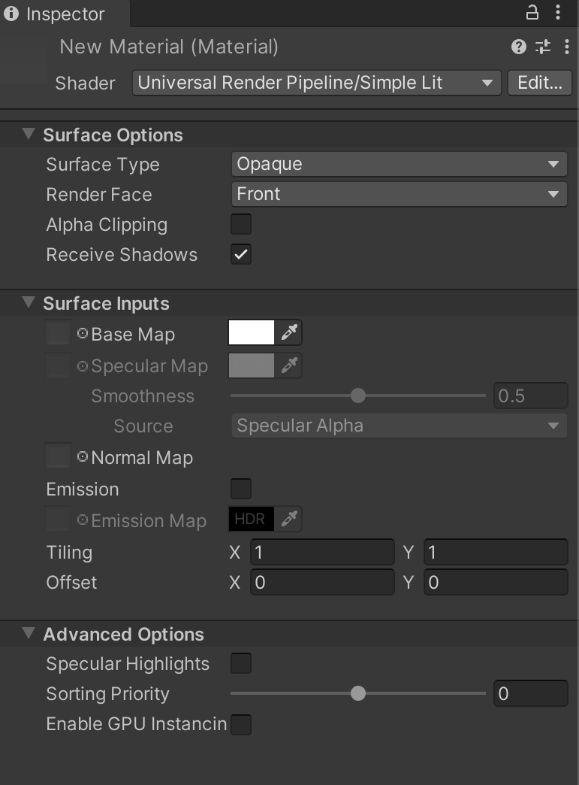
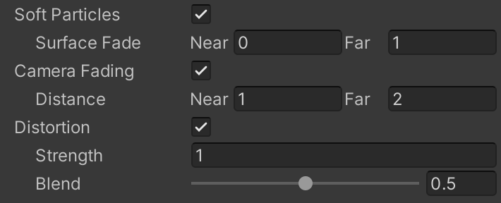

# Particles Simple Lit Shader

在通用渲染管线（URP）中，使用此 Shader 适用于对性能要求高于照片级真实感的粒子效果。此 Shader 使用简单的光照近似计算。由于[不遵循物理正确性和能量守恒](shading-model.md#simple-shading)，因此渲染速度较快。

## 在编辑器中使用 Particles Simple Lit Shader

要选择并使用此 Shader，请执行以下步骤：

1. 在项目中创建或找到要应用此 Shader 的材质（Material）。选择该 __Material__，Material Inspector 窗口将打开。
2. 点击 __Shader__，然后选择 **Universal Render Pipeline** > **Particles** > **Simple Lit**。

## UI 概览

此 Shader 的 Inspector 窗口包含以下内容：

- __[Surface Options](#surface-options)__
- __[Surface Inputs](#surface-inputs)__
- __[Advanced](#advanced)__

### Surface Options

__Surface Options__ 控制 URP 如何在屏幕上渲染材质。

| 属性                 | 描述                                                         |
| ------------------ | ------------------------------------------------------------ |
| __Surface Type__   | 选择材质的表面类型：__Opaque__ 或 __Transparent__。这决定了 URP 使用哪个渲染通道。 __Opaque__ 材质始终完全可见，无论其后是否有其他对象，并且 URP 会优先渲染不透明材质。 __Transparent__ 材质受背景影响，并根据所选的透明表面类型变化。URP 在不透明材质之后的独立通道中渲染透明材质。选择 __Transparent__ 后，将出现 __Blending Mode__ 选项。 |
| __Blending Mode__  | 选择 URP 计算透明材质像素颜色的方式，将材质与背景像素进行混合。 __Alpha__：使用材质的 Alpha 值调整透明度。0 为完全透明，1 看起来完全不透明，但仍在透明通道中渲染。这适用于需要完全可见但会随时间淡出的效果，如云层。 __Premultiply__：类似于 Alpha 模式，但保留反射和高光，即使表面透明。例如，可用于透明玻璃效果。 __Additive__：将材质颜色与背景颜色相加，适用于全息影像（Hologram）效果。 __Multiply__：将材质颜色与其背后的颜色相乘，创建类似彩色玻璃的暗色效果。 |
| __Render Face__    | 选择几何体的渲染面。 __Front Face__ 渲染几何体的正面，并[剔除](https://docs.unity.cn/cn/tuanjiemanual/Manual/SL-CullAndDepth.html)背面（默认设置）。 __Back Face__ 渲染几何体的背面，并剔除正面。 __Both__ 使 URP 渲染几何体的正反两面，适用于叶子等小型、扁平对象，使其两侧均可见。 |
| __Alpha Clipping__ | 使材质表现为[Cutout](https://docs.unity.cn/cn/tuanjiemanual/Manual/StandardShaderMaterialParameterRenderingMode.html)（剪切）Shader，以创建透明区域与不透明区域之间具有硬边界的效果。例如，可用于创建草叶的效果。 启用后，URP 将不渲染低于指定 __Threshold__（阈值）的 Alpha 值。__Threshold__ 通过滑块调整，范围为 0 到 1。所有高于阈值的区域完全不透明，低于阈值的区域完全透明。例如，设置阈值为 0.1，则 URP 不会渲染 Alpha 值低于 0.1 的部分。默认阈值为 0.5。 |
| __Color Mode__     | 选择粒子颜色与材质颜色的混合方式。 __Multiply__：将两种颜色相乘，使最终颜色变暗。 __Additive__：将两种颜色相加，使最终颜色变亮。 __Subtractive__：从材质的基色中减去粒子颜色，使像素变暗。 __Overlay__：通过混合粒子颜色与材质基色，在亮度大于 0.5 时使颜色变亮，在亮度低于 0.5 时使颜色变暗。 __Color__：使用粒子颜色影响材质颜色，同时保持材质的饱和度和亮度，适用于为单色场景添加颜色变化。 __Difference__：计算两种颜色的差异，适用于相近颜色的粒子与材质混合。 |

### Surface Inputs

__Surface Inputs__ 描述材质表面的特性。例如，可使用这些属性使表面呈现湿润、干燥、粗糙或光滑的效果。

| 属性              | 描述                                                         |
| ---------------- | ------------------------------------------------------------ |
| __Base Map__     | 赋予表面颜色，也称为漫反射贴图（Diffuse Map）。 点击旁边的对象选择器可为 __Base Map__ 选择纹理，这将打开资源浏览器，以选择项目中的贴图。 也可以使用 [颜色拾取器](https://docs.unity.cn/cn/tuanjiemanual/Manual/EditingValueProperties.html) 来调整颜色，颜色值会叠加在所选贴图之上。 如果在 __Surface Options__ 中选择了 __Transparent__ 或 __Alpha Clipping__，材质将使用贴图的 Alpha 通道或颜色。 |
| __Specular Map__ | 控制表面在直接光照（如 [定向光、点光源和聚光灯](https://docs.unity.cn/cn/tuanjiemanual/Manual/Lighting.html)）下的高光颜色。 点击对象选择器可为 __Specular Map__ 选择纹理，或使用 [颜色拾取器](https://docs.unity.cn/cn/tuanjiemanual/Manual/EditingValueProperties.html) 来调整颜色。 在 __Source__ 选项中，可选择项目中的纹理作为平滑度来源。默认情况下，来源是该纹理的 Alpha 通道。 __Smoothness__ 滑块可控制表面高光的扩散程度：0 产生较宽、较粗糙的高光，1 产生类似玻璃的小而锐利的高光。0.5 可呈现类似塑料的光泽感。 **注意：** 如果此设置呈灰色不可用，请检查 __Advanced__ 设置下的 __Specular Highlights__ 是否已启用。 |
| __Normal Map__   | 添加法线贴图（Normal Map）以增强表面细节，例如凹凸、划痕和沟槽。 点击对象选择器可分配法线贴图，该贴图会影响环境光照的交互方式。 |
| __Emission__     | 使材质表面具有自发光效果。启用后，可配置 __Emission Map__（发光贴图）和 __Emission Color__（发光颜色）。 点击对象选择器可选择发光贴图。 __Emission Color__ 可通过[颜色拾取器](https://docs.unity.cn/cn/tuanjiemanual/Manual/EditingValueProperties.html)进行调整，颜色值可以超过 100% 的白色，以用于发光强度较高的效果，如熔岩。 如果未分配 __Emission Map__，则仅使用 __Emission Color__ 颜色作为发光颜色。 如果未启用 __Emission__，URP 会将发光颜色设为黑色，并不计算发光效果。 |

### Advanced

__Advanced__ 设置影响幕后渲染过程。它们不会直接改变表面外观，但会影响底层计算，从而对性能产生影响。

| 属性                   | 描述                                                         |
| ---------------------- | ------------------------------------------------------------ |
| __Flip-Book Blending__ | 启用此选项可对 Flip-Book 帧进行平滑混合。这对于帧数有限的纹理表动画（Texture Sheet Animation）非常有用，可使动画更加流畅。 如果遇到性能问题，请尝试关闭此选项。 |
| __Specular Highlights__ | 启用此选项可使粒子在直接光照（如 [定向光、点光源和聚光灯](https://docs.unity.cn/cn/tuanjiemanual/Manual/Lighting.html)）下产生高光反射。 当禁用此选项时，Shader 将不会计算高光效果，从而提高渲染性能。默认情况下，此功能是启用的。 |
| __Vertex Streams__     | 该列表显示此材质正常运行所需的顶点流（Vertex Streams）。 如果顶点流未正确分配，将显示 __Fix Now__ 按钮。点击该按钮，系统会自动为此材质所使用的粒子系统应用正确的顶点流设置。 |
| __Sorting Priority__   | 使用此滑块调整材质的渲染顺序。URP 会优先渲染数值较低的材质。 此功能可用于减少设备上的过度绘制（Overdraw），使渲染管线优先渲染前景材质，以避免重复渲染被遮挡的区域。 该功能类似于 Unity 内置渲染管线中的 [Render Queue](https://docs.unity.cn/cn/tuanjiemanual/ScriptReference/Material-renderQueue.html)。 |

#### 透明表面类型（Transparent Surface Type）

如果在 [Surface Options](#surface-options) 中选择了透明（Transparent）表面类型，将显示以下选项：

| 属性                 | 描述                                                         |
| ------------------ | ------------------------------------------------------------ |
| __Soft Particles__ | 启用此选项可使粒子在接近其他几何体表面时逐渐淡出，而不会产生明显的交界线。此功能依赖于 [深度缓冲](https://docs.unity.cn/cn/tuanjiemanual/Manual/class-RenderTexture.html) 来计算粒子与其他物体的交互。 启用此功能后，将出现 **Surface Fade** 设置： __Near__：设置粒子完全透明的距离。当粒子到达该距离时，它完全消失。 __Far__：设置粒子完全不透明的距离。在此距离下，粒子保持完全可见。 所有距离均以世界单位（World Units）计算，仅适用于透明表面类型。  **注意：** 此功能依赖 URP 生成的 `CameraDepthTexture`。要使用此功能，请在 [URP 资源](universalrp-asset.md) 或渲染粒子的[相机](camera-component-reference.md)上启用 **Depth Texture**。 |
| __Camera Fading__  | 启用此选项可使粒子在接近相机时逐渐淡出。 启用后，将出现 **Distance** 设置： __Near__：设置粒子完全透明的距离。当粒子到达该距离时，它完全消失。 __Far__：设置粒子完全不透明的距离。在此距离下，粒子保持完全可见。 所有距离均以世界单位（World Units）计算。  **注意：** 此功能依赖 URP 生成的 `CameraDepthTexture`。要使用此功能，请在 [URP 资源](universalrp-asset.md) 或渲染粒子的[相机](camera-component-reference.md)上启用 **Depth Texture**。 |
| __Distortion__     | 通过使粒子与其后方的物体产生折射（Refraction）来创建扭曲效果。适用于模拟热浪效果或扭曲背景物体。 启用后，将出现以下设置： __Strength__：控制粒子对背景的扭曲强度。负值的效果与正值相反，例如，如果正值向右偏移，则相同的负值向左偏移。 __Blend__：控制扭曲效果的可见性。值为 0 时，扭曲不可见；值为 1 时，仅显示扭曲效果。  **注意：** 此功能依赖 URP 生成的 `CameraOpaqueTexture`。要使用此功能，请在 [URP 资源](universalrp-asset.md) 或渲染粒子的[相机](camera-component-reference.md)上启用 **Opaque Texture**。 |

