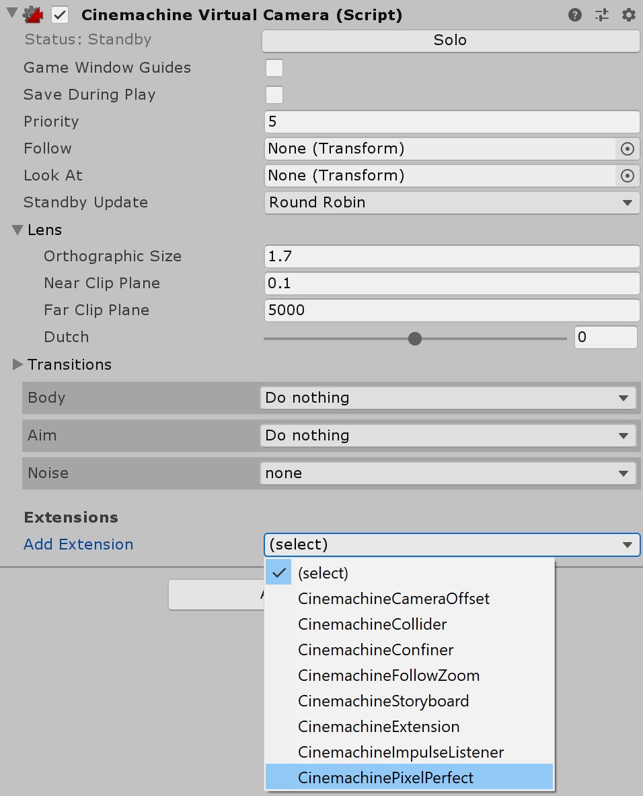

# 使用 Cinemachine Pixel Perfect 扩展

__Pixel Perfect Camera__ 和 [Cinemachine](https://unity.com/unity/features/editor/art-and-design/cinemachine) 都会修改相机的正交大小（Orthographic Size）。如果在同一场景中同时使用这两个系统，可能会导致它们争夺相机控制权，从而产生意外效果。__Cinemachine Pixel Perfect__ 扩展解决了这一兼容性问题。

__Cinemachine Pixel Perfect__ 是 [Cinemachine 虚拟相机](https://docs.unity3d.com/Packages/com.unity.cinemachine@2.2/manual/CinemachineVirtualCameraExtensions.html) 的一个扩展，它调整虚拟相机的正交大小。该扩展会检测场景中是否存在 Pixel Perfect Camera 组件，并使用其设置计算最佳的正交大小，以保持精灵（Sprites）在像素级精度下的正确分辨率。

要将此扩展添加到虚拟相机中，请在 Cinemachine 虚拟相机的 Inspector 窗口中，使用 **Add Extension** 下拉菜单。你需要为项目中的每个虚拟相机添加此扩展。

对于每个附加了该扩展的虚拟相机，Pixel Perfect Camera 组件会在 **Play Mode** 或启用了 **Run In Edit Mode** 时，计算出最适合的像素级正交大小。这可确保在应用像素精确计算时，每个虚拟相机的原始取景尽可能保持不变。

当 [Cinemachine Brain](https://docs.unity3d.com/Packages/com.unity.cinemachine@2.3/manual/CinemachineBrainProperties.html) 组件在多个虚拟相机之间[切换](https://docs.unity3d.com/Packages/com.unity.cinemachine@2.3/manual/CinemachineBlending.html)时，画面在相机过渡期间可能会暂时失去像素级精度。一旦完全切换到某个虚拟相机，画面会恢复到像素精确状态。

## 当前扩展的限制

- 当附加了 Pixel Perfect 扩展的虚拟相机设置为跟随 [目标组（Target Group）](https://docs.unity3d.com/Packages/com.unity.cinemachine@2.3/manual/CinemachineTargetGroup.html) 时，若虚拟相机使用 [Framing Transposer](https://docs.unity3d.com/Packages/com.unity.cinemachine@2.9/manual/CinemachineBodyFramingTransposer.html) 进行定位，则可能会出现可见的抖动。
- 如果在 Pixel Perfect Camera 组件中启用了 **Upscale Render Texture** 选项，则可用的像素精确分辨率减少，可能导致计算后的虚拟相机取景偏差较大。
