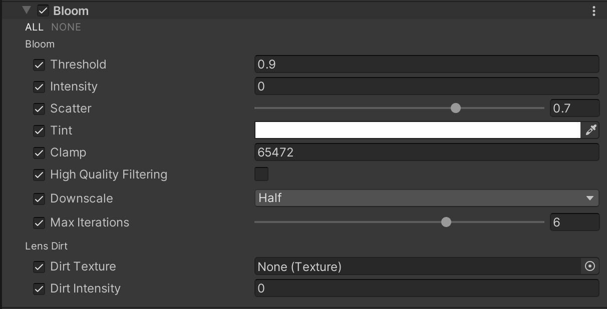
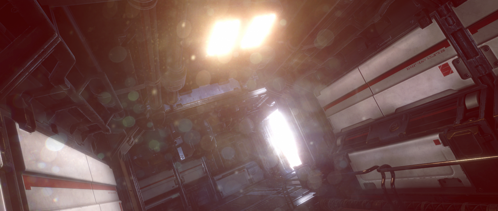

# Bloom

  
_关闭 Bloom 效果的场景。_

  
_启用 Bloom 效果的场景。_

Bloom（泛光）效果会在图像中亮区的边缘产生光晕，使光线看起来更加明亮，甚至产生溢出效果，从而营造出强光源的视觉冲击感。

Bloom 还提供了 **Lens Dirt**（镜头污迹）功能，可在整个屏幕上添加污渍或灰尘纹理，使 Bloom 效果产生散射光晕。

## 使用 Bloom

**Bloom** 使用 [Volume](Volumes.md) 系统，因此要启用和修改 **Bloom** 的属性，必须在场景中的 [Volume](VolumeOverrides.md) 组件中添加 **Bloom** 覆盖。

### 在 Volume 中添加 Bloom：

1. 在 **Scene** 视图或 **Hierarchy** 视图中，选择包含 Volume 组件的 GameObject，以在 Inspector 中查看。
2. 在 **Inspector** 窗口中，点击 **Add Override** &gt; **Post-processing**，然后选择 **Bloom**。  
   **Universal Render Pipeline** 会将 **Bloom** 应用于该 Volume 影响的所有相机。

## 属性

### Bloom

| **属性**                 | **描述**                                                         |
| ---------------------- | ------------------------------------------------------------ |
| **Threshold**         | 设置 URP 应用 Bloom 效果的伽马空间亮度阈值。低于此值的像素不会受到 Bloom 影响。最小值为 0（不过滤任何像素），默认值为 0.9，无最大值。 |
| **Intensity**         | 设置 Bloom 滤镜的强度，范围为 0 到 1。默认值为 0（禁用 Bloom 效果）。 |
| **Scatter**           | 设置 Bloom 效果的半径，范围为 0 到 1。较高的值会产生更大的光晕半径。默认值为 0.7。 |
| **Tint**              | 选择 Bloom 效果的色彩调整颜色。 |
| **Clamp**             | 设置用于计算 Bloom 的最大亮度值。若场景中的像素亮度超过该值，URP 仍会以原始亮度渲染它们，但在 Bloom 计算时使用此值。默认值为 65472。 |
| **High Quality Filtering** | 启用此选项可使用高质量采样，减少闪烁并改善平滑度。但此模式消耗更多资源，可能影响性能。 |
| **Downscale**         | 设置初始分辨率缩放比例。值越低，Bloom 初始模糊效果消耗的系统资源越少。 |
| **Max Iterations**    | 根据渲染图像的大小确定迭代次数。此设置定义最大迭代次数。降低此值可减少处理负担，提高性能，特别适用于高 DPI 移动设备。默认值为 6。 |

### Lens Dirt（镜头污迹）

| **属性**       | **描述**                                                      |
| ------------- | ------------------------------------------------------------ |
| **Texture**   | 选择一张纹理，为镜头添加污渍或灰尘效果。 |
| **Intensity** | 设置 **Lens Dirt** 效果的强度。 |

## 性能优化建议

可通过以下方式优化 Bloom 的性能开销，按照优化效果排序：

1. **禁用高质量过滤（High Quality Filtering）**：Bloom 采用双线性（Bilinear）过滤，而不是三次（Bicubic）过滤。这可能降低 Bloom 效果的平滑度，但能大幅提升性能，尤其适用于低端设备和平台。在极端情况下，场景中可能出现块状伪影。
2. **将 Downscale 设为 Quarter**：降低 Bloom 初始分辨率，从而减少初始计算成本。
3. **使用较低分辨率的 Lens Dirt 纹理**：降低内存占用并加快体积混合（Volume Blending）计算速度。
