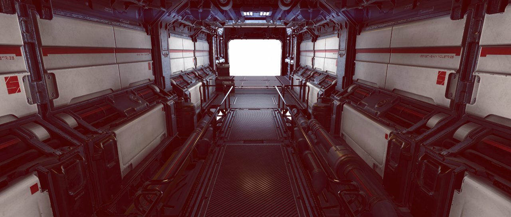
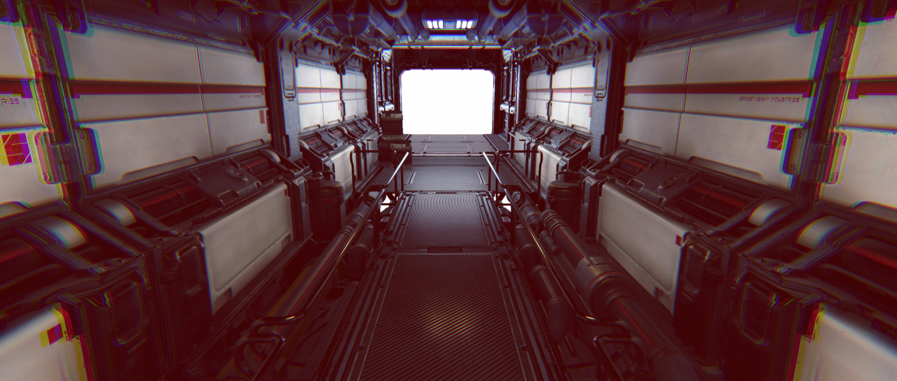
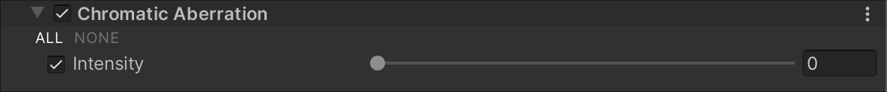

# 色差（Chromatic Aberration）

  
_未启用 Chromatic Aberration 效果的场景。_

  
_启用 Chromatic Aberration 效果的场景。_

Chromatic Aberration（色差）会在图像的明暗边界处产生彩色光晕，模拟现实世界中的相机镜头无法将所有颜色聚焦到同一点时所产生的颜色失真。  
有关更多信息，请参考 [Wikipedia: Chromatic aberration](https://en.wikipedia.org/wiki/Chromatic_aberration)。

## 使用 Chromatic Aberration

**Chromatic Aberration** 使用 [Volume](Volumes.md) 系统，因此要启用和修改 **Chromatic Aberration** 的属性，必须在场景中的 [Volume](Volumes.md) 组件中添加 **Chromatic Aberration** 覆盖。

### 在 Volume 中添加 Chromatic Aberration：

1. 在 **Scene** 视图或 **Hierarchy** 视图中，选择包含 Volume 组件的 GameObject，以在 Inspector 中查看。
2. 在 **Inspector** 窗口中，点击 **Add Override > Post-processing**，然后选择 **Chromatic Aberration**。  
   **Universal Render Pipeline** 会将 **Chromatic Aberration** 应用于该 Volume 影响的所有相机。

## 属性

| **属性**     | **描述**                                                     |
| ----------- | ------------------------------------------------------------ |
| **Intensity** | 设置色差效果的强度，取值范围为 0 到 1。值越高，色差效果越明显。默认值为 0（禁用效果）。 |
