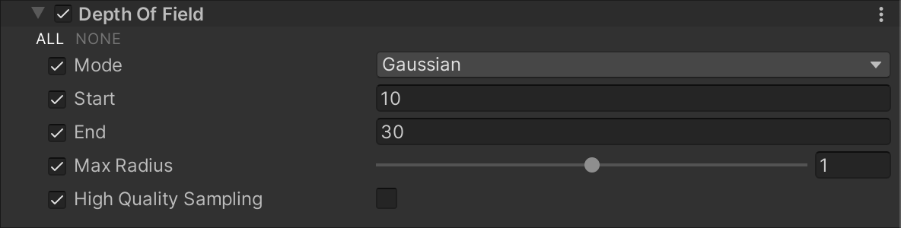
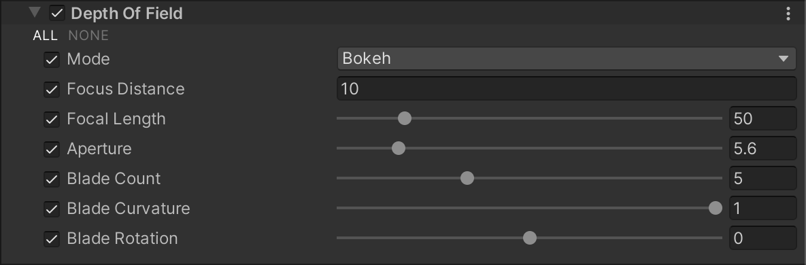
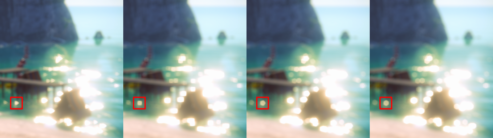

# 景深（Depth Of Field）

Depth Of Field（景深）组件应用景深效果，以模拟相机镜头的焦距特性。在现实世界中，相机只能清晰聚焦于特定距离的物体，而更近或更远的物体则会失焦并产生模糊。这种模糊可以提供物体距离的视觉线索，并引入“散景”（Bokeh），即高亮区域在失焦时出现的视觉伪影。有关 Bokeh 的详细信息，请参考 [Wikipedia: Bokeh](https://en.wikipedia.org/wiki/Bokeh)。

**通用渲染管线（URP）提供两种景深模式：**

- **Gaussian**（高斯模糊）：此模式近似模拟相机效果，但不完全模仿。它具有有限的模糊半径，并仅支持远景模糊。此模式最快，适用于低端平台。  
  

- **Bokeh**（散景模糊）：比 Gaussian 模式更慢，但质量更高，能够更准确地模拟真实相机效果。支持近景和远景模糊，并可在高亮区域（Hot Spots）生成散景效果。  
  

## 使用 Depth Of Field

**Depth Of Field** 使用 [Volume](Volumes.md) 系统，因此要启用和修改 **Depth Of Field** 的属性，必须在场景中的 [Volume](Volumes.md) 组件中添加 **Depth Of Field** 覆盖。

### 在 Volume 中添加 Depth Of Field：

1. 在 **Scene** 视图或 **Hierarchy** 视图中，选择包含 Volume 组件的 GameObject，以在 Inspector 中查看。
2. 在 **Inspector** 窗口中，点击 **Add Override > Post-processing**，然后选择 **Depth Of Field**。  
   **Universal Render Pipeline** 会将 **Depth Of Field** 应用于该 Volume 影响的所有相机。

## 属性

| **属性**   | **描述**                                                     |
| ---------- | ------------------------------------------------------------ |
| **Mode**   | 选择 URP 使用的景深模式。<ul><li>**Off**：禁用景深效果。</li><li>**Gaussian**：启用 Gaussian 模式，提供更快但受限的景深效果。</li><li>**Bokeh**：启用 Bokeh 模式，提供更高质量的散景模糊效果。</li></ul> |

### Gaussian 景深模式

| **属性**                 | **描述**                                                     |
| ------------------------ | ------------------------------------------------------------ |
| **Start**                | 设置远景模糊开始的距离（相对于相机）。 |
| **End**                  | 设置远景模糊达到最大模糊半径的距离（相对于相机）。 |
| **Max Radius**           | 设置远景模糊的最大半径，默认值为 1。 **注意：** 设置值超过 1 可能会导致视觉采样不足的伪影（Under-sampling Artifacts）。如果模糊效果出现不平滑或静态噪点，请尝试将其降低至 1 或更低。 |
| **High Quality Sampling** | 启用高质量采样，以减少闪烁并改善整体模糊平滑度。此功能会增加性能开销。 |

### Bokeh Depth of Field（散景景深）

**Bokeh** 景深模式精确模拟真实相机的光学效果。因此，该模式的设置基于真实相机参数，并提供了多个选项来调整相机的光圈叶片。  
有关光圈叶片及其对相机成像质量的影响，请参考 Improve Photography 的指南：[Aperture Blades: How many is best?](https://improvephotography.com/29529/aperture-blades-many-best/)

| **属性**               | **描述**                                                     |
| ---------------------- | ------------------------------------------------------------ |
| **Focus Distance**     | 设置从相机到焦点的距离。 |
| **Focal Length**       | 设置相机传感器与镜头之间的距离（单位：毫米）。值越大，景深越浅。 |
| **Aperture**           | 设置光圈比例（即 f-stop 或 f-number）。值越小，景深越浅，模糊越明显。 |
| **Blade Count**        | 设置光圈叶片的数量。叶片越多，Bokeh 效果越圆润。  _叶片数量示例（从左到右）：3、4、5、6。_ |
| **Blade Curvature**    | 设置光圈叶片的曲率。 值越小，叶片形状越明显；值为 1 时，Bokeh 变得完全圆润。  _光圈曲率示例：左侧曲率值为 1，右侧曲率值为 0。_ |
| **Blade Rotation**     | 设置光圈叶片的旋转角度（单位：度）。 |
