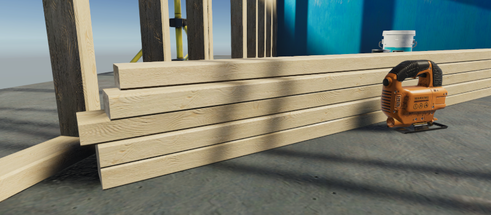
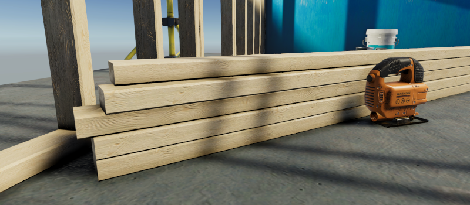
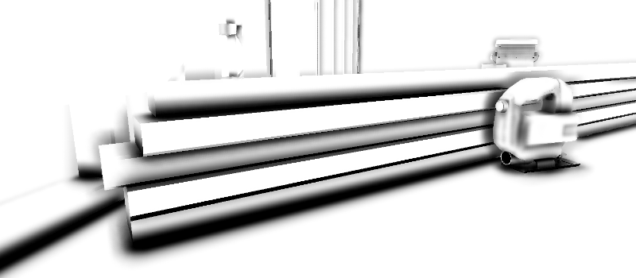
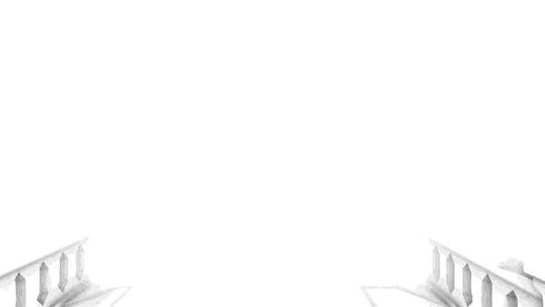
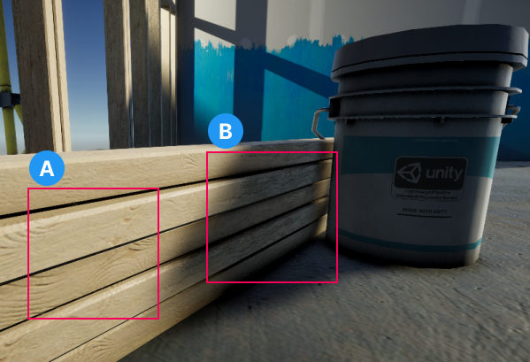
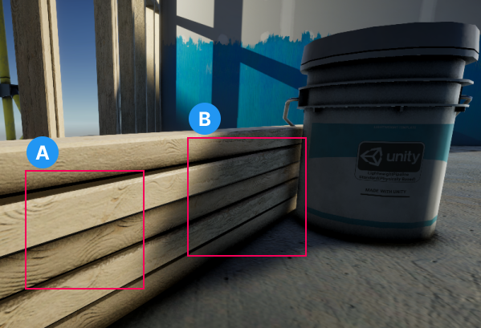
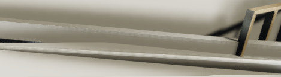
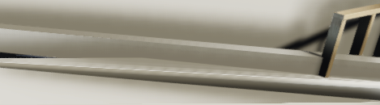
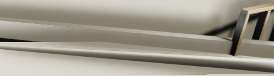

# 环境光遮蔽（Ambient Occlusion）

**环境光遮蔽**（Ambient Occlusion）效果能够在实时渲染中加深场景中缝隙、孔洞、交界处和相互靠近的表面。  
在现实世界中，这些区域往往阻挡或遮蔽了环境光，从而显得更暗。

URP 提供了屏幕空间环境光遮蔽（Screen Space Ambient Occlusion，SSAO）作为 [Renderer Feature](urp-renderer-feature.md)。  
它兼容于所有由 Universal Render Pipeline 提供的着色器，并支持任何自定义的 Shader Graph 不透明材质。

> **注意**：SSAO 是一个渲染器功能，与 URP 的后期处理效果独立存在。  
> 它不依赖于 Volume，也不与 Volume 的效果产生交互。

以下图片展示了关闭环境光遮蔽、启用环境光遮蔽以及仅显示环境光遮蔽纹理的场景。

  
_关闭环境光遮蔽时的场景_

  
_启用环境光遮蔽时的场景_

  
_仅显示环境光遮蔽纹理的场景_

## 添加 SSAO 渲染器功能到渲染器

URP 以渲染器功能的形式实现环境光遮蔽效果。

要在项目中使用 SSAO 效果，请参考 [如何向渲染器添加渲染器功能](urp-renderer-feature-how-to-add.md) 的说明，  
将“屏幕空间环境光遮蔽”渲染器功能添加到渲染器中。

一旦完成，使用该渲染器的任何相机都会呈现 SSAO 效果。

## 属性

以下是 SSAO 渲染器功能的属性说明。

### Method

此属性定义 SSAO 效果使用的噪声类型。

可用选项：

- **交错渐变噪声**：使用交错渐变噪声生成静态 SSAO。
- **蓝噪声**：使用一组蓝噪声纹理生成动态 SSAO。由于纹理每帧变化，因此在相机运动时 SSAO 效果更为微妙。

**性能影响**：轻微。

### Intensity

此属性定义遮蔽效果的强度。

**性能影响**：轻微。

### Radius

当 Unity 计算环境光遮蔽值时，SSAO 效果会在当前像素的半径范围内对法线纹理进行采样。

**性能影响**：高。

较低的 **Radius** 值可以提高性能，因为 SSAO 渲染器功能对更接近源像素的像素进行采样。这提升了缓存效率。

靠近相机的物体上的环境光遮蔽计算时间较长，而远离相机的物体计算时间较短。这是因为 **Radius** 属性会随物体的距离而缩放。

### Falloff Distance

超过此距离的物体将不再应用 SSAO 效果。

在包含许多远距离物体的场景中，较低的值会提高性能。而在较小的场景中性能提升较小。

**性能影响**：依应用情况而定。

### Direct Lighting Strength

此属性定义在直接光照下效果的可见程度。

以下图片展示了 **Direct Lighting Strength** 值如何改变 SSAO 效果在明暗区域的表现。

  
_直接光照强度：0.2._

  
_直接光照强度：0.9._

**A**. 显示 **Direct Lighting Strength** 对照明区域中 SSAO 效果的影响。

**B**. 显示 **Direct Lighting Strength** 对一个或多个阴影覆盖区域中 SSAO 效果的影响。

**性能影响**：轻微。

## 质量

### Source

选择法线向量值的来源。SSAO 渲染功能使用法线向量来计算表面每一点对环境光照的暴露程度。

可用选项：

- **Depth Normals**：SSAO 使用由 `DepthNormals` Pass 生成的法线纹理。此选项让 Unity 能够使用更精确的法线纹理。
- **Depth**：SSAO 不使用 `DepthNormals` Pass 生成法线纹理。SSAO 改为使用深度纹理重建法线向量。仅在您希望避免在自定义着色器中使用 `DepthNormals` Pass 块时选择此选项。选择此选项会启用 **Normal Quality** 属性。

**性能影响**：取决于应用程序。

在 **Depth Normals** 和 **Depth** 选项之间切换时，性能可能会有所差异，这取决于目标平台和应用程序。在许多应用程序中，性能差异较小。在大多数情况下，**Depth Normals** 可以提供更好的视觉效果。

有关 Source 属性的更多信息，请参阅 [实现细节](#implementation-details) 部分。

### Normal Quality

选择 **Source** 属性中的 **Depth** 选项时，该属性才会变为活动状态。

更高的法线质量会产生更平滑的 SSAO 效果。

可用选项：

- **Low**
- **Medium**
- **High**

**性能影响**：中等。

在某些情况下，**Depth** 选项生成的效果可与 **Depth Normals** 选项相媲美。但在特定场景下，**Depth Normals** 选项可以显著提高质量。以下图片展示了这种情况的示例。

 *Source: Depth. Normal Quality: Low.*

 *Source: Depth. Normal Quality: Medium.*

 *Source: Depth. Normal Quality: High.*

 *Source: Depth Normals.*

有关更多信息，请参阅 [实现细节](#implementation-details) 部分。

### Downsample

选中此复选框后，计算 Ambient Occlusion 效果的 Pass 分辨率会减半。

将 Ambient Occlusion Pass 分辨率降低一半，意味着像素数量减少到四分之一。这显著降低了 GPU 负载，但会使效果细节减少。

**性能影响**：非常高。

### After Opaque

启用 **After Opaque** 后，Unity 在不透明渲染通道之后计算和应用 SSAO 效果。这在将 **Source** 设为 **Depth** 时，可以提高性能，因为 Unity 不再需要执行深度预通道来计算 SSAO，而是使用现有的深度值。

**After Opaque** 还可以在使用基于平铺渲染的移动设备上提高性能。

**性能影响**：中等。

### Blur Quality

此属性定义 Unity 为 SSAO 效果应用的模糊质量。更高的模糊质量会产生更平滑、更高保真的效果，但需要更多的处理能力。

可选项：

- **High**（Bilateral）：双边模糊，需要三个 Pass 进行处理。
- **Medium**（Gaussian）：高斯模糊，需要两个 Pass 进行处理。
- **Low**（Kawase）：Kawase 模糊，仅需要一个 Pass 进行处理。

**性能影响**：非常高。

### Samples

对于每个像素，SSAO 渲染功能在指定半径内采取所选数量的样本来计算 Ambient Occlusion 值。更高的值会使效果更平滑、更细致，但性能会下降。

可选项：

- **High**：12 Samples
- **Medium**：8 Samples
- **Low**：4 Samples

**性能影响**：高。

将 **Sample Count** 值从 4 增加到 8，会使 GPU 的计算负载加倍。

## 实现细节

SSAO 渲染功能使用法线向量来计算表面每一点对环境光照的暴露程度。

URP 10.0 实现了 `DepthNormals` Pass 块，它为当前帧生成法线纹理 `_CameraNormalsTexture`。默认情况下，SSAO 渲染功能使用此纹理计算 Ambient Occlusion 值。

如果您实现了自定义 SRP，并且不希望在着色器中实现 `DepthNormals` Pass 块，可以使用 SSAO 渲染功能并将其 **Source** 属性设置为 **Depth**。在这种情况下，Unity 不使用 `DepthNormals` Pass 来生成法线向量，而是使用深度纹理重建法线向量。

将 **Source** 属性中的选项设置为 **Depth** 会启用 **Normal Quality** 属性。此属性中的选项（Low、Medium 和 High）决定 Unity 从深度纹理重建法线向量时所使用的样本数量。每种质量等级的样本数：Low：1，Medium：5，High：9。
