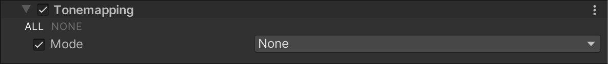

# Tonemapping

Tonemapping 是将图像的 HDR 值重新映射到一个新的值范围的过程。其最常见的目的是使低动态范围的图像看起来具有更高的动态范围。有关更多信息，请参阅 [维基百科: Tone mapping](https://en.wikipedia.org/wiki/Tone_mapping)。

## 使用 Tonemapping

**Tonemapping** 使用 [Volume](Volumes.md) 系统，因此要启用和修改 **Tonemapping** 属性，必须将 **Tonemapping** 覆盖添加到场景中的 [Volume](Volumes.md) 中。

要将 **Tonemapping** 添加到 Volume：

1. 在 Scene 或 Hierarchy 视图中，选择一个包含 Volume 组件的游戏对象，以便在 Inspector 中查看它。
2. 在 Inspector 中，导航到 **Add Override > Post-processing**，然后点击 **Tonemapping**。Universal Render Pipeline 会将 **Tonemapping** 应用于该 Volume 影响的任何相机。

## 属性

| **属性** | **描述**                                              |
| ------------ | ------------------------------------------------------------ |
| **Mode**     | 选择一个色调映射算法用于颜色分级。可选项包括：<ul><li>**None**：如果您不想应用色调映射，请使用此选项。</li><li>**Neutral**：如果您只想进行范围重新映射，同时对颜色色相和饱和度的影响最小，请使用此选项。这通常是进行大范围颜色分级的良好起点。</li><li>**ACES**：使用此选项可以应用接近参考 ACES 色调映射器的近似值，获得更具电影感的外观。相比于 Neutral，它具有更高的对比度，并对实际颜色色相和饱和度有影响。如果使用此色调映射器，Unity 将所有分级操作都在 ACES 颜色空间中进行，以获得最佳的精度和效果。 **注意**: ACES HDR 色调映射在配备 Adreno 300 系列 GPU 的 Android 设备上不支持。</li></ul> |
